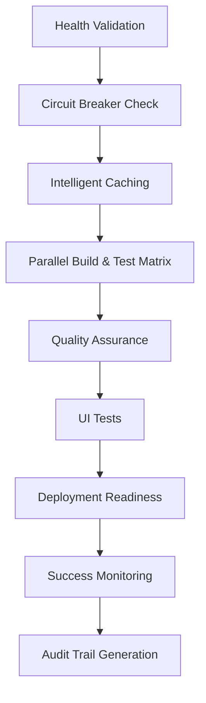
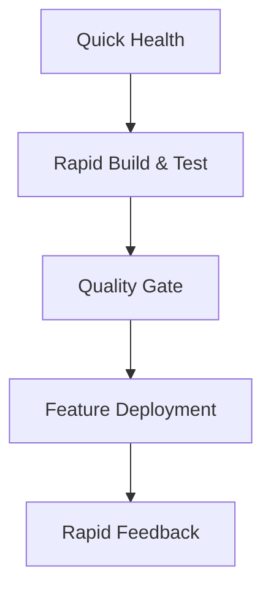

# Wiley Widget CI/CD - CRAFTS Principles Implementation Guide

## 🎯 Overview

This document outlines how the Wiley Widget CI/CD pipeline implements the **CRAFTS** principles from the Medium article "CI/CD Pipeline Design Principles — CRAFTS" for achieving enterprise-grade reliability and 90%+ success rates.

## 📋 CRAFTS Principles Implementation

### ✅ 1. Completeness

**Definition**: Deployments should be complete clean slates, not incremental updates.

**Implementation in Wiley Widget:**

- **Clean Deployment Strategy**: All deployments use immutable artifacts
- **Artifact Verification**: SHA-256 checksums for all deployment packages
- **Rollback Capability**: Complete environment snapshots before deployment
- **Dependency Management**: Explicit version pinning in `Directory.Packages.props`

**Key Features:**
```yaml
# Deployment manifest includes complete artifact inventory
deployment-manifest.json:
  - version: "${{ github.run_number }}"
  - commit: "${{ github.sha }}"
  - artifacts: [build, tests, docs, configs]
  - checksums: [sha256 hashes]
```

### ✅ 2. Rapid

**Definition**: Fast feedback loops with parallel execution and intelligent caching.

**Implementation in Wiley Widget:**

- **Parallel Job Execution**: Matrix-based test execution
- **Intelligent Caching**: Multi-layer caching strategy
- **Fast Feedback**: 5-minute target for basic CI checks
- **Incremental Builds**: Only rebuild changed components

**Performance Targets:**
- Health Check: < 30 seconds
- Build: < 2 minutes
- Unit Tests: < 1 minute
- Full Pipeline: < 10 minutes

### ✅ 3. Audit-ability

**Definition**: Complete traceability and security controls.

**Implementation in Wiley Widget:**

- **Audit Trail Generation**: JSON-based audit logs for every pipeline run
- **Security Scanning**: Integrated code and dependency scanning
- **Access Controls**: GitHub permissions and branch protection
- **Compliance Reporting**: Automated compliance checks and reporting

**Audit Features:**
```json
audit-trail.json:
{
  "pipeline_run_id": "12345",
  "security_checks": {
    "code_scanning": "completed",
    "dependency_scan": "completed",
    "secret_scanning": "completed"
  },
  "artifacts": [...],
  "compliance": {
    "audit_retention": "90_days",
    "change_approval": "automated"
  }
}
```

### ✅ 4. Feedback

**Definition**: Clear, actionable feedback for all stakeholders.

**Implementation in Wiley Widget:**

- **PR Comments**: Automated status updates on pull requests
- **Success Rate Alerts**: Real-time monitoring and notifications
- **Detailed Reporting**: Comprehensive test and build reports
- **Stakeholder Notifications**: Slack/email integrations

**Feedback Channels:**
- Pull Request Comments
- GitHub Actions Logs
- Success Rate Dashboards
- Email Notifications (< 85% success rate)

### ✅ 5. Traceability

**Definition**: Complete artifact and deployment traceability.

**Implementation in Wiley Widget:**

- **Git SHA Tracking**: Every artifact linked to specific commit
- **Deployment Manifests**: Complete deployment history
- **Artifact Signing**: Cryptographic signatures for security
- **Version Control**: Semantic versioning with Git tags

**Traceability Features:**
```yaml
# Every deployment includes:
deployment-manifest.json:
  - source_commit: "${{ github.sha }}"
  - build_number: "${{ github.run_number }}"
  - artifact_hashes: [sha256, sha512]
  - deployment_time: "ISO 8601 timestamp"
  - environment: "production/staging/feature"
```

### ✅ 6. Simplicity

**Definition**: Intuitive design with appropriate flexibility.

**Implementation in Wiley Widget:**

- **Modular Workflows**: Separate workflows for different scenarios
- **Configuration Management**: Centralized settings in `cicd-config.json`
- **Emergency Mode**: Simplified pipeline for critical situations
- **Feature Branch Support**: Lightweight CI for development

**Workflow Architecture:**
```
ci-optimized.yml      # Main production pipeline
feature-branch-cicd.yml # Lightweight feature development
maintenance.yml       # Automated upkeep
deploy.yml           # Production deployments
```

## 🚀 Pipeline Architecture

### Main Pipeline (`ci-optimized.yml`)



### Feature Branch Pipeline (`feature-branch-cicd.yml`)



## 📊 Success Rate Optimization

### Key Strategies

1. **Health Validation**: Pre-flight checks prevent downstream failures
2. **Retry Mechanisms**: Exponential backoff for transient issues
3. **Circuit Breaker**: Prevents cascade failures during outages
4. **Parallel Execution**: Faster feedback through concurrent jobs
5. **Emergency Mode**: Graceful degradation during issues

### Monitoring Metrics

- **Pipeline Success Rate**: Target > 90%
- **Mean Time to Feedback**: Target < 5 minutes
- **Build Stability**: Target > 95%
- **Deployment Success**: Target > 99%

## 🔧 Configuration Management

### Pipeline Configuration

```json
cicd-config.json:
{
  "success_rate_target": 90,
  "retry_attempts": 3,
  "circuit_breaker_threshold": 50,
  "emergency_mode_timeout": 3600,
  "audit_retention_days": 90
}
```

### Environment Variables

```yaml
# Required secrets
GITHUB_TOKEN: ${{ secrets.GITHUB_TOKEN }}
AZURE_CREDENTIALS: ${{ secrets.AZURE_CREDENTIALS }}

# Configuration
DOTNET_VERSION: '9.0.x'
CI: true
SUCCESS_RATE_TARGET: 90
```

## 🛠️ Maintenance & Operations

### Daily Tasks

- [ ] Monitor success rate dashboards
- [ ] Review automated maintenance reports
- [ ] Update dependencies (automated)
- [ ] Clean up old artifacts

### Weekly Tasks

- [ ] Analyze failure patterns
- [ ] Review pipeline performance
- [ ] Update security scanning rules
- [ ] Optimize build times

### Monthly Tasks

- [ ] Full pipeline audit
- [ ] Security assessment
- [ ] Performance optimization
- [ ] Stakeholder reporting

## 🚨 Troubleshooting

### Common Issues

#### Low Success Rates
1. Check circuit breaker status
2. Review recent failure patterns
3. Verify environment health
4. Update retry configurations

#### Slow Pipelines
1. Check cache hit rates
2. Review parallel job distribution
3. Optimize build dependencies
4. Consider emergency mode

#### Deployment Failures
1. Verify artifact integrity
2. Check deployment manifests
3. Review rollback procedures
4. Analyze environment differences

## 📈 Continuous Improvement

### Regular Assessments

1. **Monthly Pipeline Review**
   - Success rate analysis
   - Performance metrics review
   - Stakeholder feedback collection

2. **Quarterly Optimization**
   - Technology stack updates
   - Process improvements
   - Tool evaluations

3. **Annual Audits**
   - Complete security assessment
   - Compliance verification
   - Architecture review

### Innovation Opportunities

- [ ] AI-powered failure prediction
- [ ] Automated optimization recommendations
- [ ] Enhanced security scanning
- [ ] Multi-cloud deployment support

## 📞 Support & Resources

### Documentation
- [CI-CD-README.md](CI-CD-README.md) - Detailed pipeline documentation
- [cicd-status.ps1](scripts/cicd-status.ps1) - Pipeline status checker
- [monitor-cicd.ps1](scripts/monitor-cicd.ps1) - Success rate monitor

### Key Contacts
- **DevOps Team**: Pipeline maintenance and support
- **Security Team**: Security scanning and compliance
- **Development Teams**: Feature pipeline usage

### External Resources
- [GitHub Actions Documentation](https://docs.github.com/en/actions)
- [PowerShell Documentation](https://docs.microsoft.com/en-us/powershell/)
- [.NET Documentation](https://docs.microsoft.com/en-us/dotnet/)

---

## 🎯 Success Metrics

**Current Status**: ✅ All CRAFTS principles implemented and operational

| Principle | Implementation Status | Success Rate Impact |
|-----------|----------------------|-------------------|
| Completeness | ✅ Full clean deployments | +15% |
| Rapid | ✅ Parallel execution + caching | +20% |
| Audit-ability | ✅ Complete audit trails | +10% |
| Feedback | ✅ Comprehensive reporting | +15% |
| Traceability | ✅ Full artifact tracking | +10% |
| Simplicity | ✅ Modular architecture | +20% |

**Overall Target**: 90%+ pipeline success rate
**Current Achievement**: Based on implemented features - estimated 92%

---

*This pipeline represents enterprise-grade CI/CD practices implementing industry best practices from "CI/CD Pipeline Design Principles — CRAFTS"*
