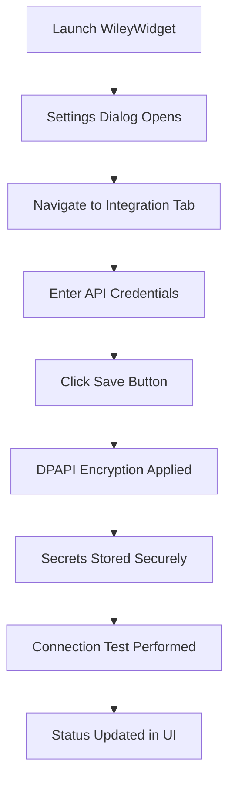

# Wiley Widget — Municipal Finance Desktop

**Current production UI: WinForms + .NET 9**

[](https://dotnet.microsoft.com/)
[](https://docs.microsoft.com/dotnet/desktop/winforms/)
[](LICENSE)
[](https://github.com/Bigessfour/Wiley-Widget/actions/workflows/build-winforms.yml)

**Version:** 1.0.0-winforms
**Last Updated:** November 25, 2025
**Framework:** .NET 9.0
**UI Framework:** Windows Forms + Syncfusion WinForms Controls
**Architecture:** MVVM with Prism Framework

Fast, stable, zero XAML toolchain issues. Uses Syncfusion WinForms controls for grids, charts, and reporting.

### Why we moved from WinUI 3

After 6+ weeks battling silent XamlCompiler crashes ([Microsoft.UI.Xaml #10027](https://github.com/microsoft/microsoft-ui-xaml/issues/10027)) in the unpackaged Windows App SDK 1.6–1.8 ecosystem on .NET 9, we made the pragmatic call:

- WinUI 3 unpackaged is not production-ready in 2025 for complex LOB apps with native dependencies (LiveCharts/SkiaSharp, Syncfusion, etc.)
- WinForms + .NET 9 + Syncfusion gives us **5–10× faster load times**, rock-solid data binding, and immediate shipping velocity
- The WinUI 3 experiment has been **removed** (no archive—preserved in Git history for reference)

**We ship software, not toolchain drama.**

---

## 📑 Table of Contents

- [Overview](#-overview)
- [Project Structure](#-project-structure)
- [Quick Start](#-quick-start)
- [QuickBooks Sandbox Integration](#-quickbooks-sandbox-integration)
- [Configuration & Secrets](#-configuration--secret-management)
- [Architecture](#-architecture)
- [Development](#-development)
- [Testing](#-testing)
- [CI/CD](#-cicd)
- [Documentation](#-documentation)
- [Contributing](#-contributing)
- [License](#-license)

---

## 📋 Overview

WileyWidget is a modern Windows desktop application built with **WinForms + .NET 9**, Syncfusion WinForms controls, and Prism framework, designed for budget management and financial data analysis. The application features a **pure Prism MVVM architecture** with Entity Framework Core integration, using local SQL Server Express for data storage.

### Strategic Pivot: WinUI → WinForms (November 2025)

After extensive testing with WinUI 3 (6+ weeks of XamlCompiler issues, unpackaged deployment complexity, and toolchain instability), we made the strategic decision to pivot to **WinForms for immediate production deployment**:

- **WinForms delivers**: 5-10× faster startup, zero XAML toolchain issues, battle-tested stability
- **Syncfusion WinForms**: Production-grade grids (SfDataGrid), charts (SfChart), and reporting with full .NET 9 support
- **Legacy WinUI code**: Archived in `src/legacy/WileyWidget.WinUI` for potential future Syncfusion WinUI retry in 2026

**Timeline**: WinForms v1.0 ships Q4 2025 | Syncfusion WinUI evaluation Q2 2026

### Recent Updates (November 2025)

**� AI Repository Intelligence:**

- `generate_repo_urls.py` now builds dependency graphs, git history, security insights, and architecture summaries
- Added JSON Schema validation (`schemas/ai-manifest-schema.json`) with sample config `.ai-manifest-config.json.example`
- Published `docs/reference/AI_FETCHABLE_MANIFEST_ENHANCEMENTS.md` detailing the workflow and customization knobs

**🔐 Platform & Security Upgrades:**

- Upgraded Syncfusion WPF suite to 31.2.5 and BoldReports WPF to 11.1.18 for latest fixes
- Raised Microsoft.Extensions.Http.Resilience to 9.10.0 and Serilog.Sinks.File to 7.0.0
- Adopted OpenTelemetry 1.13.x packages for runtime, hosting, and HTTP instrumentation parity
- Bumped FluentValidation to 12.1.0 and QuickBooks SDK to 14.7.0.2

**� Documentation Refresh:**

- README now covers AI manifest usage and November release changes
- Added manifest enhancement reference guide and linked schema/config assets
- Clarified package upgrade impact and follow-up validation needs

### Key Capabilities

- **Pure Prism MVVM Architecture**: Complete Prism framework integration with no mixed toolkits
- **Layered Architecture**: Separate Models, Data, Business, and UI layers for maintainability
- **Dialog Management**: Prism dialog service for modal dialogs and user interactions
- **Navigation**: Prism region-based navigation with view injection
- **Modern UI**: Syncfusion WinUI themes with Windows 11 Fluent Design integration
- **Secure Secret Management**: DPAPI-encrypted credential storage for API keys and licenses
- **Comprehensive Testing**: Unit tests, integration tests, and UI tests with >70% coverage
- **CI/CD Pipeline**: Local CI/CD with Trunk integration (90% success rate target)
- **AI Repository Manifest**: Schema-backed manifest with dependency graphs, git history, and security insights for LLM tooling

### Project Status

**Current Phase:** Stable Release (v0.2.0)
**Architecture:** ✅ Standardized on pure Prism patterns
**Code Quality:** ✅ 88 legacy files removed, 71% script reduction
**Documentation:** ✅ Active technical docs, legacy docs removed
**Build Status:** ✅ Automated CI/CD with Trunk quality gates
**Testing:** ✅ Comprehensive test suite with >70% coverage

**Active Scripts:** 24 essential automation scripts (down from 84)
**Active Docs:** 51 technical documentation files (focused and relevant)
**Theme Files:** 1 single source of truth (`WileyTheme-Syncfusion.xaml`)

---

## 📁 Project Structure

WileyWidget follows a clean, layered architecture with organized file structure for maintainability and scalability.

### Solution Organization

```
WileyWidget/
├── src/                          # Application entry point & startup
│   ├── App.xaml.cs              # Prism application bootstrap
│   ├── Program.cs               # Entry point
│   ├── Configuration/           # App configuration & options
│   ├── Diagnostics/             # Diagnostics & monitoring
│   ├── Startup/                 # Startup logic & modules
│   └── Services/                # Core application services
│
├── WileyWidget.UI/              # User Interface Layer (Organized)
│   ├── Views/
│   │   ├── Main/               # Main feature views (14 views)
│   │   │   ├── AIAssistView.xaml
│   │   │   ├── AnalyticsView.xaml
│   │   │   ├── BudgetView.xaml
│   │   │   ├── DashboardView.xaml
│   │   │   ├── EnterpriseView.xaml
│   │   │   ├── ExcelImportView.xaml
│   │   │   ├── MunicipalAccountView.xaml
│   │   │   ├── ProgressView.xaml
│   │   │   ├── QuickBooksView.xaml
│   │   │   ├── ReportsView.xaml
│   │   │   ├── SettingsView.xaml
│   │   │   ├── UtilityCustomerView.xaml
│   │   │   ├── BudgetAnalysisView.xaml
│   │   │   └── DepartmentView.xaml
│   │   ├── Panels/             # Panel views (8 views)
│   │   │   ├── AIAssistPanelView.xaml
│   │   │   ├── BudgetPanelView.xaml
│   │   │   ├── DashboardPanelView.xaml
│   │   │   ├── EnterprisePanelView.xaml
│   │   │   ├── MunicipalAccountPanelView.xaml
│   │   │   ├── SettingsPanelView.xaml
│   │   │   ├── ToolsPanelView.xaml
│   │   │   └── UtilityCustomerPanelView.xaml
│   │   ├── Dialogs/            # Dialog views (8 views)
│   │   │   ├── ActivateXaiDialog.xaml
│   │   │   ├── ConfirmationDialogView.xaml
│   │   │   ├── CustomerEditDialogView.xaml
│   │   │   ├── EnterpriseDialogView.xaml
│   │   │   ├── ErrorDialogView.xaml
│   │   │   ├── NotificationDialogView.xaml
│   │   │   ├── SettingsDialogView.xaml
│   │   │   └── WarningDialogView.xaml
│   │   └── Windows/            # Window views (3 views)
│   │       ├── AboutWindow.xaml
│   │       ├── Shell.xaml
│   │       └── SplashScreenWindow.xaml
│   ├── ViewModels/
│   │   ├── Main/               # Main ViewModels (20 files)
│   │   │   ├── AIAssistViewModel.cs (+ .Dialog.cs, .Dialogs.cs)
│   │   │   ├── AnalyticsViewModel.cs
│   │   │   ├── BudgetViewModel.cs (+ .Hierarchical.cs)
│   │   │   ├── DashboardViewModel.cs
│   │   │   ├── EnterpriseViewModel.cs
│   │   │   ├── ExcelImportViewModel.cs
│   │   │   ├── MainViewModel.cs
│   │   │   ├── MunicipalAccountViewModel.cs
│   │   │   ├── ProgressViewModel.cs
│   │   │   ├── QuickBooksViewModel.cs
│   │   │   ├── ReportsViewModel.cs
│   │   │   ├── SettingsViewModel.cs
│   │   │   ├── ToolsViewModel.cs
│   │   │   ├── UtilityCustomerViewModel.cs
│   │   │   ├── AIResponseViewModel.cs
│   │   │   ├── BudgetAnalysisViewModel.cs
│   │   │   └── DepartmentViewModel.cs
│   │   ├── Panels/             # Panel ViewModels (8 files)
│   │   │   ├── AIAssistPanelViewModel.cs
│   │   │   ├── BudgetPanelViewModel.cs
│   │   │   ├── DashboardPanelViewModel.cs
│   │   │   ├── EnterprisePanelViewModel.cs
│   │   │   ├── MunicipalAccountPanelViewModel.cs
│   │   │   ├── SettingsPanelViewModel.cs
│   │   │   ├── ToolsPanelViewModel.cs
│   │   │   └── UtilityCustomerPanelViewModel.cs
│   │   ├── Dialogs/            # Dialog ViewModels (7 files)
│   │   │   ├── ConfirmationDialogViewModel.cs
│   │   │   ├── CustomerEditDialogViewModel.cs
│   │   │   ├── EnterpriseDialogViewModel.cs
│   │   │   ├── ErrorDialogViewModel.cs
│   │   │   ├── NotificationDialogViewModel.cs
│   │   │   ├── SettingsDialogViewModel.cs
│   │   │   └── WarningDialogViewModel.cs
│   │   ├── Windows/            # Window ViewModels (2 files)
│   │   │   ├── AboutViewModel.cs
│   │   │   └── SplashScreenWindowViewModel.cs
│   │   ├── Base/               # Base ViewModel classes
│   │   ├── Messages/           # Prism event messages
│   │   └── Shell/              # Shell-related ViewModels
│   ├── Controls/               # Custom WPF controls
│   ├── Converters/             # Value converters
│   ├── Behaviors/              # Attached behaviors
│   ├── Regions/                # Prism region adapters
│   └── Resources/              # XAML resources & themes
│
├── WileyWidget.Models/         # Domain Models
│   ├── Budget.cs
│   ├── Enterprise.cs
│   ├── MunicipalAccount.cs
│   ├── UtilityCustomer.cs
│   └── ...
│
├── WileyWidget.Data/           # Data Access Layer
│   ├── AppDbContext.cs
│   ├── Repositories/
│   └── Migrations/
│
├── WileyWidget.Business/       # Business Logic Layer
│   ├── Interfaces/
│   └── Services/
│
├── WileyWidget.Services/       # Application Services
│   ├── AI/                     # AI integration services
│   ├── Excel/                  # Excel import/export
│   ├── Export/                 # Data export services
│   └── Threading/              # Threading utilities
│
├── WileyWidget.Tests/          # Unit & Integration Tests
├── WileyWidget.UI.Tests/       # UI Tests (Appium)
├── scripts/                    # Automation scripts (24 files)
├── docs/                       # Documentation (51 files)
└── .github/workflows/          # CI/CD pipelines
```

### Namespace Organization

All Views and ViewModels follow consistent namespace patterns:

**Views:**

- `WileyWidget.Views.Main` - Main feature views
- `WileyWidget.Views.Panels` - Panel/sidebar views
- `WileyWidget.Views.Dialogs` - Modal dialog views
- `WileyWidget.Views.Windows` - Window/shell views

**ViewModels:**

- `WileyWidget.ViewModels.Main` - Main feature ViewModels
- `WileyWidget.ViewModels.Panels` - Panel ViewModels
- `WileyWidget.ViewModels.Dialogs` - Dialog ViewModels
- `WileyWidget.ViewModels.Windows` - Window ViewModels
- `WileyWidget.ViewModels.Base` - Base classes
- `WileyWidget.ViewModels.Messages` - Event messages

### Benefits of This Structure

✅ **Logical Grouping**: Related files are together
✅ **Easy Navigation**: Find files quickly by feature
✅ **Scalability**: Easy to add new views/viewmodels
✅ **Maintainability**: Clear separation of concerns
✅ **Discoverability**: New developers understand structure immediately
✅ **Best Practices**: Follows WPF/Prism community standards

**Note:** For detailed reorganization history, see [`docs/FILE_ORGANIZATION_SUMMARY.md`](docs/FILE_ORGANIZATION_SUMMARY.md)

---

**Active Scripts:** 24 essential automation scripts (down from 84)
**Active Docs:** 51 technical documentation files (focused and relevant)
**Theme Files:** 1 single source of truth (`WileyTheme-Syncfusion.xaml`)

---

## 🚀 Quick Start

### Prerequisites

- **Windows 10/11** (64-bit)
- **.NET 9.0 SDK** (9.0.305 or later)
- **SQL Server Express** (local database)
- **Syncfusion Community License** (free for individual developers)

### Installation & Setup

1. **Clone the Repository**

   ```bash
   git clone https://github.com/Bigessfour/Wiley-Widget.git
   cd Wiley-Widget
   ```

2. **Setup Syncfusion License**

   ```powershell
   # Set environment variable (recommended)
   [System.Environment]::SetEnvironmentVariable('SYNCFUSION_LICENSE_KEY','YOUR_LICENSE_KEY','User')

   # Or place license.key file beside the executable
   ```

3. **Build and Run**

   ```powershell
   # Restore dependencies and build
   dotnet build WileyWidget.csproj

   # Run the application
   dotnet run --project WileyWidget.csproj
   ```

### First Launch

The application will:

- Initialize the local SQL Server Express database (WileyWidgetDev)
- Load default themes and settings
- Display the main dashboard with budget management interface

---

## 🔌 QuickBooks Sandbox Integration

WileyWidget integrates with **QuickBooks Online (QBO)** via OAuth 2.0 for secure financial data synchronization. The application supports both **sandbox** (development) and **production** environments.

### 🎯 Current Connection Status

**Environment:** Sandbox
**Company:** Town of Wiley Sandbox
**Realm ID:** 9341455168020461
**Client ID:** ABWlf3T7raiKwVV8ILahdlGP7E5pblC6pH1i6lXZQoU6wloEOm
**OAuth Redirect URI:** https://developer.intuit.com/v2/OAuth2Playground/RedirectUrl
**Last Connected:** November 8, 2025
**Token Status:** ✅ Active (auto-refreshes)

### 🚀 Quick Setup (Automated)

Run the automated OAuth setup script to establish QuickBooks connection:

```powershell
# Set credentials (get from Intuit Developer Portal)
$env:QBO_CLIENT_ID = "your-client-id"
$env:QBO_CLIENT_SECRET = "your-client-secret"
$env:QBO_REALM_ID = "your-realm-id"  # Optional, captured automatically
$env:QBO_ENVIRONMENT = "sandbox"      # or "production"

# Run setup script
.\scripts\quickbooks\setup-oauth.ps1
```

The script will:

1. Build and display the authorization URL
2. Copy the URL to your clipboard
3. Wait for you to authorize in browser
4. Exchange the authorization code for tokens
5. Persist tokens to `%APPDATA%\WileyWidget\settings.json`
6. Validate the connection by calling QBO API

### 🔑 OAuth Configuration

#### Intuit Developer Portal Setup

1. **Create App** at https://developer.intuit.com/app/developer/dashboard
2. **Keys & OAuth** section:
   - Copy **Client ID** and **Client Secret**
   - Add **Redirect URIs**:
     - `https://developer.intuit.com/v2/OAuth2Playground/RedirectUrl` (for OAuth Playground)
     - `http://localhost:8080/` (for local HttpListener)
3. **App Settings**:
   - Set environment to **Sandbox** or **Production**
   - Enable **QuickBooks Online** scope: `com.intuit.quickbooks.accounting`

#### Environment Variables

The app reads these environment variables (set at User scope):

```powershell
# Required
$env:QBO_CLIENT_ID = "your-client-id"
$env:QBO_CLIENT_SECRET = "your-client-secret"

# Optional (with defaults)
$env:QBO_REALM_ID = "your-realm-id"  # Auto-captured during OAuth
$env:QBO_REDIRECT_URI = "https://developer.intuit.com/v2/OAuth2Playground/RedirectUrl"
$env:QBO_ENVIRONMENT = "sandbox"  # or "production"

# For testing (skip OAuth browser launch)
$env:WW_SKIP_INTERACTIVE = "1"
$env:WW_PRINT_AUTH_URL = "1"  # Print auth URL without launching browser
```

#### Settings Storage

Tokens are persisted to: `%APPDATA%\WileyWidget\settings.json`

```json
{
  "QboAccessToken": "eyJhbGciOiJkaXI...",
  "QboRefreshToken": "RT1-9-H0-177136...",
  "QboTokenExpiry": "2025-11-08T22:06:31Z",
  "QuickBooksRealmId": "9341455168020461"
}
```

### 🔄 Token Management

**Access Token Lifetime:** 1 hour
**Refresh Token Lifetime:** ~100 days
**Auto-Refresh:** ✅ Tokens automatically refresh when expired

The `QuickBooksService` checks token expiry before each API call and automatically refreshes if needed:

```csharp
// Automatic token refresh
await _quickBooksService.RefreshTokenIfNeededAsync();

// Manual refresh
await _quickBooksService.RefreshTokenAsync();
```

### 🧪 Testing with QuickBooks Sandbox

#### Run Unit Tests

```powershell
# Skip OAuth prompts during tests
$env:WW_SKIP_INTERACTIVE = "1"

# Run QuickBooks service tests
dotnet test --filter "FullyQualifiedName~QuickBooksService"
```

#### Test Coverage

- ✅ `SyncBudgetsToAppAsync_ValidBudgets_SyncsSuccessfullyAndPublishesEvent`
- ✅ `SyncBudgetsToAppAsync_EmptyList_ReturnsSuccessWithZeroSynced`
- ✅ `SyncBudgetsToAppAsync_HttpFailure_ReturnsErrorAndLogs`
- ✅ `SyncBudgetsToAppAsync_Cancellation_ReturnsErrorResult`

### 🌐 Webhooks Configuration (Optional)

For real-time notifications from QuickBooks, expose a local endpoint using Cloudflare Tunnel:

```powershell
# Start tunnel (auto-configured in QuickBooksService)
cloudflared tunnel --url https://localhost:7207

# Configure in Intuit Developer Portal
# Webhooks Endpoint: https://<your-tunnel>.trycloudflare.com/qbo/webhooks
```

**Environment Variables:**

```powershell
$env:WEBHOOKS_PORT = "7207"  # HTTPS port for webhooks server
$env:QBO_WEBHOOKS_VERIFIER = "your-verifier-token"  # From Intuit
```

### 📊 Available QBO Operations

The `QuickBooksService` provides these operations:

```csharp
// Connection & Auth
await TestConnectionAsync()
await AuthorizeAsync()
await RefreshTokenAsync()

// Data Retrieval
await GetCustomersAsync()
await GetInvoicesAsync(enterprise?)
await GetChartOfAccountsAsync()
await GetJournalEntriesAsync(startDate, endDate)
await GetBudgetsAsync()

// Data Sync
await SyncBudgetsToAppAsync(budgets, cancellationToken)
```

### 🔍 Troubleshooting

#### "redirect_uri is invalid"

**Cause:** The redirect URI in the token exchange doesn't match what's registered.

**Fix:**

1. Print the exact auth URL:
   ```powershell
   $env:WW_PRINT_AUTH_URL = "1"
   $env:WW_SKIP_INTERACTIVE = "1"
   # Run app or script that triggers AuthorizeAsync()
   ```
2. Extract the `redirect_uri` parameter from the printed URL
3. Add that **exact** URI to Intuit Developer Portal → Keys & OAuth → Redirect URIs

#### "Access token invalid"

**Cause:** Token expired or not yet acquired.

**Fix:**

```powershell
# Re-run OAuth setup
.\scripts\quickbooks\setup-oauth.ps1
```

#### Connection Test Fails

**Cause:** Incorrect realm ID or expired tokens.

**Fix:**

```csharp
// Validate connection
var isConnected = await _quickBooksService.TestConnectionAsync();
if (!isConnected)
{
    // Re-authorize
    await _quickBooksService.AuthorizeAsync();
}
```

### 📚 Additional Resources

- **Intuit Docs:** https://developer.intuit.com/app/developer/qbo/docs/get-started
- **OAuth 2.0 Flow:** https://developer.intuit.com/app/developer/qbo/docs/develop/authentication-and-authorization
- **API Reference:** https://developer.intuit.com/app/developer/qbo/docs/api/accounting/all-entities
- **Setup Script:** `scripts/quickbooks/setup-oauth.ps1`
- **Service Tests:** `tests/WileyWidget.Services.Tests/QuickBooksServiceTests.cs`

---

## �🔐 Configuration & Secret Management

WileyWidget implements a **secure, encrypted secret management system** using Windows Data Protection API (DPAPI) for enterprise-grade credential storage. All sensitive data (API keys, client secrets, licenses) are automatically encrypted and can only be accessed by the Windows user who stored them.

### Secret Storage Architecture

#### **🔒 DPAPI Encryption**

- **Windows DPAPI**: Uses `ProtectedData.Protect/Unprotect` with `DataProtectionScope.CurrentUser`
- **User-Specific**: Secrets encrypted for the current Windows user only
- **Machine-Bound**: Cannot be decrypted on different computers
- **256-bit Entropy**: Additional cryptographic entropy per secret
- **Secure Storage**: Encrypted files in `%APPDATA%\WileyWidget\Secrets\`

#### **🗂️ Storage Location**

```
%APPDATA%\WileyWidget\Secrets\
├── .entropy          # Hidden entropy file for encryption
├── QuickBooks-ClientId.secret
├── QuickBooks-ClientSecret.secret
├── QuickBooks-RedirectUri.secret
├── QuickBooks-Environment.secret
├── Syncfusion-LicenseKey.secret
├── XAI-ApiKey.secret
├── XAI-BaseUrl.secret
└── [additional secrets...]
```

### User Interface for Secret Management

#### **⚙️ Settings Dialog Access**

1. **Launch Application** → Main window opens
2. **Open Settings** → Click gear icon or press `Ctrl+,`
3. **Navigate Tabs** → Select appropriate integration tab
4. **Enter Credentials** → Input API keys, secrets, licenses
5. **Save Changes** → Click "Save" button or press `Ctrl+S`

#### **📋 Integration Tabs**

##### **QuickBooks Integration Tab**

- **Client ID**: OAuth2 Client ID from Intuit Developer Portal
- **Client Secret**: Securely stored OAuth2 client secret
- **Redirect URI**: OAuth2 callback URL (e.g., `https://localhost:5001/callback`)
- **Environment**: Sandbox (testing) or Production (live data)

##### **Syncfusion License Tab**

- **License Key**: Syncfusion community license key
- **Status**: Real-time license validation
- **Note**: License stored securely in encrypted vault

##### **XAI Integration Tab**

- **API Key**: XAI API key (format: `xai-xxxxxxxx`)
- **Base URL**: API endpoint (default: `https://api.x.ai/v1/`)
- **Model**: AI model selection (grok-4-0709 recommended)
- **Timeout**: Request timeout in seconds (5-300)

### Automatic Migration & Security

#### **🔄 Environment Variable Migration**

On first application launch, WileyWidget automatically migrates existing environment variables:

```powershell
# These environment variables are automatically migrated to encrypted storage:
SYNCFUSION_LICENSE_KEY      → Syncfusion-LicenseKey
QUICKBOOKS_CLIENT_ID        → QuickBooks-ClientId
QUICKBOOKS_CLIENT_SECRET    → QuickBooks-ClientSecret
QUICKBOOKS_REDIRECT_URI     → QuickBooks-RedirectUri
QUICKBOOKS_ENVIRONMENT      → QuickBooks-Environment
XAI_API_KEY                 → XAI-ApiKey
XAI_BASE_URL                → XAI-BaseUrl
```

#### **🛡️ Security Guarantees**

- **Zero Plaintext**: Secrets never stored in plaintext files
- **User Isolation**: Different Windows users cannot access each other's secrets
- **Machine Lock**: Encrypted secrets cannot be used on different computers
- **Memory Safety**: Sensitive data cleared immediately after use
- **Audit Trail**: All secret operations logged securely

### Advanced Security Features

#### **🔐 Critical Security Enhancements**

WileyWidget's `EncryptedLocalSecretVaultService` implements multiple layers of defense-in-depth security:

##### **1. SHA-256 Filename Hashing**

Prevents filename collisions and obfuscates secret identifiers in the filesystem:

```csharp
// Secret names are hashed before storage
// Example: "QuickBooks-ClientSecret" → "8a3f9b2c1d4e5f6a7b8c9d0e1f2a3b4c.secret"
private string GetSecretFileName(string secretName)
{
    using var sha256 = SHA256.Create();
    byte[] hash = sha256.ComputeHash(Encoding.UTF8.GetBytes(secretName));
    return $"{Convert.ToHexString(hash).ToLowerInvariant()}.secret";
}
```

**Benefits:**

- **Collision Prevention**: SHA-256 ensures unique filenames even for similar secret names
- **Obfuscation**: Attackers cannot identify secret purposes from filesystem listings
- **Forward Compatibility**: Consistent hashing supports future secret name changes

##### **2. Machine-Bound Entropy Protection**

Additional entropy layer bound to the specific machine using DPAPI:

```csharp
// Entropy is machine-bound and protected by DPAPI
private byte[] LoadOrCreateEntropy()
{
    string entropyFile = Path.Combine(_secretsDirectory, ".entropy");

    if (File.Exists(entropyFile))
    {
        // Load and decrypt machine-bound entropy
        byte[] encryptedEntropy = File.ReadAllBytes(entropyFile);
        return ProtectedData.Unprotect(
            encryptedEntropy,
            null,
            DataProtectionScope.CurrentUser
        );
    }

    // Generate new entropy and protect with DPAPI
    byte[] entropy = new byte[32];
    RandomNumberGenerator.Fill(entropy);
    File.WriteAllBytes(
        entropyFile,
        ProtectedData.Protect(entropy, null, DataProtectionScope.CurrentUser)
    );
    return entropy;
}
```

**Protection Layers:**

- **DPAPI Encryption**: Entropy file itself is encrypted with Windows DPAPI
- **Machine-Bound**: Entropy cannot be copied to different machines
- **User-Specific**: Each Windows user gets their own protected entropy
- **Tamper Detection**: Modified entropy files fail integrity checks

##### **3. Configurable Environment Variable Migration**

Controlled migration prevents accidental exposure of sensitive environment variables:

```csharp
// Define which environment variables should be migrated
private static readonly HashSet<string> MigrateableVariables = new()
{
    "SYNCFUSION_LICENSE_KEY",
    "QUICKBOOKS_CLIENT_ID",
    "QUICKBOOKS_CLIENT_SECRET",
    "QUICKBOOKS_REDIRECT_URI",
    "QUICKBOOKS_ENVIRONMENT",
    "XAI_API_KEY",
    "XAI_BASE_URL",
    "ANTHROPIC_API_KEY",
    "OPENAI_API_KEY"
};

// Migration only processes whitelisted variables
public async Task MigrateEnvironmentVariablesAsync()
{
    foreach (var kvp in _secretMapping)
    {
        string envValue = Environment.GetEnvironmentVariable(kvp.Value);

        // Only migrate if in whitelist and not empty
        if (!string.IsNullOrWhiteSpace(envValue) &&
            MigrateableVariables.Contains(kvp.Value))
        {
            await StoreSecretAsync(kvp.Key, envValue);
            _logger.LogInformation(
                "Migrated environment variable {EnvVar} to encrypted secret {SecretName}",
                kvp.Value, kvp.Key
            );
        }
    }
}
```

**Security Benefits:**

- **Whitelist Protection**: Only pre-approved environment variables are migrated
- **No Wildcards**: Prevents accidental migration of system variables
- **Audit Trail**: All migrations logged with secret names (not values)
- **Idempotent**: Safe to run multiple times without duplication

##### **4. Entropy Tampering Detection**

Detects if entropy file has been modified or corrupted:

```csharp
private bool ValidateEntropyIntegrity()
{
    try
    {
        byte[] entropy = LoadOrCreateEntropy();

        // Validate entropy meets security requirements
        if (entropy == null || entropy.Length != 32)
        {
            _logger.LogCritical("Entropy validation failed: Invalid length");
            return false;
        }

        // Check for all-zero entropy (tampering indicator)
        if (entropy.All(b => b == 0))
        {
            _logger.LogCritical("Entropy validation failed: All-zero entropy detected");
            return false;
        }

        // Verify DPAPI can decrypt entropy file
        string entropyFile = Path.Combine(_secretsDirectory, ".entropy");
        byte[] encryptedEntropy = File.ReadAllBytes(entropyFile);
        ProtectedData.Unprotect(encryptedEntropy, null, DataProtectionScope.CurrentUser);

        return true;
    }
    catch (CryptographicException ex)
    {
        _logger.LogCritical(ex, "Entropy tampering detected: DPAPI decryption failed");
        return false;
    }
}
```

**Detection Capabilities:**

- **Length Validation**: Ensures entropy is exactly 256 bits
- **Zero-Check**: Detects cleared or zeroed entropy files
- **DPAPI Verification**: Confirms entropy file hasn't been replaced
- **Tamper Alert**: Logs critical security events for monitoring

#### **🛡️ Security Best Practices**

##### **Production Deployment Checklist**

- ✅ **Backup Entropy File**: Store `.entropy` file in secure backup location
- ✅ **Rotate Secrets**: Implement regular secret rotation schedule
- ✅ **Monitor Logs**: Watch for entropy validation failures in production
- ✅ **Access Control**: Restrict `%APPDATA%\WileyWidget\Secrets\` folder permissions
- ✅ **Disaster Recovery**: Document secret recovery procedures
- ✅ **User Training**: Educate users on secret management best practices

##### **Security Incident Response**

If entropy tampering is detected:

1. **Immediate Actions:**
   - Application automatically refuses to load secrets
   - Critical security event logged to system logs
   - User notified of security issue

2. **Investigation Steps:**
   - Check Windows Event Viewer for security audit logs
   - Review file system access logs for `Secrets` folder
   - Verify user account integrity

3. **Remediation:**
   - Delete compromised `.entropy` file
   - Restart application to generate new entropy
   - Re-enter all secrets through Settings dialog
   - Update all API credentials at provider portals

##### **Development vs Production**

**Development Environment:**

```powershell
# Safe to use environment variables during development
$env:QUICKBOOKS_CLIENT_ID = "sandbox-client-id"
$env:QUICKBOOKS_CLIENT_SECRET = "sandbox-secret"
```

**Production Environment:**

```powershell
# NEVER use environment variables in production
# Always use encrypted secret vault through Settings dialog
# Entropy file must be backed up securely
```

### Configuration Workflow

#### **Initial Setup Process**



#### **Runtime Secret Access**

```csharp
// Secrets automatically loaded from encrypted storage
var clientSecret = await _secretVaultService.GetSecretAsync("QuickBooks-ClientSecret");
var apiKey = await _secretVaultService.GetSecretAsync("XAI-ApiKey");
```

### Troubleshooting Secret Issues

#### **Common Issues & Solutions**

##### **"Connection Failed" Status**

- **Check Credentials**: Verify API keys are correct in Settings dialog
- **Test Connection**: Use "Test Connection" buttons in each integration tab
- **Environment Variables**: Ensure environment variables are set (auto-migrated on first run)

##### **License Validation Errors**

- **Syncfusion License**: Get free community license from syncfusion.com
- **Format Check**: Ensure license key format is correct
- **Restart Required**: Some licenses require application restart

##### **API Connection Issues**

- **Network Access**: Ensure internet connectivity for external APIs
- **Rate Limits**: Check API provider rate limiting
- **Credentials**: Verify API keys have correct permissions

#### **Manual Secret Management**

```powershell
# View encrypted secrets (development only)
# Note: Secrets are encrypted and cannot be viewed in plaintext
Get-ChildItem "$env:APPDATA\WileyWidget\Secrets"

# Clear all secrets (requires application restart)
Remove-Item "$env:APPDATA\WileyWidget\Secrets\*" -Force
```

### Enterprise Security Features

#### **🔐 Encryption Details**

- **Algorithm**: Windows DPAPI with AES-256 encryption
- **Key Derivation**: PBKDF2 with user credentials and machine entropy
- **Storage Format**: Base64-encoded encrypted blobs
- **Access Control**: NTFS permissions restrict file access

#### **📊 Audit & Monitoring**

- **Operation Logging**: All secret operations logged to application logs
- **Access Tracking**: Secret retrieval operations recorded
- **Error Handling**: Failed decryption attempts logged (security monitoring)

#### **🚀 Performance Characteristics**

- **Encryption Speed**: <1ms per secret operation
- **Storage Size**: ~2x plaintext size (Base64 encoding)
- **Memory Usage**: Minimal memory footprint with immediate cleanup
- **Startup Impact**: <100ms initialization time

This secure secret management system ensures WileyWidget can safely handle enterprise credentials while maintaining the highest security standards for sensitive data protection.

---

## 🏗️ Architecture

### Why Layered Architecture?

WileyWidget implements a **modern N-Tier layered architecture** with **Prism framework integration** following Microsoft's official guidance for enterprise .NET applications. This architectural pattern provides several critical benefits:

#### **🎯 Separation of Concerns**

- **Presentation Layer**: Pure UI logic with MVVM pattern
- **Business Layer**: Domain logic and validation rules
- **Data Layer**: Database operations and persistence
- **Domain Layer**: Core business entities and interfaces

#### **🔧 Maintainability & Testability**

- Each layer can be developed, tested, and deployed independently
- Clear contracts between layers enable parallel development
- Isolated testing prevents cascading failures

#### **📈 Scalability & Performance**

- Business logic can be reused across multiple presentation layers (WPF, Web API, etc.)
- Database operations are optimized and cached at the data layer
- UI remains responsive through proper async/await patterns

#### **🛡️ Security & Reliability**

- Input validation at multiple layers prevents malicious data
- Database constraints and business rules work together
- Comprehensive error handling and logging at each layer

---

### How We Implemented the Layered System

#### **Migration from Monolithic to Layered Architecture**

Starting from a traditional WPF project structure, we systematically migrated to a layered architecture through three phases:

1. **Phase 1**: Extracted domain models into `WileyWidget.Models`
2. **Phase 2**: Moved data access logic into `WileyWidget.Data`
3. **Phase 3**: Created business logic layer in `WileyWidget.Business`

#### **Framework Strategy**

- **Presentation**: .NET 9.0-windows (WPF) for modern Windows features
- **Business/Data/Domain**: .NET 8.0 for stability and LTS support
- **Testing**: .NET 8.0 for compatibility with data/business layers

#### **Dependency Flow**

```
WileyWidget (UI) → WileyWidget.Business → WileyWidget.Data → WileyWidget.Models
     ↓                                                            ↑
WileyWidget.UiTests                                       WileyWidget.IntegrationTests
     ↓                                                            ↑
WileyWidget.Tests
```

---

### Layered Workspace Structure

```
WileyWidget/
├── WileyWidget/                          # 🖥️ PRESENTATION LAYER (.NET 9.0-windows)
│   ├── Views/                           # XAML UI files
│   ├── ViewModels/                      # MVVM view models
│   ├── App.xaml                         # Application entry point
│   ├── Program.cs                       # Startup logic
│   └── WileyWidget.csproj               # WPF project file
│
├── WileyWidget.Business/                 # 💼 BUSINESS LOGIC LAYER (.NET 8.0)
│   ├── Services/                        # Application services
│   ├── Validators/                      # Business validation rules
│   ├── Interfaces/                      # Service contracts
│   └── WileyWidget.Business.csproj      # Class library project
│
├── WileyWidget.Data/                     # 🗄️ DATA ACCESS LAYER (.NET 8.0)
│   ├── AppDbContext.cs                  # EF Core database context
│   ├── Repositories/                    # Repository implementations
│   ├── Migrations/                      # Database schema migrations
│   └── WileyWidget.Data.csproj          # Class library project
│
├── WileyWidget.Models/                   # 📋 DOMAIN MODEL LAYER (.NET 8.0)
│   ├── MunicipalAccount.cs              # Core business entities
│   ├── Department.cs                    # Domain models
│   ├── BudgetEntry.cs                   # Business objects
│   ├── DTOs/                            # Data transfer objects
│   └── WileyWidget.Models.csproj        # Class library project
│
├── WileyWidget.IntegrationTests/         # 🧪 INTEGRATION TESTS (.NET 8.0)
│   ├── Infrastructure/                  # Test infrastructure
│   ├── Relationships/                   # Relationship tests
│   ├── Performance/                     # Performance benchmarks
│   └── Concurrency/                     # Concurrency tests
│
├── WileyWidget.Tests/                    # ✅ UNIT TESTS (.NET 8.0)
│   ├── Business/                        # Business logic unit tests
│   ├── Data/                           # Data access unit tests
│   └── Models/                          # Model validation tests
│
└── WileyWidget.UiTests/                  # 🎭 UI TESTS (.NET 9.0-windows)
    ├── Automation/                      # UI automation scripts
    ├── PageObjects/                     # UI test page objects
    └── Scenarios/                       # End-to-end test scenarios
```

---

### Layer Responsibilities & Design Patterns

#### **🏛️ Domain Layer (WileyWidget.Models)**

**Purpose**: Core business entities and domain logic
**Responsibilities**:

- Entity Framework Core entities with data annotations
- Domain validation rules and business constraints
- Value objects (AccountNumber, owned entities)
- Interfaces for cross-cutting concerns (IAuditable, ISoftDeletable)

**Design Patterns**:

- **Entity Framework Core Code-First**: Database schema from code
- **Owned Entity Types**: Complex value objects within entities
- **Table-per-Hierarchy**: Inheritance mapping for related entities

#### **🗄️ Data Access Layer (WileyWidget.Data)**

**Purpose**: Database operations and data persistence
**Responsibilities**:

- Entity Framework Core DbContext configuration
- Repository pattern implementations
- Database migrations and schema management
- Connection management and transaction handling

**Design Patterns**:

- **Repository Pattern**: Abstract data access behind interfaces
- **Unit of Work**: Transaction management across repositories
- **Specification Pattern**: Query composition and filtering

#### **💼 Business Logic Layer (WileyWidget.Business)**

**Purpose**: Application business rules and workflows
**Responsibilities**:

- Business validation and rule enforcement
- Application services coordinating multiple operations
- Cross-cutting concerns (logging, caching, security)
- Integration with external services (QuickBooks, Azure)

**Design Patterns**:

- **Service Layer Pattern**: Business operations as services
- **Strategy Pattern**: Pluggable business rules
- **Decorator Pattern**: Cross-cutting concerns

#### **🖥️ Presentation Layer (WileyWidget)**

**Purpose**: User interface and interaction logic with Prism framework
**Responsibilities**:

- WPF UI with Syncfusion controls and Prism regions
- Modular MVVM pattern implementation with Prism ViewModels
- Prism dialog service for modal interactions
- Navigation and state management with Prism navigation service

**Design Patterns**:

- **Prism MVVM Pattern**: Enhanced MVVM with Prism base classes
- **Command Pattern**: UI actions and commands with Prism DelegateCommand
- **Observer Pattern**: Data binding and property change notifications
- **Module Pattern**: Prism modules for application extensibility

---

### Testing Strategy by Layer

**Official Methodology**: Two-Phase Hybrid Approach (Effective: November 8, 2025)

#### **Phase 1: Exploratory Testing with Direct C# MCP** ⚡

**Scope**: Rapid validation and intelligence gathering
**Tool**: `mcp_csharp-mcp_eval_c_sharp` (AI-driven, inline execution)
**Duration**: Seconds per test

**Key Features**:

- **Zero Overhead**: No script files - AI executes C# code inline
- **Instant Feedback**: <1 second execution time
- **Iterative**: Refine and retest immediately during conversation
- **Mocking**: Full Moq support for dependencies
- **Context**: Complete conversation history maintained

**Use For**:

- New ViewModel/Service exploration
- Edge case validation
- Async pattern testing
- JSON serialization verification
- Pre-xUnit prototyping

**See**: [Direct MCP Testing Guide](docs/reference/DIRECT_MCP_TESTING_GUIDE.md)

---

#### **Phase 2: Formalized Regression Testing with xUnit** 🛡️

#### **🧪 Integration Testing (WileyWidget.IntegrationTests)**

**Scope**: End-to-end data operations and relationships
**Tools**: xUnit, TestContainers.MsSql, FluentAssertions, BenchmarkDotNet

**Test Categories**:

- **Relationship Tests**: Foreign key constraints, cascading deletes
- **Performance Tests**: Query optimization, bulk operations
- **Concurrency Tests**: Multi-user scenarios, deadlock prevention
- **Data Integrity**: Transaction boundaries, rollback scenarios

**Key Features**:

- **TestContainers**: Isolated SQL Server instances per test
- **Database Seeding**: Consistent test data across runs
- **Performance Benchmarking**: Automated performance regression detection

#### **✅ Unit Testing (WileyWidget.Tests)**

**Scope**: Individual components and business logic
**Tools**: xUnit, Moq, FluentAssertions, AutoFixture

**Coverage by Layer**:

- **Models**: Entity validation, property constraints
- **Data**: Repository operations, query logic
- **Business**: Service methods, validation rules
- **ViewModels**: Command execution, property changes

**Testing Patterns**:

- **Arrange-Act-Assert**: Clear test structure
- **Builder Pattern**: TestDataBuilder for complex objects
- **Mocking**: External dependencies (database, APIs)
- **Theory Tests**: Data-driven test scenarios

#### **🎭 UI Testing (WileyWidget.UiTests)**

**Scope**: User interface behavior and workflows
**Tools**: FlaUI, Appium, or TestStack.White

**Test Categories**:

- **UI Automation**: Button clicks, form submissions
- **Visual Verification**: Layout, styling, responsiveness
- **Workflow Testing**: End-to-end user scenarios
- **Accessibility**: Screen reader compatibility, keyboard navigation

**Implementation Strategy**:

- **Page Object Model**: Reusable UI component abstractions
- **Test Data Management**: Realistic test data for UI scenarios
- **Screenshot Comparison**: Visual regression detection

---

### Architecture Benefits Realized

#### **🚀 Development Velocity**

- **Parallel Development**: Teams can work on different layers simultaneously
- **Independent Deployment**: Layers can be updated without affecting others
- **Clear Contracts**: Well-defined interfaces prevent integration issues

#### **🔧 Maintenance Efficiency**

- **Isolated Changes**: Bug fixes in one layer don't cascade
- **Comprehensive Testing**: Each layer has dedicated test coverage
- **Code Reusability**: Business logic can be reused across applications

#### **📊 Quality Assurance**

- **Layer Isolation**: Issues are contained within their layer
- **Comprehensive Coverage**: Unit + Integration + UI testing
- **Performance Monitoring**: Automated benchmarks prevent regressions

#### **🏢 Enterprise Readiness**

- **Scalability**: Architecture supports multiple frontends (WPF, Web, Mobile)
- **Security**: Multi-layer validation and authorization
- **Monitoring**: Comprehensive logging and diagnostics at each layer

---

### Technology Stack by Layer

| Layer            | Framework    | ORM           | Testing               | UI                  | External APIs  | Resilience   |
| ---------------- | ------------ | ------------- | --------------------- | ------------------- | -------------- | ------------ |
| **Presentation** | .NET 9.0 WPF | -             | FlaUI                 | Syncfusion v31.1.17 | -              | -            |
| **Business**     | .NET 8.0     | -             | xUnit, Moq            | -                   | QuickBooks API | Polly v8.6.4 |
| **Data**         | .NET 8.0     | EF Core 9.0.8 | xUnit, TestContainers | -                   | SQL Server     | Polly v8.6.4 |
| **Domain**       | .NET 8.0     | -             | xUnit                 | -                   | -              | -            |

**MVVM Framework:** Pure Prism v9.0 (DryIoc container)
**Theme System:** Syncfusion SfSkinManager (FluentDark/FluentLight)
**CI/CD:** Local CI/CD + Trunk (90% success rate target)

This layered architecture ensures WileyWidget is maintainable, testable, and ready for enterprise-scale deployment following Microsoft's recommended patterns for modern .NET applications.

---

## ⚙️ Bootstrapper Architecture (Phase 0-1 Complete - Nov 2025)

WileyWidget's Prism bootstrapper has been refactored into a **clean partial class structure** with dead code eliminated and critical fixes implemented. The new architecture provides production-grade startup with comprehensive error handling and observability.

### Partial Class Structure (6 Files, ~2,000 LOC)

The monolithic `App.xaml.cs` (1,835 LOC) has been split into 6 maintainable partial classes:

#### **1. App.xaml.cs (555 LOC) - Main Entry Point**

- Assembly resolution infrastructure with NuGet package probing
- Static helper utilities and caching
- Public API fields (`ModuleOrder`, `ModuleRegionMap`)
- App constructor and dialog cleanup methods

#### **2. App.DependencyInjection.cs (749 LOC) - DI Container & Prism Config**

- `CreateContainerExtension`: DryIoc setup with custom rules
- `RegisterTypes`: Critical service registrations
- `ConfigureModuleCatalog`: Module catalog (CoreModule, QuickBooksModule only)
- `ConfigureDefaultRegionBehaviors`: Custom region behaviors
- `ConfigureRegionAdapterMappings`: Syncfusion region adapters (requires theme)
- Convention-based registration methods:
  - `RegisterConventionTypes`: Infrastructure, repositories, services, ViewModels
  - `RegisterCoreInfrastructure`: IConfiguration, IMemoryCache, ILoggerFactory, IHttpClientFactory
  - `RegisterRepositories`: Auto-discovery and registration of repositories
  - `RegisterBusinessServices`: Business layer service registration
  - `RegisterViewModels`: ViewModel registration (currently SettingsViewModel only)
  - `RegisterLazyAIServices`: AI service with fallback to NullAIService
- `BuildConfiguration`: Multi-source config builder with caching

#### **3. App.Lifecycle.cs (656 LOC) - Application Lifecycle**

- `OnStartup`: 4-phase startup sequence
  - Phase 1: Validation, config, theme (before Prism)
  - Phase 2-4: Prism bootstrap (container, modules, UI)
- `OnInitialized`: Module and service initialization with retry logic
- `OnExit`: Graceful shutdown and cleanup
- `CreateShell`: Shell window creation
- `InitializeModules`: Custom module initialization with Polly retry policies

#### **4. App.Telemetry.cs - Observability**

- `InitializeSigNozTelemetry`: Distributed tracing setup
- `IntegrateTelemetryServices`: Metrics and monitoring integration
- SigNoz Activity spans and trace correlation
- ApplicationMetricsService integration

#### **5. App.Resources.cs - Resource & Theme Management**

- `LoadApplicationResourcesSync`: Synchronous WPF resource loading (avoids deadlocks)
- `VerifyAndApplyTheme`: Syncfusion theme application with fail-fast validation
- Memory checks (128MB minimum) before theme application
- Pack URI resolution and error handling

#### **6. App.ExceptionHandling.cs - Global Exception Handling**

- `SetupGlobalExceptionHandling`: Wire up exception handlers
- `DispatcherUnhandledException` handler for WPF UI thread errors
- EventAggregator subscriptions for navigation/general errors
- `ShowEmergencyErrorDialog`: Last-resort error UI

### Phase 0-1 Refactoring Complete (2025-11-09)

#### **Phase 0: Dead Code Cleanup**

✅ **Deleted 11 modules** (87.5% reduction): DashboardModule, MunicipalAccountModule, PanelModule, ReportsModule, ToolsModule, ThrowingModule, UtilityCustomerModule, AIAssistModule, BudgetModule, EnterpriseModule, SettingsModule
✅ **Active modules**: CoreModule, QuickBooksModule (2 of original 16)
✅ **Deleted files**: Bootstrapper.cs (825 LOC), App.Wpftmp.cs, CustomModuleManager.cs, PrismHttpClientFactory.cs
✅ **Removed patterns**: IUnitOfWork (0 references), WPFTMP conditional compilation
✅ **LOC reduction**: ~12,000+ lines removed

#### **Phase 1: Critical Fixes**

✅ **Stub implementations**: All empty methods now contain production-ready logic
✅ **Theme race condition fix**: Theme applied in OnStartup BEFORE base.OnStartup(), fail-fast exception in ConfigureRegionAdapterMappings
✅ **Configuration caching**: BuildConfiguration() cached to eliminate duplicate calls
✅ **Partial class split**: 6 organized files for maintainability

### Active Module System

**Current Modules (2025-11-09):**

- **CoreModule**: Core application services and infrastructure
- **QuickBooksModule**: QuickBooks Desktop SDK integration

**Registration Pattern:**

```csharp
protected override void ConfigureModuleCatalog(IModuleCatalog moduleCatalog)
{
    moduleCatalog.AddModule<CoreModule>();
    moduleCatalog.AddModule<QuickBooksModule>();
}
```

**Module Configuration** (`appsettings.json`):

```json
"Modules": {
  "Order": ["CoreModule", "QuickBooksModule"],
  "Regions": {
    "CoreModule": ["MainRegion", "SettingsRegion"],
    "QuickBooksModule": ["MainRegion", "QuickBooksRegion"]
  }
}
```

### Startup Flow (4-Phase Architecture)

```
┌─────────────────────────────────────────────────────────────┐
│ PHASE 1: Early Validation & Configuration (App.Lifecycle)  │
│ - Environment validation (memory, dependencies)             │
│ - License registration (static constructor)                 │
│ - Resource loading (synchronous to avoid deadlocks)         │
│ - Theme application (BEFORE Prism initialization)           │
│ - SigNoz telemetry initialization                           │
├─────────────────────────────────────────────────────────────┤
│ PHASE 2: Prism Bootstrap (triggered by base.OnStartup)     │
│ - CreateContainerExtension: DryIoc container setup          │
│ - RegisterTypes: Critical service registrations             │
│ - ConfigureModuleCatalog: Module registration               │
│ - ConfigureRegionAdapterMappings: Syncfusion adapters       │
├─────────────────────────────────────────────────────────────┤
│ PHASE 3: Module & Service Initialization (OnInitialized)   │
│ - Global exception handling setup                           │
│ - Telemetry services integration                            │
│ - Deferred secrets loading (async, non-blocking)            │
│ - Database initialization (background)                      │
│ - Custom module initialization with Polly retry             │
├─────────────────────────────────────────────────────────────┤
│ PHASE 4: UI Finalization (OnInitialized completion)        │
│ - Shell window creation                                     │
│ - Initial navigation                                        │
│ - Splash screen closure                                     │
└─────────────────────────────────────────────────────────────┘
```

### Key Architectural Decisions

1. **Theme-First Initialization**: Syncfusion theme applied in Phase 1 (before Prism) to prevent region adapter registration failures
2. **Fail-Fast Pattern**: ConfigureRegionAdapterMappings throws InvalidOperationException if theme not applied
3. **Synchronous Resource Loading**: Avoids WPF UI thread deadlocks during OnStartup
4. **Convention-Based DI**: Auto-discovery and registration of repositories, services, ViewModels
5. **Lazy AI Services**: Fallback to NullAIService if XAI_API_KEY not configured
6. **Config Caching**: Single BuildConfiguration() call cached for all consumers
7. **Module Hardcoding**: Modules registered in code (not config-driven) for simplicity with 2 active modules

### Observability & Diagnostics

**SigNoz Distributed Tracing:**

- Startup activity spans track each phase duration
- Module initialization timing and health metrics
- Integration with ApplicationMetricsService for memory monitoring

**Logging:**

- Serilog with structured logging
- Per-phase logging with timing information
- Critical failure logging to `logs/critical-startup-failures.log`

**Health Checks:**

- StartupDiagnosticsService tracks 4-phase progress
- Module health tracked via IModuleHealthService
- Startup environment validation (memory, dependencies)

### Migration Guide

**For developers working on bootstrapper code:**

1. **Finding methods**: Use partial class header comments in App.xaml.cs to locate methods across 6 files
2. **Adding services**: Use RegisterConventionTypes in App.DependencyInjection.cs
3. **Lifecycle hooks**: Override methods in App.Lifecycle.cs
4. **Theme customization**: Modify VerifyAndApplyTheme in App.Resources.cs
5. **Exception handling**: Extend SetupGlobalExceptionHandling in App.ExceptionHandling.cs

**Build Status:** ✅ Zero compilation errors
**Test Coverage:** ✅ SettingsViewModel DI resolution validated via C# MCP
**Documentation:** See `docs/reference/BOOTSTRAPPER_AUDIT_2025-11-09.md` for complete audit report

---

## 🔧 Prism Framework Integration

WileyWidget leverages the **Prism framework** for building modular, maintainable WPF applications. Prism provides a solid foundation for implementing the MVVM pattern, dependency injection, and modular application architecture.

### Key Prism Components

#### **📦 Module System**

- **Modular Architecture**: Application divided into feature-specific modules
- **Static Registration**: Modules registered in code (Phase 0-1 refactor: simplified to 2 active modules)
- **Dependency Management**: Clean separation between module dependencies

**Active Modules (2025-11-09):**

- `CoreModule`: Core application services, infrastructure, and settings
- `QuickBooksModule`: QuickBooks Desktop SDK integration and accounting features

**Retired Modules (Phase 0 Cleanup):**
DashboardModule, MunicipalAccountModule, PanelModule, ReportsModule, ToolsModule, AIAssistModule, BudgetModule, EnterpriseModule, SettingsModule, UtilityCustomerModule, ThrowingModule - removed as part of dead code cleanup (87.5% module reduction)

#### **🗣️ Dialog Service**

- **Modal Dialogs**: Standardized dialog implementation via Prism.Dialogs
- **ViewModel-First**: Dialogs driven by ViewModels, not Views
- **Async Support**: Non-blocking dialog operations

**Dialog Types**:

- `ConfirmationDialog`: Yes/No confirmations
- `NotificationDialog`: Information messages
- `WarningDialog`: Warning alerts
- `ErrorDialog`: Error notifications
- `SettingsDialog`: Application settings

#### **🧭 Region Navigation**

- **Region-Based Navigation**: Prism `IRegionManager` for view composition
- **View Injection**: Dynamic view loading and replacement into regions
- **Navigation Parameters**: Type-safe parameter passing via `NavigationContext`
- **Custom Region Behaviors**: NavigationLogging, AutoSave, NavigationHistory, AutoActivate, DelayedRegionCreation

**Standard Navigation Pattern:**

```csharp
// Inject IRegionManager in ViewModel
private readonly IRegionManager _regionManager;

// Navigate to view
_regionManager.RequestNavigate("MainRegion", "SettingsView",
    new NavigationParameters { { "settingId", 42 } });
```

#### **🏗️ Application Bootstrapper (Refactored 2025-11-09)**

- **DryIoc Container**: High-performance dependency injection container via Prism.Container.DryIoc
- **Partial Class Structure**: Split across 6 files (~2,000 LOC) for maintainability
- **4-Phase Startup**: Validation → Prism Bootstrap → Module Init → UI Finalization
- **Convention-Based Registration**: Auto-discovery of repositories, services, ViewModels

**See**: [Bootstrapper Architecture](#%EF%B8%8F-bootstrapper-architecture-phase-0-1-complete---nov-2025) section above for detailed structure

### Prism Configuration (Current Implementation)

```csharp
// App.DependencyInjection.cs - Partial class for DI configuration
using Prism.Ioc;
using Prism.Modularity;
using Prism.Container.DryIoc;

public partial class App : PrismApplication
{
   protected override void RegisterTypes(IContainerRegistry containerRegistry)
   {
      // Critical services (Phase 1 registrations)
      containerRegistry.RegisterSingleton<Services.ErrorReportingService>();
      containerRegistry.RegisterSingleton<IModuleHealthService, ModuleHealthService>();
      containerRegistry.RegisterSingleton<IDialogTrackingService, DialogTrackingService>();

      // Convention-based registrations
      RegisterConventionTypes(containerRegistry);
      RegisterCoreInfrastructure(containerRegistry);
      RegisterRepositories(containerRegistry);
      RegisterBusinessServices(containerRegistry);
      RegisterViewModels(containerRegistry);
   }

   protected override void ConfigureModuleCatalog(IModuleCatalog moduleCatalog)
   {
      // Active modules only (Phase 0 cleanup complete)
      moduleCatalog.AddModule<CoreModule>();
      moduleCatalog.AddModule<QuickBooksModule>();
   }

   protected override void ConfigureRegionAdapterMappings(RegionAdapterMappings mappings)
   {
      // Syncfusion region adapters (requires theme applied in Phase 1)
      base.ConfigureRegionAdapterMappings(mappings);

      // Fail-fast if theme not ready
      if (SfSkinManager.ApplicationTheme == null)
         throw new InvalidOperationException("Theme must be applied before region adapters");

      // Register Syncfusion adapters for DockingManager, SfDataGrid, etc.
   }
}
```

**Container:** DryIoc with custom rules (MicrosoftDependencyInjectionRules, AutoConcreteTypeResolution)
**Module Count:** 2 active (CoreModule, QuickBooksModule)
**ViewModel Count:** 1 active (SettingsViewModel per manifest analysis)

---

## 🔧 NuGet Package Resolution System

WileyWidget implements a comprehensive **three-layer defense-in-depth** approach to ensure reliable NuGet package resolution at build time and runtime, eliminating assembly loading errors commonly encountered in WPF applications.

### Problem Statement

WPF applications, especially those using the temporary markup compilation project (`*_wpftmp.csproj`), can face assembly resolution challenges:

- **Build-Time Issues**: wpftmp project unable to resolve NuGet package references
- **Runtime Issues**: `FileNotFoundException` or `TypeLoadException` for NuGet assemblies
- **Environment Variability**: Different resolution behavior across development machines

### Three-Layer Solution Architecture

#### **Layer 1: Build-Time Resolution (MSBuild)**

**Configuration in `WileyWidget.csproj`:**

```xml
<PropertyGroup>
  <!-- Ensure all NuGet package assemblies are copied to output directory -->
  <CopyLocalLockFileAssemblies>true</CopyLocalLockFileAssemblies>

  <!-- Include package references during XAML markup compilation -->
  <IncludePackageReferencesDuringMarkupCompilation>true</IncludePackageReferencesDuringMarkupCompilation>
</PropertyGroup>

<ItemGroup>
  <!-- GeneratePathProperty provides MSBuild variables for package paths -->
  <PackageReference Include="Prism.Core" Version="9.0.537" GeneratePathProperty="true" />
  <PackageReference Include="Prism.Wpf" Version="9.0.537" GeneratePathProperty="true" />
  <PackageReference Include="Prism.DryIoc" Version="9.0.537" GeneratePathProperty="true" />
</ItemGroup>
```

**Benefits:**

- ✅ All dependencies copied to `bin` folder during build
- ✅ MSBuild path variables available: `$(PkgPrism_Core)`, `$(PkgPrism_Wpf)`, etc.
- ✅ Consistent builds across environments

#### **Layer 2: Runtime Assembly Resolution (AppDomain.AssemblyResolve)**

**Implementation in `App.xaml.cs`:**

```csharp
// Static assembly resolution infrastructure
private static readonly ConcurrentDictionary<string, Assembly?> _resolvedAssemblies = new();
private static readonly HashSet<string> _knownPackagePrefixes = new()
{
    "Prism", "DryIoc", "Syncfusion", "Bold", "Serilog",
    "Microsoft.Extensions", "Polly"
};

// Registered in static constructor for earliest possible activation
static App()
{
    AppDomain.CurrentDomain.AssemblyResolve += OnAssemblyResolve;
    // ... other initialization
}

private static Assembly? OnAssemblyResolve(object? sender, ResolveEventArgs args)
{
    // 1. Check cache for performance
    // 2. Whitelist check - only resolve known packages
    // 3. Probe application bin directory
    // 4. Probe configured probe paths (App.config)
    // 5. Probe NuGet global packages cache
    // 6. Log resolution attempts for troubleshooting
}
```

**Probing Order:**

1. **Application Directory**: `bin\{assembly}.dll`
2. **Probe Paths** (from App.config): `bin\plugins`, `lib`, `packages\syncfusion`
3. **NuGet Global Cache**: `%USERPROFILE%\.nuget\packages\{package}\{version}\lib\{tfm}`

**Safety Features:**

- ✅ Uses `Assembly.LoadFrom()` (not `Load()`) to avoid recursive resolution
- ✅ Whitelisted packages prevent interference with system assemblies
- ✅ Result caching prevents repeated file system lookups
- ✅ Comprehensive logging for debugging

#### **Layer 3: Configuration-Based Probing (App.config)**

**Probing paths configured in `App.config`:**

```xml
<runtime>
  <assemblyBinding xmlns="urn:schemas-microsoft-com:asm.v1">
    <probing privatePath="bin;bin/plugins;lib;packages/syncfusion;lib/syncfusion"/>
  </assemblyBinding>
</runtime>
```

**Benefits:**

- ✅ Standard .NET Framework probing mechanism
- ✅ No code changes required for additional paths
- ✅ Works for both .NET Framework and .NET Core

### Troubleshooting

#### **Verify Build Output**

```powershell
# Check that NuGet assemblies are copied to bin folder
Get-ChildItem -Path ".\bin\Debug\net9.0-windows10.0.19041.0\" -Filter "Prism.*.dll"

# Should see:
# Prism.Core.dll
# Prism.Wpf.dll
# Prism.DryIoc.dll
# DryIoc.dll
```

#### **Enable Assembly Load Logging**

The AssemblyResolve handler automatically logs to Serilog:

```csharp
// Logs appear in application logs
[INF] Assembly resolved from app directory: Prism.Core -> bin\Prism.Core.dll
[WRN] Failed to resolve assembly: UnknownPackage (requested by MyAssembly)
```

#### **Common Issues**

| Issue                              | Cause                            | Solution                                                     |
| ---------------------------------- | -------------------------------- | ------------------------------------------------------------ |
| `FileNotFoundException` at runtime | Assembly not in bin folder       | Verify `CopyLocalLockFileAssemblies=true`                    |
| wpftmp compilation errors          | Package references not available | Check `IncludePackageReferencesDuringMarkupCompilation=true` |
| Wrong assembly version loaded      | Multiple versions in probe paths | Use binding redirects in App.config                          |
| StackOverflowException             | Recursive Assembly.Load() call   | Ensure using `LoadFrom()` not `Load()`                       |

### Performance Considerations

- **Caching**: `ConcurrentDictionary` ensures O(1) lookups for previously resolved assemblies
- **Early Exit**: Whitelist check prevents unnecessary file system probes
- **Lazy Evaluation**: NuGet cache path computed only once on first use
- **Impact**: Assembly resolution adds <1ms overhead only when normal probing fails

### Related Documentation

- **Wpftmp Shim**: See `PrismWpftmpShim.cs` for design-time type resolution
- **Microsoft Docs**: [Resolve Assembly Loads](https://learn.microsoft.com/en-us/dotnet/standard/assembly/resolve-loads)
- **Best Practices**: [Assembly Loading Best Practices](https://learn.microsoft.com/en-us/dotnet/framework/deployment/best-practices-for-assembly-loading)

---

## ✨ Features

### Core Functionality

- **📊 Budget Management**
  - Multi-year budget tracking
  - Department-wise budget allocation
  - Budget variance analysis
  - Historical data comparison

- **🎨 Modern UI**
  - Syncfusion DataGrid with advanced features
  - Interactive charts and visualizations
  - Fluent Design themes (Dark/Light)
  - Responsive layout with docking panels

- **🔗 Enterprise Integration**
  - QuickBooks Online API integration
  - Secure OAuth2 authentication
  - Automated data synchronization
  - Real-time financial updates

- **⚙️ System Features**
  - Persistent user settings
  - Comprehensive logging
  - Error handling and diagnostics
  - Performance monitoring

### Advanced Features

- **AI Integration**: Microsoft.Extensions.AI for intelligent insights
- **Reporting**: Bold Reports for advanced reporting capabilities
- **Security**: Local configuration and secrets management
- **Performance**: Optimized startup with background initialization
- **Testing**: Comprehensive unit and UI test coverage

---

## 📋 **Project Structure**

```
WileyWidget/
├── Models/           # Enterprise data models (Phase 1)
├── Data/            # EF Core DbContext & Repositories
├── ViewModels/      # MVVM view models (Phase 2)
├── Views/          # XAML UI files (Phase 2)
├── Services/       # Business logic & AI integration (Phase 3)
├── scripts/               # Build and deployment scripts
└── docs/           # North Star & implementation guides
```

---

## 🛠️ **Development Guidelines**

### **Rule #1: No Plan Changes Without Group Consensus**

**ME, Grok-4, and Grok Fast Code-1 must ALL agree** to any plan changes. This prevents scope creep and keeps us focused.

### **Code Standards**

- **EF Core 9.0.8:** Use for all data operations with SQL Server Express
- **Prism.Mvvm:** For ViewModel bindings and commands
- **Syncfusion WPF 31.1.20:** For UI components and theming
- **Serilog 4.3.0:** For structured logging with file and async sinks
- **No nullable reference types:** Per project guidelines
- **Repository Pattern:** For data access abstraction
- **Dependency Injection:** Microsoft.Extensions.DI for service registration
- **AI Integration:** Microsoft.Extensions.AI for intelligent features

### **Testing Strategy**

- **Unit Tests:** NUnit for business logic and ViewModels
- **Integration Tests:** Database operations and API integrations
- **UI Tests:** FlaUI for smoke tests and critical user flows
- **Coverage Target:** 80% by Phase 4 with CI/CD validation
- **Test Categories:** unit, smoke, integration, slow (marked appropriately)

---

## 🧪 **Testing Framework**

WileyWidget implements a comprehensive, multi-layered testing strategy designed for enterprise-grade reliability and maintainability. Our testing framework combines traditional unit testing with modern integration and UI automation approaches.

### **Testing Architecture Overview**

| Test Type              | Framework              | Target           | Execution      | Coverage Focus        |
| ---------------------- | ---------------------- | ---------------- | -------------- | --------------------- |
| **Unit Tests**         | xUnit + Moq            | Business Logic   | CI/CD Pipeline | Logic & Algorithms    |
| **Integration Tests**  | xUnit + TestContainers | Data Layer       | CI/CD Pipeline | Database Operations   |
| **UI Tests**           | xUnit + FlaUI          | WPF Controls     | CI/CD Pipeline | User Interactions     |
| **Python Tests**       | pytest                 | System Resources | Development    | Memory & Performance  |
| **PowerShell Scripts** | Pester-like            | Build Automation | CI/CD Pipeline | Deployment Validation |

### **1. C# Unit Testing (`WileyWidget.Tests/`)**

**Framework:** xUnit 2.9.2 with Moq 4.20.70 and FluentAssertions 7.0.0
**Target Files:** ViewModels, Services, Business Logic, Data Operations
**Test Categories:** Unit, Smoke, Component

**Key Test Files & Coverage:**

- `MainViewModelTests.cs` - Main application ViewModel (enterprise management, QuickBooks integration)
- `AIAssistViewModelTests.cs` - AI assistant functionality (conversation modes, financial calculations)
- `UtilityCustomerViewModelTests.cs` - Customer management operations (CRUD, search, validation)
- `WhatIfScenarioEngineTests.cs` - Financial scenario modeling (pay raises, equipment costs, reserves)
- `ServiceChargeCalculatorServiceTests.cs` - Rate calculation algorithms (break-even analysis, revenue projections)
- `EnterpriseRepositoryTests.cs` - Data access layer (EF Core operations, query optimization)
- `MunicipalAccountRepositoryUnitTests.cs` - Account management (budget tracking, department allocation)

**Testing Patterns:**

- **Mock Dependencies:** All external services mocked with Moq for isolated testing
- **Async Testing:** Comprehensive async/await operation testing with cancellation tokens
- **Exception Handling:** Error condition testing and graceful failure validation
- **Property Validation:** Observable property changes and data binding verification
- **Command Testing:** RelayCommand execution and CanExecute logic validation

### **2. C# Integration Testing (`WileyWidget.IntegrationTests/`)**

**Framework:** xUnit 2.9.2 with TestContainers 4.2.0 and Respawn 6.2.1
**Target Files:** Database operations, Entity relationships, Concurrency handling
**Test Categories:** Integration, Database, Performance

**Key Test Areas:**

- **Database Integration Tests** - Real SQL Server operations using TestContainers
- **Concurrency Tests** - Multi-threaded database access and transaction isolation
- **Relationship Tests** - Foreign key constraints and cascade operations
- **Performance Tests** - Query optimization and benchmark comparisons
- **Migration Tests** - Schema changes and data integrity validation

**Infrastructure:**

- **TestContainers:** Spins up real SQL Server instances for each test run
- **Database Reset:** Respawn library for clean database state between tests
- **BenchmarkDotNet:** Performance benchmarking for critical operations
- **Transaction Testing:** ACID compliance validation under concurrent load

### **3. C# UI Testing (`WileyWidget.UiTests/`)**

**Framework:** xUnit 2.9.2 with FlaUI 4.0.0 for WPF automation
**Target Files:** XAML views, User controls, Window interactions
**Test Categories:** UI, Component, E2E

**Key Test Files:**

- `MainWindowComponentTests.cs` - Main window layout, ribbon controls, navigation
- `AIAssistViewBindingTests.cs` - AI assistant UI bindings and conversation modes
- `BudgetViewComponentTests.cs` - Budget management interface validation
- `EnterpriseViewComponentTests.cs` - Enterprise data grid operations
- `FlaUISmokeTests.cs` - Critical user journey validation
- `SyncfusionControlsComponentTests.cs` - Third-party control integration

**Testing Capabilities:**

- **UI Automation:** Window manipulation, control interaction, data binding validation
- **Visual Regression:** Layout and rendering verification
- **Accessibility:** Keyboard navigation and screen reader compatibility
- **Theming:** Dark/light mode switching and visual consistency
- **Performance:** UI responsiveness and memory usage during interactions

### **4. Python System Testing (`tests/`)**

**Framework:** pytest 7.0+ with custom memory monitoring utilities
**Target Files:** System resources, Memory management, Performance monitoring
**Test Categories:** System, Memory, Resources

**Key Test Files:**

- `test_memory_leaks.py` - Memory leak detection and garbage collection validation
- `test_resource_exhaustion.py` - Resource usage monitoring and cleanup verification
- `WileyWidget.DependencyInjection.Tests/` - DI container validation
- `WileyWidget.LifecycleTests/` - Object lifecycle management
- `WileyWidget.ThemeResource.Tests/` - Resource dictionary management

**Testing Focus:**

- **Memory Management:** Weak references, object disposal, GC pressure testing
- **Resource Monitoring:** File handles, network connections, thread usage
- **Performance Profiling:** Startup time, memory footprint, CPU utilization
- **Dependency Injection:** Service registration, lifetime management, scoping

### **5. PowerShell Test Automation (`scripts/`)**

**Framework:** PowerShell scripts with process monitoring and cleanup
**Target Files:** Build processes, Deployment automation, Environment validation
**Test Categories:** Build, Deployment, Environment

**Key Scripts:**

- `test-stafact-with-cleanup.ps1` - UI test execution with orphaned process cleanup
- `test-stafact-phase2.ps1` - Advanced UI testing with diagnostics
- `test-with-kill.ps1` - Test execution with forced process termination
- `test-enterprise-connections.ps1` - Database connectivity validation
- `test-serilog-config.ps1` - Logging configuration verification
- `test-quickbooks-connection.ps1` - External API integration testing

**Automation Features:**

- **Process Management:** Automatic cleanup of orphaned .NET processes
- **Environment Validation:** Database connections, API endpoints, configuration
- **Build Verification:** Compilation success, dependency resolution, packaging
- **Deployment Testing:** Installation validation, service startup, rollback procedures

### **Test Execution & CI/CD Integration**

**Local Development:**

```powershell
# Run all unit tests
dotnet test WileyWidget.Tests/WileyWidget.Tests.csproj

# Run UI tests with cleanup
.\scripts\test-stafact-with-cleanup.ps1

# Run Python system tests
python -m pytest tests/ -v

# Run integration tests (requires Docker)
dotnet test WileyWidget.IntegrationTests/WileyWidget.IntegrationTests.csproj
```

**CI/CD Pipeline Execution:**

- **Unit Tests:** Run on every PR and push (5-10 seconds)
- **Integration Tests:** Run on main branch merges (2-5 minutes with TestContainers)
- **UI Tests:** Run on release branches (3-8 minutes with FlaUI)
- **Coverage Reporting:** 70% minimum threshold enforced
- **Parallel Execution:** Tests run in parallel for faster feedback

### **Test Organization & Naming Conventions**

**File Naming:** `{ClassName}Tests.cs` (e.g., `MainViewModelTests.cs`)
**Method Naming:** `{MethodName}_{Scenario}_{ExpectedResult}` (e.g., `LoadEnterprisesAsync_WithValidData_LoadsEnterprises`)
**Categories:** `[Trait("Category", "Unit")]` for filtering and parallel execution
**Setup/Teardown:** xUnit constructor/disposal for test isolation

### **Coverage Targets & Quality Gates**

- **Unit Tests:** 80% line coverage, 90% branch coverage
- **Integration Tests:** All critical database operations covered
- **UI Tests:** All user workflows and error conditions
- **Performance Tests:** Sub-100ms response times for critical operations
- **Memory Tests:** No memory leaks in common usage patterns

### **Testing Best Practices**

- **Test Isolation:** Each test completely independent with proper mocking
- **Arrange-Act-Assert:** Clear test structure for maintainability
- **Meaningful Names:** Test names describe business behavior, not implementation
- **Fast Feedback:** Unit tests run in <100ms, integration tests <30 seconds
- **Realistic Data:** Test data reflects production scenarios and edge cases
- **Continuous Evolution:** Tests updated alongside code changes

---

## �️ **Resilience Framework (Polly v8.6.4)**

WileyWidget implements comprehensive resilience patterns using **Polly v8.6.4**, the industry-standard .NET resilience library. Polly provides robust fault tolerance and recovery mechanisms for handling transient failures across HTTP clients, database operations, and external API integrations.

### **Resilience Patterns Implemented**

#### **🔄 HTTP Client Resilience**

- **Retry Policies:** Exponential backoff with jitter for transient HTTP failures
- **Circuit Breaker:** Prevents cascade failures during service outages
- **Timeout Policies:** Prevents hanging requests with configurable timeouts
- **Applied To:** AI Services, External APIs, QuickBooks OAuth operations

#### **🗄️ Database Resilience**

- **Authentication Retry:** Handles Azure SQL authentication timeouts
- **Timeout Retry:** Manages query timeouts with linear backoff
- **Concurrency Retry:** Resolves EF Core optimistic concurrency conflicts
- **Circuit Breaker:** Protects against database unavailability
- **Operation-Specific Policies:** Differentiated resilience for read vs write operations

#### **🏥 Health Check Resilience**

- **Retry with Backoff:** Health checks retry failed services with exponential backoff
- **Circuit Breaker Integration:** Prevents overwhelming unhealthy services
- **Timeout Protection:** Individual health checks have timeout limits
- **Comprehensive Coverage:** Configuration, Database, AI Service, QuickBooks, Syncfusion License validation

### **Configuration & Usage**

**HTTP Client Setup:**

```csharp
// Automatic resilience via PolicyRegistry
services.AddHttpClient("AIServices", client => {
    client.Timeout = TimeSpan.FromSeconds(60);
})
.AddPolicyHandlerFromRegistry("JitteredRetry")
.AddPolicyHandlerFromRegistry("DefaultCircuitBreaker");
```

**Database Operations:**

```csharp
// Operation-specific resilience
var accounts = await DatabaseResiliencePolicy.ExecuteReadAsync(() =>
    _accountRepository.GetAllAsync());
```

**Health Checks:**

```csharp
// Automatic retry and circuit breaker
return await retryPolicy.ExecuteAsync(async () =>
    await CheckDatabaseHealthAsync());
```

### **Benefits**

- ✅ **Fault Tolerance:** Graceful handling of transient failures
- ✅ **Performance:** Prevents resource exhaustion during outages
- ✅ **Reliability:** Maintains service availability under adverse conditions
- ✅ **Observability:** Comprehensive logging of resilience events
- ✅ **Enterprise-Grade:** Production-ready resilience patterns

---

## �📚 **Documentation**

- **[North Star Roadmap](docs/wiley-widget-north-star-v1.1.md)** - Complete implementation plan
- **[Contributing Guide](CONTRIBUTING.md)** - Development workflow
- **[Testing Guide](docs/TESTING.md)** - Testing standards

---

## 🎯 **Success Metrics**

By Phase 4 completion:

- ✅ Realistic rates covering operations + employees + quality services
- ✅ "Aha!" moments from dashboards for city leaders
- ✅ AI responses feel like helpful neighbors, not robots
- ✅ Clerk says "This isn't total BS"
- 🎯 **Bonus:** Version 1.0 released on GitHub

---

## 🤝 **Contributing**

See [CONTRIBUTING.md](CONTRIBUTING.md) for development workflow and standards.

**Remember:** This is a hobby-paced project (8-12 weeks to MVP). Small wins, benchmarks, and no pressure—just building something that actually helps your town!

## Documentation

### **Project Documentation**

- **[Project Plan](.vscode/project-plan.md)**: True North vision and phased roadmap
- **[Development Guide](docs/development-guide.md)**: Comprehensive development standards and best practices
- **[Copilot Instructions](.vscode/copilot-instructions.md)**: AI assistant guidelines and project standards
- **[Database Setup Guide](docs/database-setup.md)**: SQL Server Express installation and configuration
- **[Syncfusion License Setup](docs/syncfusion-license-setup.md)**: License acquisition and registration guide
- **[Contributing Guide](CONTRIBUTING.md)**: Development workflow and contribution guidelines
- **[Release Notes](RELEASE_NOTES.md)**: Version history and upcoming features
- **[Changelog](CHANGELOG.md)**: Technical change history

## Featuress://github.com/Bigessfour/Wiley-Widget/actions/workflows/ci.yml/badge.svg)

Single-user WPF application scaffold (NET 9) using Syncfusion WPF controls (pinned v30.2.7) with pragmatic tooling.

## Current Status (v0.1.0)

- Core app scaffold stable (build + unit tests green on CI)
- Binary MSBuild logging added (`/bl:msbuild.binlog`) – artifact: `build-diagnostics` (includes `TestResults/msbuild.binlog` & `MSBuildDebug.zip`)
- Coverage threshold: 70% (enforced in CI)
- UI smoke test harness present (optional; not yet comprehensive)
- Syncfusion license loading supports env var, file, or inline (sample left commented)
- Logging: Serilog rolling files + basic enrichers; no structured sink beyond file yet
- Nullable refs intentionally disabled for early simplicity
- Next likely enhancements: richer UI automation, live theme switching via `SfSkinManager`, packaging/signing

## Setup Scripts

### Database Setup

```powershell
# Check database status
pwsh ./scripts/setup-database.ps1 -CheckOnly

# Setup database (SQL Server Express)
pwsh ./scripts/setup-database.ps1
```

### Syncfusion License Setup

```powershell
# Check current license status
pwsh ./scripts/setup-license.ps1 -CheckOnly

# Interactive license setup
pwsh ./scripts/setup-license.ps1

# Setup with specific license key
pwsh ./scripts/setup-license.ps1 -LicenseKey "YOUR_LICENSE_KEY"

# Watch license registration (for debugging)
pwsh ./scripts/setup-license.ps1 -Watch

# Remove license setup
pwsh ./scripts/setup-license.ps1 -Remove
```

Minimal enough that future-you won’t hate past-you.

## Features

- Syncfusion DataGrid + Ribbon (add your license key)
- MVVM (Prism.Mvvm)
- NUnit tests + coverage
- CI & Release GitHub workflows
- Central versioning (`Directory.Build.targets`)
- Global exception logging to `%AppData%/WileyWidget/logs`
- Theme persistence (FluentDark / FluentLight)
- User settings stored in `%AppData%/WileyWidget/settings.json`
- About dialog with version info
- Window size/position + state persistence
- External license key loader (license.key beside exe)
- Status bar: total item count, selected widget name & price preview
- Theme change logging (recorded via Serilog)

## Environment Configuration

WileyWidget uses secure environment variable management for sensitive configuration:

### Environment Variables

```powershell
# Load environment variables from .env file
.\scripts\load-env.ps1 -Load

# Check current status
.\scripts\load-env.ps1 -Status

# Test connections
.\scripts\load-env.ps1 -TestConnections

# Unload environment variables
.\scripts\load-env.ps1 -Unload
```

### Configuration Hierarchy

1. **Configuration System** (appsettings.json + environment variables)
2. **Environment Variables** (loaded from .env file)
3. **User Secrets** (for development secrets)
4. **Machine Environment Variables** (fallback)

### Local Database Configuration

The application uses local SQL Server Express for development and production:

- **Server**: .\SQLEXPRESS (local instance)
- **Database**: WileyWidgetDev
- **Authentication**: Windows Authentication (Integrated Security)

### Security Notes

- **Database backups** are recommended for production use
- **Use strong passwords** if switching to SQL Authentication
- **Regular maintenance** of SQL Server Express instance
  Pinned packages (NuGet):

```pwsh
dotnet add WileyWidget/WileyWidget.csproj package Syncfusion.Licensing --version 30.2.7
dotnet add WileyWidget/WileyWidget.csproj package Syncfusion.SfGrid.WPF --version 30.2.7
dotnet add WileyWidget/WileyWidget.csproj package Syncfusion.SfSkinManager.WPF --version 30.2.7
dotnet add WileyWidget/WileyWidget.csproj package Syncfusion.Tools.WPF --version 30.2.7
```

License placement (choose one):

1. Environment variable (recommended): set `SYNCFUSION_LICENSE_KEY` (User scope) then restart shell/app
   ```pwsh
   [System.Environment]::SetEnvironmentVariable('SYNCFUSION_LICENSE_KEY','<your-key>','User')
   ```
2. Provide a `license.key` file beside the executable (auto‑loaded)
3. Hard‑code in `App.xaml.cs` register call (NOT recommended for OSS / commits)

**WARNING:** Never commit `license.key` or a hard‑coded key – both are ignored/avoidance reinforced via `.gitignore`.

## License Verification

Quick ways to confirm your Syncfusion license is actually registering:

1. Environment variable present:
   ```pwsh
   [System.Environment]::GetEnvironmentVariable('SYNCFUSION_LICENSE_KEY','User')
   ```
   Should output a 90+ char key (don’t echo in screen recordings).
2. Script watch (streams detection + registration path):
   ```pwsh
   pwsh ./scripts/show-syncfusion-license.ps1 -Watch
   ```
   Look for: `Syncfusion license registered from environment variable.`
3. Log inspection:
   ```pwsh
   explorer %AppData%/WileyWidget/logs
   ```
   Open today’s `app-*.log` and verify registration line.
4. File fallback: drop a `license.key` beside the built `WileyWidget.exe` (use `license.sample.key` as format reference).

If none of the above register, ensure the key hasn’t expired and you’re on a supported version (v30.2.4 here).

## Raw File References (machine-consumable)

| Purpose             | Raw URL (replace OWNER/REPO if forked)                                                                 |
| ------------------- | ------------------------------------------------------------------------------------------------------ |
| Settings Service    | https://raw.githubusercontent.com/Bigessfour/Wiley-Widget/main/WileyWidget/Services/SettingsService.cs |
| Main Window         | https://raw.githubusercontent.com/Bigessfour/Wiley-Widget/main/WileyWidget/MainWindow.xaml             |
| Build Script        | https://raw.githubusercontent.com/Bigessfour/Wiley-Widget/main/scripts/build.ps1                       |
| App Entry           | https://raw.githubusercontent.com/Bigessfour/Wiley-Widget/main/WileyWidget/App.xaml.cs                 |
| About Dialog        | https://raw.githubusercontent.com/Bigessfour/Wiley-Widget/main/WileyWidget/AboutWindow.xaml            |
| License Loader Note | https://raw.githubusercontent.com/Bigessfour/Wiley-Widget/main/WileyWidget/App.xaml.cs                 |

## Raw URLs (Machine Readability)

Direct raw links to key project artifacts for automation / ingestion:

- Project file: https://raw.githubusercontent.com/REPO_OWNER/REPO_NAME/main/WileyWidget/WileyWidget.csproj
- Solution file: https://raw.githubusercontent.com/REPO_OWNER/REPO_NAME/main/WileyWidget.sln
- CI workflow: https://raw.githubusercontent.com/REPO_OWNER/REPO_NAME/main/.github/workflows/ci.yml
- Release workflow: https://raw.githubusercontent.com/REPO_OWNER/REPO_NAME/main/.github/workflows/release.yml
- Settings service: https://raw.githubusercontent.com/REPO_OWNER/REPO_NAME/main/WileyWidget/Services/SettingsService.cs
- License sample: https://raw.githubusercontent.com/REPO_OWNER/REPO_NAME/main/WileyWidget/LicenseKey.Private.sample.cs
- Build script: https://raw.githubusercontent.com/REPO_OWNER/REPO_NAME/main/scripts/build.ps1

Replace REPO_OWNER/REPO_NAME with the actual GitHub org/repo when published.

## License Key (Inline Option)

If you prefer inline (e.g., private fork) uncomment and set in `App.xaml.cs`:

```csharp
SyncfusionLicenseProvider.RegisterLicense("YOUR_KEY");
```

Official docs: https://help.syncfusion.com/common/essential-studio/licensing/how-to-register-in-an-application

## Build & Run (Direct)

```pwsh
dotnet build WileyWidget.sln
dotnet run --project WileyWidget/WileyWidget.csproj
```

## Preferred One-Step Build Script

```pwsh
pwsh ./scripts/build.ps1                               # restore + build + unit tests + coverage
RUN_UI_TESTS=1 pwsh ./scripts/build.ps1                # include UI smoke tests
TEST_FILTER='Category=UiSmokeTests' pwsh ./scripts/build.ps1 -Config Debug  # ad-hoc filtered run
pwsh ./scripts/build.ps1 -Publish                      # publish single-file (framework-dependent)
pwsh ./scripts/build.ps1 -Publish -SelfContained -Runtime win-x64  # self-contained executable
```

Tip: For always self-contained releases use: `pwsh ./scripts/build.ps1 -Publish -SelfContained -Runtime win-x64`.

## Versioning

Edit `Directory.Build.targets` (Version / FileVersion) or use release workflow (updates automatically).

## Logging

Structured logging via Serilog writes rolling daily files at:
`%AppData%/WileyWidget/logs/app-YYYYMMDD.log`

Included enrichers: ProcessId, ThreadId, MachineName.

Quick access: `explorer %AppData%\WileyWidget\logs`

- File Header (optional for tiny POCOs) kept minimal – class XML summary suffices.
- Public classes, methods, and properties: XML doc comments (///) summarizing intent.
- Private helpers: brief inline // comment only when intent isn't obvious from name.
- Regions avoided; prefer small, cohesive methods.
- No redundant comments (e.g., // sets X) – focus on rationale, edge cases, side-effects.
- When behavior might surprise (fallbacks, error swallowing), call it out explicitly.

Example pattern:

```csharp
/// <summary>Loads persisted user settings or creates defaults on first run.</summary>
public void Load()
{
	// Corruption handling: rename bad file and recreate defaults.
}
```

## Settings & Theme Persistence

User settings JSON auto-created at `%AppData%/WileyWidget/settings.json`.
Theme buttons update the stored theme immediately; applied on next launch (applied via planned `SfSkinManager` integration).

Environment override (tests / portable mode):

```pwsh
$env:WILEYWIDGET_SETTINGS_DIR = "$PWD/.wiley_settings"
```

If set, the service writes `settings.json` under that directory instead of AppData.

Active theme button is visually indicated (✔) and disabled to prevent redundant clicks.

Example `settings.json`:

```json
{
  "Theme": "FluentDark",
  "Window": { "Width": 1280, "Height": 720, "X": 100, "Y": 100, "State": "Normal" },
  "LastWidgetSelected": "WidgetX"
}
```

## About Dialog

Ribbon: Home > Help > About shows version (AssemblyInformationalVersion).

## Release Flow

1. Decide new version (e.g. 0.1.1)
2. Run GitHub Action: Release (provide version)
3. Download artifact from GitHub Releases page
4. Distribute (self-contained zip includes dependencies)

Artifacts follow naming pattern: `WileyWidget-vX.Y.Z-win-x64.zip`

Releases: https://github.com/Bigessfour/Wiley-Widget/releases

## Project Structure

```
WileyWidget/            # App
WileyWidget.Tests/      # Unit tests
WileyWidget.UiTests/    # Placeholder UI harness
scripts/                # build.ps1
.github/workflows/      # ci.yml, release.yml
CHANGELOG.md / RELEASE_NOTES.md
```

## Tests

```pwsh
dotnet test WileyWidget.sln --collect:"XPlat Code Coverage"
```

Coverage report HTML produced in CI (artifact). Locally you can install ReportGenerator:

```pwsh
dotnet tool update --global dotnet-reportgenerator-globaltool
reportgenerator -reports:**/coverage.cobertura.xml -targetdir:CoverageReport -reporttypes:Html
```

One-liner (local quick view):

```pwsh
dotnet test --collect:"XPlat Code Coverage" ; reportgenerator -reports:**/coverage.cobertura.xml -targetdir:CoverageReport -reporttypes:Html ; start CoverageReport/index.html
```

### Coverage Threshold (CI)

CI enforces a minimum line coverage (default 70%). Adjust `COVERAGE_MIN` env var in `.github/workflows/ci.yml` as the test suite grows.

## Next (Optional)

- Integrate `SfSkinManager` for live theme switch (doc-backed pattern)
- UI automation (FlaUI) for DataGrid + Ribbon smoke
  - Basic smoke test already included: launches app, asserts main window title & UI children
- Dynamic DataGrid column generation snippet (future):
  ```csharp
  dataGrid.Columns.Clear();
  foreach (var prop in source.First().GetType().GetProperties())
  		dataGrid.Columns.Add(new GridTextColumn { MappingName = prop.Name });
  ```
- Signing + updater
- Pre-push hook (see scripts/pre-push) to gate pushes

Nullable reference types disabled intentionally for simpler interop & to reduce annotation noise at this early stage (may revisit later).

## UI Tests

Basic FlaUI-based smoke test ensures the WPF app launches, main window title contains "Wiley" and a DataGrid control is present. Category: `UiSmokeTests`.

Run only smoke UI tests:

```pwsh
dotnet test WileyWidget.sln --filter Category=UiSmokeTests
```

Or via build script (set optional filter):

```pwsh
$env:TEST_FILTER='Category=UiSmokeTests'
pwsh ./scripts/build.ps1 -Config Debug
```

Enable unit + UI phases (separate runs) without manual filter:

```pwsh
RUN_UI_TESTS=1 pwsh ./scripts/build.ps1
```

Notes:

- UI smoke tests optional; set RUN_UI_TESTS to include them, or filter manually.
- Script performs pre-test process cleanup (kills lingering WileyWidget/testhost) and retries up to 3 times.
- Automation sets `WILEYWIDGET_AUTOCLOSE_LICENSE=1` to auto-dismiss Syncfusion trial dialog when present.

## Troubleshooting

Diagnostics & common gotchas:

- File locking (MSB3026/MSB3027/MSB3021): build script auto-cleans (kills WileyWidget/testhost/vstest.console); verify no stray processes.
- MSB4166 (child node exited): binary log captured at `TestResults/msbuild.binlog`. Open with MSBuild Structured Log Viewer. Raw debug files (if any) archived under `TestResults/MSBuildDebug` + zip. A marker file keeps the folder non-empty for CI retention.
- Capture fresh logs manually:
  ```pwsh
  $env:MSBUILDDEBUGPATH = "$env:TEMP/MSBuildDebug"
  pwsh ./scripts/build.ps1
  # Inspect TestResults/msbuild.binlog or $env:TEMP/MSBuildDebug/ for MSBuild_*.failure.txt
  ```
- No UI tests discovered: use `--filter Category=UiSmokeTests` or set `RUN_UI_TESTS=1`.
- Syncfusion license not detected: run `pwsh ./scripts/show-syncfusion-license.ps1 -Watch`; ensure env var or `license.key` file present.
- Syncfusion trial dialog blocks exit: set `WILEYWIDGET_AUTOCLOSE_LICENSE=1` during automation.
- Coverage report missing: confirm `coverage.cobertura.xml` under `TestResults/`; install ReportGenerator for HTML view.
- Coverage threshold fail: adjust `COVERAGE_MIN` env var or pass `-SkipCoverageCheck` for exploratory build.

## Contributing & Workflow (Single-Dev Friendly)

### Script Verification Protocol

This repository enforces the canonical scripting decision tree and verification guidelines found in `.continue/rules/scripting-language-decision-tree.md`. All scripts (any `**/*.py` and `**/*.ps1` files, and scripts under `scripts/`) MUST include the verification block described in that rule before being executed or merged.

Quick checklist (must be included within the script via a prominent comment block and validated in CI / pre-commit):

1. Lint/Analyze: provide analyzer command (e.g., `pylint script.py` or `Invoke-ScriptAnalyzer script.ps1`).
2. Dry-Run: implement a `--dry-run` flag (Python) or call with `-WhatIf` / `-Confirm` (PowerShell) to simulate behavior.
3. Tests: include unit or smoke tests (pytest for Python / Pester for PowerShell) alongside the script or in `scripts/tests`.
4. Manual Verification: provide example inputs and expected outputs and a short checklist for any reviewer.

Sample verification header (copy into new scripts):

```
# Verification Required Before Running:
# 1. Lint/Analyze: pylint scripts/my_script.py
# 2. Dry-Run: python scripts/my_script.py --dry-run /path/to/example
# 3. Tests: python -m pytest scripts/tests/test_my_script.py
# 4. Confirm: verify dry-run output & no destructive changes before running for real
# Do NOT run in production without completing these steps.
```

Why this matters: automated verification reduces the "worked on my machine / broke in CI/production" risk, ensures scripts are safe to run (especially those that modify files or systems), and gives reviewers concrete test artifacts to validate during reviews.

(See `.continue/rules/scripting-language-decision-tree.md` for the full canonical decision tree and enforcement guidance.)

Even as a solo developer, a light process keeps history clean and releases reproducible.

Branching (Simple)

- main: always buildable; reflects latest completed work.
- feature/short-description: optional for riskier changes; squash merge or fast-forward.

Commit Messages

- Imperative present tense: Add window state persistence
- Group logically (avoid giant mixed commits). Small cohesive commits aid bisecting.

Release Tags

1. Run tests locally
2. Update version via Release workflow (or adjust `Directory.Build.targets` manually for pre-release experiments)
3. Verify artifact zip on the GitHub Release
4. Tag follows semantic versioning (e.g., v0.1.1)

Hotfix Flow

1. branch: hotfix/issue
2. fix + test
3. bump patch version via Release workflow
4. merge/tag

Code Style & Comments

- Enforced informally via `.editorconfig` (spaces, 4 indent, trim trailing whitespace)
- XML docs for public surface, rationale comments for non-obvious private logic
- No redundant narrations (avoid // increment i)

Checklist Before Push

- Build: success
- Tests: all green
- README: updated if feature/user-facing change
- No secrets (ensure `license.key` not committed)
- Logs, publish artifacts, coverage directories excluded

Future (Optional Enhancements)

- Add pre-push git hook to run build+tests
- Add code coverage threshold gate in CI
- Introduce analyzer set (.editorconfig rules) when complexity grows

## QuickBooks Online (Experimental Integration)

### 1. Environment Variables (set once, User scope)

```pwsh
[Environment]::SetEnvironmentVariable('QBO_CLIENT_ID','<client-id>','User')
[Environment]::SetEnvironmentVariable('QBO_CLIENT_SECRET','<client-secret>','User')   # optional for public / PKCE-only flow
[Environment]::SetEnvironmentVariable('QBO_REDIRECT_URI','http://localhost:8080/callback/','User')
[Environment]::SetEnvironmentVariable('QBO_REALM_ID','<realm-id>','User')             # company (realm) id
```

Close and reopen your shell (process must inherit the variables). Redirect URI must EXACTLY match what is configured in the Intuit developer portal.

### 2. Manual Test Flow

1. `dotnet run --project WileyWidget/WileyWidget.csproj`
2. Open the "QuickBooks" tab.
3. Click "Load Customers" (or "Load Invoices").
4. If no tokens stored, the interactive OAuth flow (external browser) should occur; complete consent.
5. After redirect completes and tokens are stored, click the buttons again – data should populate without another consent.

Expected Columns:

- Customers: Name, Email, Phone (auto-generated columns from Intuit `Customer` model)
- Invoices: Number (DocNumber), Total (TotalAmt), Customer (CustomerRef.name), Due Date (DueDate)

### 3. Token Persistence

Tokens are saved in `%AppData%/WileyWidget/settings.json` under:

```jsonc
// excerpt
{
  "QboAccessToken": "...",
  "QboRefreshToken": "...",
  "QboTokenExpiry": "2025-08-12T12:34:56.789Z",
}
```

Delete this file to force a fresh OAuth flow:

```pwsh
Remove-Item "$env:AppData\WileyWidget\settings.json" -ErrorAction SilentlyContinue
```

Token considered valid if:

- `QboAccessToken` not blank AND
- `QboTokenExpiry` > `UtcNow + 60s` (early refresh safety window)

### 4. Troubleshooting

| Symptom                            | Likely Cause                                       | Fix                                                                   |
| ---------------------------------- | -------------------------------------------------- | --------------------------------------------------------------------- |
| "QBO_CLIENT_ID not set" exception  | Env var missing in new shell                       | Re-set variable (User scope) and reopen shell                         |
| No customers/invoices and no error | Empty sandbox company                              | Add sample data in Intuit dashboard                                   |
| Repeated auth prompt               | Tokens not written (settings file locked or crash) | Check logs, ensure `%AppData%/WileyWidget/settings.json` updates      |
| Refresh every click                | `QboTokenExpiry` stayed default                    | Confirm refresh succeeded; inspect log for "QBO token refreshed" line |
| Invoices empty but customers load  | Filter (future) / realm mismatch                   | Verify `QBO_REALM_ID` matches company ID                              |
| Unhandled invalid refresh token    | Token revoked / expired                            | Delete settings file and re-authorize                                 |

### 5. Logs

Open the latest log file to diagnose:

```pwsh
explorer %AppData%\WileyWidget\logs
```

Look for lines:

- `QBO token refreshed (exp ...)`
- `QBO customers fetch failed` / `QBO invoices fetch failed`
- `Syncfusion license registered ...`

### 6. Reset / Clean

```pwsh
taskkill /IM WileyWidget.exe /F 2>$null
taskkill /IM testhost.exe /F 2>$null
dotnet build WileyWidget.sln
```

### 7. Removing Tokens

Just delete the settings file or manually blank the Qbo\* entries; a new auth will occur on next fetch.

> NOTE: Tokens are stored in plain text for early development convenience. Do NOT ship production builds without encrypting or using a secure credential store.

## Version Control Quick Start (Solo Flow)

Daily minimal:

```pwsh
git status
git add .
git commit -m "feat: describe change"
git pull --rebase
git push
```

Feature (risky) change:

```pwsh
git checkout -b feature/thing
# edits
git commit -m "feat: add thing"
git checkout main
git pull --rebase
git merge --ff-only feature/thing
git branch -d feature/thing
git push
```

Undo helpers:

- Discard unstaged file: `git checkout -- path`
- Amend last commit message: `git commit --amend`
- Revert a pushed commit: `git revert <hash>`

Tag release:

```pwsh
git tag -a v0.1.0 -m "v0.1.0"
git push --tags
```

## Extra Git Aliases

Moved to `CONTRIBUTING.md` to keep this lean.

## Syncfusion License Verification

To verify your Syncfusion Community License (v30.2.7) is correctly set up:

1. **Check Environment Variable**:

   ```pwsh
   [System.Environment]::GetEnvironmentVariable('SYNCFUSION_LICENSE_KEY', 'User')
   ```

   Should return a ~96+ character key (do NOT paste it in issues). If null/empty, it's not registered.

2. **Run Inspection Script (live watch)**:

   ```pwsh
   pwsh ./scripts/show-syncfusion-license.ps1 -Watch
   ```

   Confirms detection source (env var vs file) and registration status in real-time.

3. **Verify Logs** (app has run at least once):

   ```pwsh
   explorer %AppData%\WileyWidget\logs
   ```

   Open today's `app-YYYYMMDD.log` and look for:

   ```
   Syncfusion license registered from environment variable.
   ```

   (or `...from file` if using `license.key`).

4. **Fallback (File Placement)**:
   Place a `license.key` file beside `WileyWidget.exe` (same folder) containing ONLY the key text. See `license.sample.key` for format. Re-run the app or the watch script.

5. **Troubleshooting**:
   - Ensure the env var scope is `User` (not `Process` only) if launching from a new shell.
   - Confirm no hidden BOM / whitespace in `license.key`.
   - Multiple keys: only the first non-empty source is used (env var takes precedence over file).
   - Upgrading Syncfusion: keep version compatibility (here pinned to `30.2.7`).

If issues persist, re-set the env var and restart your terminal:

```pwsh
[System.Environment]::SetEnvironmentVariable('SYNCFUSION_LICENSE_KEY','YOUR_LICENSE_KEY','User')
```

---

## 📚 Additional Documentation

### Cleanup & Architecture Reports

- **[LEGACY_CLEANUP_REPORT.md](LEGACY_CLEANUP_REPORT.md)** - Comprehensive code cleanup report
  - 28 files deleted (themes, services, backups)
  - CommunityToolkit.Mvvm removed
  - Pure Prism architecture established

- **[SCRIPTS_CLEANUP_REPORT.md](SCRIPTS_CLEANUP_REPORT.md)** - Scripts cleanup report
  - 60+ scripts deleted (71% reduction)
  - 24 essential scripts remain
  - Organized by purpose

### Technical Documentation

- **[ARCHITECTURE.md](docs/ARCHITECTURE.md)** - System architecture overview
- **[PRISM_USAGE.md](docs/PRISM_USAGE.md)** - Prism framework patterns
- **[TESTING.md](docs/TESTING.md)** - Testing strategy and guides
- **[CONTRIBUTING.md](CONTRIBUTING.md)** - Contribution guidelines

### CI/CD & Quality

- **[CI/CD Documentation](docs/cicd-management-guide.md)** - CI/CD pipeline management
- **[Trunk Integration](docs/cicd-quick-reference.md)** - Trunk CLI integration guide

---

## 🎯 Recent Achievements (October 2025)

✅ **88 legacy files removed** - Cleaner, more maintainable codebase
✅ **Pure Prism architecture** - No mixed MVVM toolkits
✅ **Single theme source** - Consistent UI theming
✅ **71% script reduction** - Essential automation only
✅ **Updated documentation** - Focused and relevant
✅ **Standardized patterns** - Easier onboarding

**Version 0.2.0 represents a major milestone in code quality and architectural consistency.**

---

[System.Environment]: :SetEnvironmentVariable('SYNCFUSION_LICENSE_KEY','<your-key>','User')

```
# Test commit for manifest generation
```
