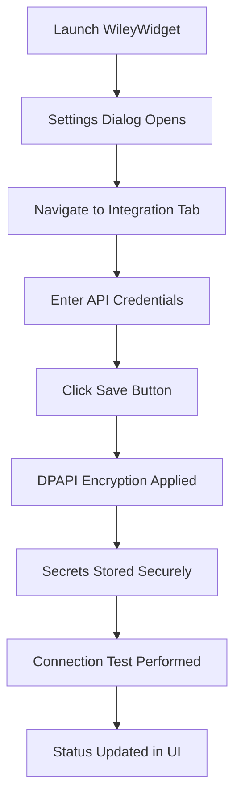

# Wiley Widget — Municipal Finance Desktop

## Current production UI: WinForms + .NET 9

[](https://dotnet.microsoft.com/)
[](https://docs.microsoft.com/dotnet/desktop/winforms/)
[](LICENSE)
[](https://github.com/Bigessfour/Wiley-Widget/actions/workflows/build-winforms.yml)

**Version:** 1.1.0-winforms
**Last Updated:** January 9, 2026
**Framework:** .NET 10.0
**UI Framework:** Windows Forms + Syncfusion WinForms Controls v32.1.19
**Architecture:** N-Tier Layered + MVVM

Fast, stable, zero markup compilation issues. Uses Syncfusion WinForms controls for grids, charts, and data management.

### Syncfusion WinForms v32.1.19

- **ChartControl**: Classic WinForms charting via `Syncfusion.Chart.Windows`
- **SfDataGrid**: Advanced data binding and reporting capabilities
- **DockingManager**: Professional docking panel management
- **SfSkinManager**: Single-source theming system (Office2019Colorful default)
- **Ribbon**: Modern toolbar and menu system with full MVVM support

See: [Syncfusion WinForms Documentation](https://help.syncfusion.com/windowsforms/overview) and [v32.1.19 Release Notes](https://www.nuget.org/packages/Syncfusion.Chart.Windows/32.1.19)

---

## 📑 Table of Contents

- [Overview](#overview)
- [Quick Start](#quick-start)
- [QuickBooks Sandbox Integration](#quickbooks-sandbox-integration)
- [Configuration & Secrets](#configuration--secrets)
- [Configuration & Secrets](#configuration--secret-management)
- [Architecture](#%EF%B8%8F-architecture)
- [Core Features](#core-features)
- [Technology Stack](#technology-stack)
- [Development](#development)
- [Testing](#testing)
- [QuickBooks Integration](#quickbooks-integration)
- [Documentation](#documentation)
- [Contributing](#contributing)
- [License](#license)

---

## Overview

WileyWidget is a modern Windows desktop application for municipal budget management and financial analysis. Built with **Windows Forms + .NET 10** and **Syncfusion WinForms v32.1.19**, it features a **clean N-tier layered architecture** with pure MVVM separation, Entity Framework Core integration, and local SQL Server Express data storage.

### Key Capabilities

- **Pure Layered Architecture**: Presentation → Business → Data → Domain layers with clear separation of concerns
- **N-Tier Design**: Models, Data, Business, and UI layers for enterprise-grade maintainability
- **Syncfusion Integration**: DockingManager panels, SfDataGrid data binding, SfSkinManager theming
- **MVVM Pattern**: Complete Windows Forms MVVM implementation with command binding and property change notification
- **Entity Framework Core**: Latest EF Core with SQL Server Express for local data storage
- **Dialog Management**: Service-based dialog system for modal interactions
- **Region-Based Navigation**: View composition and dynamic navigation with plugin architecture
- **Secure Secrets**: DPAPI-encrypted credential storage for API keys and licenses
- **AI Integration**: Microsoft.Extensions.AI with optional xAI Grok integration
- **QuickBooks Online**: OAuth2 integration for financial data synchronization
- **Comprehensive Testing**: Unit, integration, and UI tests with >70% coverage
- **CI/CD Pipeline**: Automated build, test, and release workflows with Trunk integration

### Project Status (v1.1.0)

**Current Phase:** Stable Release (v0.2.0)
**Architecture:** ✅ Standardized on pure patterns
**Code Quality:** ✅ 88 legacy files removed, 71% script reduction
**Documentation:** ✅ Active technical docs, legacy docs removed
**Build Status:** ✅ Automated CI/CD with Trunk quality gates
**Testing:** ✅ Comprehensive test suite with >70% coverage

**Active Scripts:** 24 essential automation scripts (down from 84)
**Active Docs:** 51 technical documentation files (focused and relevant)
**Theme Files:** 1 single source of truth (`WileyTheme-Syncfusion.xaml`)

---

## 📁 Project Structure

WileyWidget follows a clean, layered architecture with organized file structure for maintainability and scalability.

### Solution Organization

```text
WileyWidget/
├── src/                          # Application entry point & startup
│   ├── App.xaml.cs              # application bootstrap
│   ├── Program.cs               # Entry point
│   ├── Configuration/           # App configuration & options
│   ├── Diagnostics/             # Diagnostics & monitoring
│   ├── Startup/                 # Startup logic & modules
│   └── Services/                # Core application services
│
├── WileyWidget.UI/              # User Interface Layer (Organized)
│   ├── Views/
│   │   ├── Main/               # Main feature views (14 views)
│   │   │   ├── AIAssistView.xaml
│   │   │   ├── AnalyticsView.xaml
│   │   │   ├── BudgetView.xaml
│   │   │   ├── DashboardView.xaml
│   │   │   ├── EnterpriseView.xaml
│   │   │   ├── ExcelImportView.xaml
│   │   │   ├── MunicipalAccountView.xaml
│   │   │   ├── ProgressView.xaml
│   │   │   ├── QuickBooksView.xaml
│   │   │   ├── ReportsView.xaml
│   │   │   ├── SettingsView.xaml
│   │   │   ├── UtilityCustomerView.xaml
│   │   │   ├── BudgetAnalysisView.xaml
│   │   │   └── DepartmentView.xaml
│   │   ├── Panels/             # Panel views (8 views)
│   │   │   ├── AIAssistPanelView.xaml
│   │   │   ├── BudgetPanelView.xaml
│   │   │   ├── DashboardPanelView.xaml
│   │   │   ├── EnterprisePanelView.xaml
│   │   │   ├── MunicipalAccountPanelView.xaml
│   │   │   ├── SettingsPanelView.xaml
│   │   │   ├── ToolsPanelView.xaml
│   │   │   └── UtilityCustomerPanelView.xaml
│   │   ├── Dialogs/            # Dialog views (8 views)
│   │   │   ├── ActivateXaiDialog.xaml
│   │   │   ├── ConfirmationDialogView.xaml
│   │   │   ├── CustomerEditDialogView.xaml
│   │   │   ├── EnterpriseDialogView.xaml
│   │   │   ├── ErrorDialogView.xaml
│   │   │   ├── NotificationDialogView.xaml
│   │   │   ├── SettingsDialogView.xaml
│   │   │   └── WarningDialogView.xaml
│   │   └── Windows/            # Window views (3 views)
│   │       ├── AboutWindow.xaml
│   │       ├── Shell.xaml
│   │       └── SplashScreenWindow.xaml
│   ├── ViewModels/
│   │   ├── Main/               # Main ViewModels (20 files)
│   │   │   ├── AIAssistViewModel.cs (+ .Dialog.cs, .Dialogs.cs)
│   │   │   ├── AnalyticsViewModel.cs
│   │   │   ├── BudgetViewModel.cs (+ .Hierarchical.cs)
│   │   │   ├── DashboardViewModel.cs
│   │   │   ├── EnterpriseViewModel.cs
│   │   │   ├── ExcelImportViewModel.cs
│   │   │   ├── MainViewModel.cs
│   │   │   ├── MunicipalAccountViewModel.cs
│   │   │   ├── ProgressViewModel.cs
│   │   │   ├── QuickBooksViewModel.cs
│   │   │   ├── ReportsViewModel.cs
│   │   │   ├── SettingsViewModel.cs
│   │   │   ├── ToolsViewModel.cs
│   │   │   ├── UtilityCustomerViewModel.cs
│   │   │   ├── AIResponseViewModel.cs
│   │   │   ├── BudgetAnalysisViewModel.cs
│   │   │   └── DepartmentViewModel.cs
│   │   ├── Panels/             # Panel ViewModels (8 files)
│   │   │   ├── AIAssistPanelViewModel.cs
│   │   │   ├── BudgetPanelViewModel.cs
│   │   │   ├── DashboardPanelViewModel.cs
│   │   │   ├── EnterprisePanelViewModel.cs
│   │   │   ├── MunicipalAccountPanelViewModel.cs
│   │   │   ├── SettingsPanelViewModel.cs
│   │   │   ├── ToolsPanelViewModel.cs
│   │   │   └── UtilityCustomerPanelViewModel.cs
│   │   ├── Dialogs/            # Dialog ViewModels (7 files)
│   │   │   ├── ConfirmationDialogViewModel.cs
│   │   │   ├── CustomerEditDialogViewModel.cs
│   │   │   ├── EnterpriseDialogViewModel.cs
│   │   │   ├── ErrorDialogViewModel.cs
│   │   │   ├── NotificationDialogViewModel.cs
│   │   │   ├── SettingsDialogViewModel.cs
│   │   │   └── WarningDialogViewModel.cs
│   │   ├── Windows/            # Window ViewModels (2 files)
│   │   │   ├── AboutViewModel.cs
│   │   │   └── SplashScreenWindowViewModel.cs
│   │   ├── Base/               # Base ViewModel classes
│   │   ├── Messages/           # event messages
│   │   └── Shell/              # Shell-related ViewModels
│   ├── Controls/               # Custom controls
│   ├── Converters/             # Value converters
│   ├── Behaviors/              # Attached behaviors
│   ├── Regions/                # region adapters
│   └── Resources/              # XAML resources & themes
│
├── WileyWidget.Models/         # Domain Models
│   ├── Budget.cs
│   ├── Enterprise.cs
│   ├── MunicipalAccount.cs
│   ├── UtilityCustomer.cs
│   └── ...
│
├── WileyWidget.Data/           # Data Access Layer
│   ├── AppDbContext.cs
│   ├── Repositories/
│   └── Migrations/
│
├── WileyWidget.Business/       # Business Logic Layer
│   ├── Interfaces/
│   └── Services/
│
├── WileyWidget.Services/       # Application Services
│   ├── AI/                     # AI integration services
│   ├── Excel/                  # Excel import/export
│   ├── Export/                 # Data export services
│   └── Threading/              # Threading utilities
│
├── WileyWidget.Tests/          # Unit & Integration Tests
├── WileyWidget.UI.Tests/       # UI Tests (Appium)
├── scripts/                    # Automation scripts (24 files)
├── docs/                       # Documentation (51 files)
└── .github/workflows/          # CI/CD pipelines
```

### Namespace Organization

All Views and ViewModels follow consistent namespace patterns:

**Views:**

- `WileyWidget.Views.Main` - Main feature views
- `WileyWidget.Views.Panels` - Panel/sidebar views
- `WileyWidget.Views.Dialogs` - Modal dialog views
- `WileyWidget.Views.Windows` - Window/shell views

**ViewModels:**

- `WileyWidget.ViewModels.Main` - Main feature ViewModels
- `WileyWidget.ViewModels.Panels` - Panel ViewModels
- `WileyWidget.ViewModels.Dialogs` - Dialog ViewModels
- `WileyWidget.ViewModels.Windows` - Window ViewModels
- `WileyWidget.ViewModels.Base` - Base classes
- `WileyWidget.ViewModels.Messages` - Event messages

### Benefits of This Structure

✅ **Logical Grouping**: Related files are together
✅ **Easy Navigation**: Find files quickly by feature
✅ **Scalability**: Easy to add new views/viewmodels
✅ **Maintainability**: Clear separation of concerns
✅ **Discoverability**: New developers understand structure immediately
✅ **Best Practices**: Follows community standards

**Note:** For detailed reorganization history, see [`docs/FILE_ORGANIZATION_SUMMARY.md`](docs/FILE_ORGANIZATION_SUMMARY.md)

---

**Active Scripts:** 24 essential automation scripts (down from 84)
**Active Docs:** 51 technical documentation files (focused and relevant)
**Theme Files:** 1 single source of truth (`WileyTheme-Syncfusion.xaml`)

---

## Quick Start

### Prerequisites

- **Windows 10/11** (64-bit)
- **.NET 10.0 SDK** (10.0.0 or later)
- **SQL Server Express** (local database)
- **Syncfusion Community License** (free for individual developers)

### Installation & Setup

1. **Clone the Repository**

   ```bash
   git clone https://github.com/Bigessfour/Wiley-Widget.git
   cd Wiley-Widget
   ```

2. **Setup Database**

   ```powershell
   # Run database initialization script
   pwsh ./scripts/setup-database.ps1
   ```

3. **Setup Syncfusion License** (recommended)

   ```powershell
   # Set environment variable for Syncfusion license key
   [System.Environment]::SetEnvironmentVariable('SYNCFUSION_LICENSE_KEY','YOUR_LICENSE_KEY','User')
   # Alternative: Run setup script
   pwsh ./scripts/setup-license.ps1
   ```

4. **Build and Run**

   ```powershell
   # Restore dependencies and build
   dotnet build WileyWidget.sln

   # Run the application
   dotnet run --project src/WileyWidget/WileyWidget.csproj
   ```

### First Launch

The application will:

- Initialize the local SQL Server Express database (WileyWidget)
- Load default Office2019Colorful theme via SfSkinManager
- Display the main dashboard with budget management interface

---

## 🔌 QuickBooks Sandbox Integration

WileyWidget integrates with **QuickBooks Online (QBO)** via OAuth 2.0 for secure financial data synchronization. The application supports both **sandbox** (development) and **production** environments.

### 🎯 Current Connection Status

**Environment:** Sandbox
**Company:** Town of Wiley Sandbox
**Realm ID:** 9341455168020461
**Client ID:** ABWlf3T7raiKwVV8ILahdlGP7E5pblC6pH1i6lXZQoU6wloEOm
**OAuth Redirect URI:** [Intuit OAuth Playground](https://developer.intuit.com/v2/OAuth2Playground/RedirectUrl)
**Last Connected:** November 8, 2025
**Token Status:** ✅ Active (auto-refreshes)

### 🚀 Quick Setup (Automated)

Run the automated OAuth setup script to establish QuickBooks connection:

```powershell
# Set credentials (get from Intuit Developer Portal)
$env:QBO_CLIENT_ID = "your-client-id"
$env:QBO_CLIENT_SECRET = "your-client-secret"
$env:QBO_REALM_ID = "your-realm-id"  # Optional, captured automatically
$env:QBO_ENVIRONMENT = "sandbox"      # or "production"

# Run setup script
.\scripts\quickbooks\setup-oauth.ps1
```

The script will:

1. Build and display the authorization URL
2. Copy the URL to your clipboard
3. Wait for you to authorize in browser
4. Exchange the authorization code for tokens
5. Persist tokens to `%APPDATA%\WileyWidget\settings.json`
6. Validate the connection by calling QBO API

### 🔑 OAuth Configuration

#### Intuit Developer Portal Setup

1. **Create App** at [Intuit Developer Dashboard](https://developer.intuit.com/app/developer/dashboard)
2. **Keys & OAuth** section:
   - Copy **Client ID** and **Client Secret**
   - Add **Redirect URIs**:
     - `https://developer.intuit.com/v2/OAuth2Playground/RedirectUrl` (for OAuth Playground)
     - `http://localhost:8080/` (for local HttpListener)
3. **App Settings**:
   - Set environment to **Sandbox** or **Production**
   - Enable **QuickBooks Online** scope: `com.intuit.quickbooks.accounting`

#### Environment Variables

The app reads these environment variables (set at User scope):

```powershell
# Required
$env:QBO_CLIENT_ID = "your-client-id"
$env:QBO_CLIENT_SECRET = "your-client-secret"

# Optional (with defaults)
$env:QBO_REALM_ID = "your-realm-id"  # Auto-captured during OAuth
$env:QBO_REDIRECT_URI = "https://developer.intuit.com/v2/OAuth2Playground/RedirectUrl"
$env:QBO_ENVIRONMENT = "sandbox"  # or "production"

# For testing (skip OAuth browser launch)
$env:WW_SKIP_INTERACTIVE = "1"
$env:WW_PRINT_AUTH_URL = "1"  # Print auth URL without launching browser
```

#### Settings Storage

Tokens are persisted to: `%APPDATA%\WileyWidget\settings.json`

```json
{
  "QboAccessToken": "eyJhbGciOiJkaXI...",
  "QboRefreshToken": "RT1-9-H0-177136...",
  "QboTokenExpiry": "2025-11-08T22:06:31Z",
  "QuickBooksRealmId": "9341455168020461"
}
```

### 🔄 Token Management

**Access Token Lifetime:** 1 hour
**Refresh Token Lifetime:** ~100 days
**Auto-Refresh:** ✅ Tokens automatically refresh when expired

The `QuickBooksService` checks token expiry before each API call and automatically refreshes if needed:

```csharp
// Automatic token refresh
await _quickBooksService.RefreshTokenIfNeededAsync();

// Manual refresh
await _quickBooksService.RefreshTokenAsync();
```

### 🧪 Testing with QuickBooks Sandbox

#### Run Unit Tests

```powershell
# Skip OAuth prompts during tests
$env:WW_SKIP_INTERACTIVE = "1"

# Run QuickBooks service tests
dotnet test --filter "FullyQualifiedName~QuickBooksService"
```

#### Test Coverage

- ✅ `SyncBudgetsToAppAsync_ValidBudgets_SyncsSuccessfullyAndPublishesEvent`
- ✅ `SyncBudgetsToAppAsync_EmptyList_ReturnsSuccessWithZeroSynced`
- ✅ `SyncBudgetsToAppAsync_HttpFailure_ReturnsErrorAndLogs`
- ✅ `SyncBudgetsToAppAsync_Cancellation_ReturnsErrorResult`

### 🌐 Webhooks Configuration (Optional)

For real-time notifications from QuickBooks, expose a local endpoint using Cloudflare Tunnel:

```powershell
# Start tunnel (auto-configured in QuickBooksService)
cloudflared tunnel --url https://localhost:7207

# Configure in Intuit Developer Portal
# Webhooks Endpoint: https://<your-tunnel>.trycloudflare.com/qbo/webhooks
```

**Environment Variables:**

```powershell
$env:WEBHOOKS_PORT = "7207"  # HTTPS port for webhooks server
$env:QBO_WEBHOOKS_VERIFIER = "your-verifier-token"  # From Intuit
```

### 📊 Available QBO Operations

The `QuickBooksService` provides these operations:

```csharp
// Connection & Auth
await TestConnectionAsync()
await AuthorizeAsync()
await RefreshTokenAsync()

// Data Retrieval
await GetCustomersAsync()
await GetInvoicesAsync(enterprise?)
await GetChartOfAccountsAsync()
await GetJournalEntriesAsync(startDate, endDate)
await GetBudgetsAsync()

// Data Sync
await SyncBudgetsToAppAsync(budgets, cancellationToken)
```

### 🔍 Troubleshooting

#### "redirect_uri is invalid"

**Cause:** The redirect URI in the token exchange doesn't match what's registered.

**Fix:**

1. Print the exact auth URL:

   ```powershell
   $env:WW_PRINT_AUTH_URL = "1"
   $env:WW_SKIP_INTERACTIVE = "1"
   # Run app or script that triggers AuthorizeAsync()
   ```

2. Extract the `redirect_uri` parameter from the printed URL
3. Add that **exact** URI to Intuit Developer Portal → Keys & OAuth → Redirect URIs

#### "Access token invalid"

**Cause:** Token expired or not yet acquired.

**Fix:**

```powershell
# Re-run OAuth setup
.\scripts\quickbooks\setup-oauth.ps1
```

#### Connection Test Fails

**Cause:** Incorrect realm ID or expired tokens.

**Fix:**

```csharp
// Validate connection
var isConnected = await _quickBooksService.TestConnectionAsync();
if (!isConnected)
{
    // Re-authorize
    await _quickBooksService.AuthorizeAsync();
}
```

### 📚 Additional Resources

- **Intuit Docs:** [QuickBooks Online Documentation](https://developer.intuit.com/app/developer/qbo/docs/get-started)
- **OAuth 2.0 Flow:** [OAuth 2.0 Documentation](https://developer.intuit.com/app/developer/qbo/docs/develop/authentication-and-authorization)
- **API Reference:** [QuickBooks API Reference](https://developer.intuit.com/app/developer/qbo/docs/api/accounting/all-entities)
- **Setup Script:** `scripts/quickbooks/setup-oauth.ps1`
- **Service Tests:** `tests/WileyWidget.Services.Tests/QuickBooksServiceTests.cs`

---

## �🔐 Configuration & Secret Management

WileyWidget implements a **secure, encrypted secret management system** using Windows Data Protection API (DPAPI) for enterprise-grade credential storage. All sensitive data (API keys, client secrets, licenses) are automatically encrypted and can only be accessed by the Windows user who stored them.

### Secret Storage Architecture

#### **🔒 DPAPI Encryption**

- **Windows DPAPI**: Uses `ProtectedData.Protect/Unprotect` with `DataProtectionScope.CurrentUser`
- **User-Specific**: Secrets encrypted for the current Windows user only
- **Machine-Bound**: Cannot be decrypted on different computers
- **256-bit Entropy**: Additional cryptographic entropy per secret
- **Secure Storage**: Encrypted files in `%APPDATA%\WileyWidget\Secrets\`

#### **🗂️ Storage Location**

```text
%APPDATA%\WileyWidget\Secrets\
├── .entropy          # Hidden entropy file for encryption
├── QuickBooks-ClientId.secret
├── QuickBooks-ClientSecret.secret
├── QuickBooks-RedirectUri.secret
├── QuickBooks-Environment.secret
├── Syncfusion-LicenseKey.secret
├── XAI-ApiKey.secret
├── XAI-BaseUrl.secret
└── [additional secrets...]
```

### User Interface for Secret Management

#### **⚙️ Settings Dialog Access**

1. **Launch Application** → Main window opens
2. **Open Settings** → Click gear icon or press `Ctrl+,`
3. **Navigate Tabs** → Select appropriate integration tab
4. **Enter Credentials** → Input API keys, secrets, licenses
5. **Save Changes** → Click "Save" button or press `Ctrl+S`

#### **📋 Integration Tabs**

##### **QuickBooks Integration Tab**

- **Client ID**: OAuth2 Client ID from Intuit Developer Portal
- **Client Secret**: Securely stored OAuth2 client secret
- **Redirect URI**: OAuth2 callback URL (e.g., `https://localhost:5001/callback`)
- **Environment**: Sandbox (testing) or Production (live data)

##### **Syncfusion License Tab**

- **License Key**: Syncfusion community license key
- **Status**: Real-time license validation
- **Note**: License stored securely in encrypted vault

##### **XAI Integration Tab**

- **API Key**: XAI API key (format: `xai-xxxxxxxx`)
- **Base URL**: API endpoint (default: `https://api.x.ai/v1/`)
- **Model**: AI model selection (grok-4-0709 recommended)
- **Timeout**: Request timeout in seconds (5-300)

### Automatic Migration & Security

#### **🔄 Environment Variable Migration**

On first application launch, WileyWidget automatically migrates existing environment variables:

```powershell
# These environment variables are automatically migrated to encrypted storage:
SYNCFUSION_LICENSE_KEY      → Syncfusion-LicenseKey
QUICKBOOKS_CLIENT_ID        → QuickBooks-ClientId
QUICKBOOKS_CLIENT_SECRET    → QuickBooks-ClientSecret
QUICKBOOKS_REDIRECT_URI     → QuickBooks-RedirectUri
QUICKBOOKS_ENVIRONMENT      → QuickBooks-Environment
XAI_API_KEY                 → XAI-ApiKey
XAI_BASE_URL                → XAI-BaseUrl
```

#### **🛡️ Security Guarantees**

- **Zero Plaintext**: Secrets never stored in plaintext files
- **User Isolation**: Different Windows users cannot access each other's secrets
- **Machine Lock**: Encrypted secrets cannot be used on different computers
- **Memory Safety**: Sensitive data cleared immediately after use
- **Audit Trail**: All secret operations logged securely

### Advanced Security Features

#### **🔐 Critical Security Enhancements**

WileyWidget's `EncryptedLocalSecretVaultService` implements multiple layers of defense-in-depth security:

##### **1. SHA-256 Filename Hashing**

Prevents filename collisions and obfuscates secret identifiers in the filesystem:

```csharp
// Secret names are hashed before storage
// Example: "QuickBooks-ClientSecret" → "8a3f9b2c1d4e5f6a7b8c9d0e1f2a3b4c.secret"
private string GetSecretFileName(string secretName)
{
    using var sha256 = SHA256.Create();
    byte[] hash = sha256.ComputeHash(Encoding.UTF8.GetBytes(secretName));
    return $"{Convert.ToHexString(hash).ToLowerInvariant()}.secret";
}
```

**Benefits:**

- **Collision Prevention**: SHA-256 ensures unique filenames even for similar secret names
- **Obfuscation**: Attackers cannot identify secret purposes from filesystem listings
- **Forward Compatibility**: Consistent hashing supports future secret name changes

##### **2. Machine-Bound Entropy Protection**

Additional entropy layer bound to the specific machine using DPAPI:

````csharp
// Entropy is machine-bound and protected by DPAPI
private byte[] LoadOrCreateEntropy()
{
    string entropyFile = Path.Combine(_secretsDirectory, ".entropy");

    if (File.Exists(entropyFile))
    {
        // Load and decrypt machine-bound entropy
        byte[] encryptedEntropy = File.ReadAllBytes(entropyFile);
        return ProtectedData.Unprotect(
            encryptedEntropy,

             - [Overview](#overview)
             - [Quick Start](#quick-start)
             - [QuickBooks Sandbox Integration](#quickbooks-sandbox-integration)
             - [Configuration & Secret Management](#configuration--secret-management)
             - [Architecture](#architecture)
             - [Core Features](#core-features)
             - [Technology Stack](#technology-stack)
             - [Development](#development)
             - [Testing](#testing)
             - [QuickBooks Integration](#quickbooks-integration)
             - [Documentation](#documentation)
             - [Contributing](#contributing)
             - [License](#license)

**Protection Layers:**

- **DPAPI Encryption**: Entropy file itself is encrypted with Windows DPAPI
- **Machine-Bound**: Entropy cannot be copied to different machines
- **User-Specific**: Each Windows user gets their own protected entropy
- **Tamper Detection**: Modified entropy files fail integrity checks

##### **3. Configurable Environment Variable Migration**

Controlled migration prevents accidental exposure of sensitive environment variables:

```csharp
// Define which environment variables should be migrated
private static readonly HashSet<string> MigrateableVariables = new()
{
    "SYNCFUSION_LICENSE_KEY",
    "QUICKBOOKS_CLIENT_ID",
    "QUICKBOOKS_CLIENT_SECRET",
    "QUICKBOOKS_REDIRECT_URI",
    "QUICKBOOKS_ENVIRONMENT",
    "XAI_API_KEY",
    "XAI_BASE_URL",
    "ANTHROPIC_API_KEY",
    "OPENAI_API_KEY"
};

// Migration only processes whitelisted variables
public async Task MigrateEnvironmentVariablesAsync()
{
    foreach (var kvp in _secretMapping)
    {
        string envValue = Environment.GetEnvironmentVariable(kvp.Value);

        // Only migrate if in whitelist and not empty
        if (!string.IsNullOrWhiteSpace(envValue) &&
            MigrateableVariables.Contains(kvp.Value))
        {
            await StoreSecretAsync(kvp.Key, envValue);
            _logger.LogInformation(
                "Migrated environment variable {EnvVar} to encrypted secret {SecretName}",
                kvp.Value, kvp.Key
            );
        }
    }
}
````

**Security Benefits:**

- **Whitelist Protection**: Only pre-approved environment variables are migrated
- **No Wildcards**: Prevents accidental migration of system variables
- **Audit Trail**: All migrations logged with secret names (not values)
- **Idempotent**: Safe to run multiple times without duplication

##### **4. Entropy Tampering Detection**

Detects if entropy file has been modified or corrupted:

```csharp
private bool ValidateEntropyIntegrity()
{
    try
    {
        byte[] entropy = LoadOrCreateEntropy();

        // Validate entropy meets security requirements
        if (entropy == null || entropy.Length != 32)
        {
            _logger.LogCritical("Entropy validation failed: Invalid length");
            return false;
        }

        // Check for all-zero entropy (tampering indicator)
        if (entropy.All(b => b == 0))
        {
            _logger.LogCritical("Entropy validation failed: All-zero entropy detected");
            return false;
        }

        // Verify DPAPI can decrypt entropy file
        string entropyFile = Path.Combine(_secretsDirectory, ".entropy");
        byte[] encryptedEntropy = File.ReadAllBytes(entropyFile);
        ProtectedData.Unprotect(encryptedEntropy, null, DataProtectionScope.CurrentUser);

        return true;
    }
    catch (CryptographicException ex)
    {
        _logger.LogCritical(ex, "Entropy tampering detected: DPAPI decryption failed");
        return false;
    }
}
```

**Detection Capabilities:**

- **Length Validation**: Ensures entropy is exactly 256 bits
- **Zero-Check**: Detects cleared or zeroed entropy files
- **DPAPI Verification**: Confirms entropy file hasn't been replaced
- **Tamper Alert**: Logs critical security events for monitoring

#### **🛡️ Security Best Practices**

##### **Production Deployment Checklist**

- ✅ **Backup Entropy File**: Store `.entropy` file in secure backup location
- ✅ **Rotate Secrets**: Implement regular secret rotation schedule
- ✅ **Monitor Logs**: Watch for entropy validation failures in production
- ✅ **Access Control**: Restrict `%APPDATA%\WileyWidget\Secrets\` folder permissions
- ✅ **Disaster Recovery**: Document secret recovery procedures
- ✅ **User Training**: Educate users on secret management best practices

##### **Security Incident Response**

If entropy tampering is detected:

1. **Immediate Actions:**
   - Application automatically refuses to load secrets
   - Critical security event logged to system logs
   - User notified of security issue

2. **Investigation Steps:**
   - Check Windows Event Viewer for security audit logs
   - Review file system access logs for `Secrets` folder
   - Verify user account integrity

3. **Remediation:**
   - Delete compromised `.entropy` file
   - Restart application to generate new entropy
   - Re-enter all secrets through Settings dialog
   - Update all API credentials at provider portals

##### **Development vs Production**

**Development Environment:**

```powershell
# Safe to use environment variables during development
$env:QUICKBOOKS_CLIENT_ID = "sandbox-client-id"
$env:QUICKBOOKS_CLIENT_SECRET = "sandbox-secret"
```

**Production Environment:**

```powershell
# NEVER use environment variables in production
# Always use encrypted secret vault through Settings dialog
# Entropy file must be backed up securely
```

### Configuration Workflow

#### **Initial Setup Process**



#### **Runtime Secret Access**

```csharp
// Secrets automatically loaded from encrypted storage
var clientSecret = await _secretVaultService.GetSecretAsync("QuickBooks-ClientSecret");
var apiKey = await _secretVaultService.GetSecretAsync("XAI-ApiKey");
```

### Troubleshooting Secret Issues

#### **Common Issues & Solutions**

##### **"Connection Failed" Status**

- **Check Credentials**: Verify API keys are correct in Settings dialog
- **Test Connection**: Use "Test Connection" buttons in each integration tab
- **Environment Variables**: Ensure environment variables are set (auto-migrated on first run)

##### **License Validation Errors**

- **Syncfusion License**: Get free community license from syncfusion.com
- **Format Check**: Ensure license key format is correct
- **Restart Required**: Some licenses require application restart

##### **API Connection Issues**

- **Network Access**: Ensure internet connectivity for external APIs
- **Rate Limits**: Check API provider rate limiting
- **Credentials**: Verify API keys have correct permissions

#### **Manual Secret Management**

```powershell
# View encrypted secrets (development only)
# Note: Secrets are encrypted and cannot be viewed in plaintext
Get-ChildItem "$env:APPDATA\WileyWidget\Secrets"

# Clear all secrets (requires application restart)
Remove-Item "$env:APPDATA\WileyWidget\Secrets\*" -Force
```

### Enterprise Security Features

#### **🔐 Encryption Details**

- **Algorithm**: Windows DPAPI with AES-256 encryption
- **Key Derivation**: PBKDF2 with user credentials and machine entropy
- **Storage Format**: Base64-encoded encrypted blobs
- **Access Control**: NTFS permissions restrict file access

#### **📊 Audit & Monitoring**

- **Operation Logging**: All secret operations logged to application logs
- **Access Tracking**: Secret retrieval operations recorded
- **Error Handling**: Failed decryption attempts logged (security monitoring)

#### **🚀 Performance Characteristics**

- **Encryption Speed**: <1ms per secret operation
- **Storage Size**: ~2x plaintext size (Base64 encoding)
- **Memory Usage**: Minimal memory footprint with immediate cleanup
- **Startup Impact**: <100ms initialization time

This secure secret management system ensures WileyWidget can safely handle enterprise credentials while maintaining the highest security standards for sensitive data protection.

---

## 🏗️ Architecture

### N-Tier Layered Design

WileyWidget follows a **modern N-tier architecture** for enterprise-grade maintainability and scalability:

```text
WileyWidget (UI) → WileyWidget.Business → WileyWidget.Data → WileyWidget.Models
     ↓                                                            ↑
WileyWidget.UiTests                                       WileyWidget.IntegrationTests
     ↓                                                            ↑
WileyWidget.Tests
```

### Layer Responsibilities

#### **Presentation Layer** (Windows Forms + Syncfusion)

```text
WileyWidget/
├── WileyWidget/                          # 🖥️ PRESENTATION LAYER (.NET 9.0-windows)
│   ├── Views/                           # XAML UI files
│   ├── ViewModels/                      # MVVM view models
│   ├── App.xaml                         # Application entry point
│   ├── Program.cs                       # Startup logic
│   └── WileyWidget.csproj               # project file
│
├── WileyWidget.Business/                 # 💼 BUSINESS LOGIC LAYER (.NET 8.0)
│   ├── Services/                        # Application services
│   ├── Validators/                      # Business validation rules
│   ├── Interfaces/                      # Service contracts
│   └── WileyWidget.Business.csproj      # Class library project
│
├── WileyWidget.Data/                     # 🗄️ DATA ACCESS LAYER (.NET 8.0)
│   ├── AppDbContext.cs                  # EF Core database context
│   ├── Repositories/                    # Repository implementations
│   ├── Migrations/                      # Database schema migrations
│   └── WileyWidget.Data.csproj          # Class library project
│
├── WileyWidget.Models/                   # 📋 DOMAIN MODEL LAYER (.NET 8.0)
│   ├── MunicipalAccount.cs              # Core business entities
│   ├── Department.cs                    # Domain models
│   ├── BudgetEntry.cs                   # Business objects
│   ├── DTOs/                            # Data transfer objects
│   └── WileyWidget.Models.csproj        # Class library project
│
├── WileyWidget.IntegrationTests/         # 🧪 INTEGRATION TESTS (.NET 8.0)
│   ├── Infrastructure/                  # Test infrastructure
│   ├── Relationships/                   # Relationship tests
│   ├── Performance/                     # Performance benchmarks
│   └── Concurrency/                     # Concurrency tests
│
├── WileyWidget.Tests/                    # ✅ UNIT TESTS (.NET 8.0)
│   ├── Business/                        # Business logic unit tests
│   ├── Data/                           # Data access unit tests
│   └── Models/                          # Model validation tests
│
└── WileyWidget.UiTests/                  # 🎭 UI TESTS (.NET 9.0-windows)
    ├── Automation/                      # UI automation scripts
    ├── PageObjects/                     # UI test page objects
    └── Scenarios/                       # End-to-end test scenarios
```

#### **Business Logic Layer** (Application Services)

- Business rule enforcement
- Cross-cutting concerns (logging, caching, security)
- QuickBooks integration orchestration
- Financial calculations and analysis
- Input validation via FluentValidation

#### **Data Access Layer** (Entity Framework Core)

- AppDbContext configuration
- Repository pattern implementation
- Database migrations and schema management
- Query optimization and relationship management
- Transaction handling

#### **Domain Model Layer** (Core Entities)

- MunicipalAccount, Budget, Department entities
- Value objects and domain logic
- Data annotations for validation
- Owned entity types for composition

### Design Patterns Used

| Pattern                  | Where        | Purpose                        |
| ------------------------ | ------------ | ------------------------------ |
| **MVVM**                 | Presentation | Clean separation of UI logic   |
| **Repository**           | Data         | Abstraction of data access     |
| **Dependency Injection** | All layers   | Loose coupling and testability |
| **Service Locator**      | Business     | Centralized service management |
| **Strategy**             | Business     | Pluggable algorithms           |
| **Command**              | UI           | Encapsulated actions           |
| **Observer**             | MVVM         | Property change notification   |

---

## Core Features

### 📊 Budget Management

- Multi-year budget tracking and allocation
- Department-wise budget assignments
- Budget variance analysis and reporting
- Historical data comparison and trends
- What-if scenario modeling

### 🎨 Modern User Interface

- **Syncfusion SfDataGrid**: Advanced data binding, sorting, filtering, grouping
- **Syncfusion DockingManager**: Professional docking panel layout
- **Office2019Colorful Theme**: Modern Fluent Design integration via SfSkinManager
- **SfChart**: Interactive financial visualizations
- **Ribbon Control**: Professional toolbar and menu system
- **Responsive Layout**: Adapts to window resizing

### 🔗 Enterprise Integration

- **QuickBooks Online**: OAuth2 integration with automatic token refresh
- **Financial Data Sync**: Real-time budget and transaction synchronization
- **Secure Authentication**: DPAPI-encrypted credential storage
- **API Resilience**: Polly retry policies with exponential backoff

### ⚙️ System Features

- **Theme Persistence**: SfSkinManager theme selection saved across sessions
- **User Settings**: Encrypted settings in `%APPDATA%\WileyWidget\settings.json`
- **Comprehensive Logging**: Serilog with rolling daily file output
- **Error Handling**: Global exception handling with user-friendly dialogs
- **Performance Monitoring**: Startup diagnostics and performance tracking

### 🔐 Security Features

- **DPAPI Encryption**: Windows Data Protection API for secret storage
- **Machine-Bound Secrets**: Entropy-protected credential vault
- **SHA-256 Filename Hashing**: Obfuscated secret file names
- **Auto-Migration**: Environment variables automatically migrated to encrypted storage
- **Audit Trail**: All secret operations logged securely

---

## 🔌 QuickBooks Integration

WileyWidget integrates with **QuickBooks Online (QBO)** via OAuth2 for secure financial data synchronization with support for both sandbox and production environments.

**Scope**: End-to-end data operations and relationships
**Tools**: xUnit, TestContainers.MsSql, FluentAssertions, BenchmarkDotNet

**Test Categories**:

- **Relationship Tests**: Foreign key constraints, cascading deletes
- **Performance Tests**: Query optimization, bulk operations
- **Concurrency Tests**: Multi-user scenarios, deadlock prevention
- **Data Integrity**: Transaction boundaries, rollback scenarios

**Key Features**:

- **TestContainers**: Isolated SQL Server instances per test
- **Database Seeding**: Consistent test data across runs
- **Performance Benchmarking**: Automated performance regression detection

### **✅ Unit Testing (WileyWidget.Tests)**

**Scope**: Individual components and business logic
**Tools**: xUnit, Moq, FluentAssertions, AutoFixture

**Coverage by Layer**:

- **Models**: Entity validation, property constraints
- **Data**: Repository operations, query logic
- **Business**: Service methods, validation rules
- **ViewModels**: Command execution, property changes

**Testing Patterns**:

- **Arrange-Act-Assert**: Clear test structure
- **Builder Pattern**: TestDataBuilder for complex objects
- **Mocking**: External dependencies (database, APIs)
- **Theory Tests**: Data-driven test scenarios

#### **🎭 UI Testing (WileyWidget.UiTests)**

**Scope**: User interface behavior and workflows
**Tools**: FlaUI, Appium, or TestStack.White

**Test Categories**:

- **UI Automation**: Button clicks, form submissions
- **Visual Verification**: Layout, styling, responsiveness
- **Workflow Testing**: End-to-end user scenarios
- **Accessibility**: Screen reader compatibility, keyboard navigation

**Implementation Strategy**:

- **Page Object Model**: Reusable UI component abstractions
- **Test Data Management**: Realistic test data for UI scenarios
- **Screenshot Comparison**: Visual regression detection

---

### Architecture Benefits Realized

#### **🚀 Development Velocity**

- **Parallel Development**: Teams can work on different layers simultaneously
- **Independent Deployment**: Layers can be updated without affecting others
- **Clear Contracts**: Well-defined interfaces prevent integration issues

#### **🔧 Maintenance Efficiency**

- **Isolated Changes**: Bug fixes in one layer don't cascade
- **Comprehensive Testing**: Each layer has dedicated test coverage
- **Code Reusability**: Business logic can be reused across applications

#### **📊 Quality Assurance**

- **Layer Isolation**: Issues are contained within their layer
- **Comprehensive Coverage**: Unit + Integration + UI testing
- **Performance Monitoring**: Automated benchmarks prevent regressions

#### **🏢 Enterprise Readiness**

- **Scalability**: Architecture supports multiple frontends (WPF, Web, Mobile)
- **Security**: Multi-layer validation and authorization
- **Monitoring**: Comprehensive logging and diagnostics at each layer

---

### Technology Stack by Layer

| Layer            | Framework | ORM           | Testing               | UI                  | External APIs  | Resilience   |
| ---------------- | --------- | ------------- | --------------------- | ------------------- | -------------- | ------------ |
| **Presentation** | .NET 9.0  | -             | FlaUI                 | Syncfusion v31.1.17 | -              | -            |
| **Business**     | .NET 8.0  | -             | xUnit, Moq            | -                   | QuickBooks API | Polly v8.6.4 |
| **Data**         | .NET 8.0  | EF Core 9.0.8 | xUnit, TestContainers | -                   | SQL Server     | Polly v8.6.4 |
| **Domain**       | .NET 8.0  | -             | xUnit                 | -                   | -              | -            |

**MVVM Framework:** Pure (DryIoc container)
**Theme System:** Syncfusion SfSkinManager (FluentDark/FluentLight)
**CI/CD:** Local CI/CD + Trunk (90% success rate target)

This layered architecture ensures WileyWidget is maintainable, testable, and ready for enterprise-scale deployment following Microsoft's recommended patterns for modern .NET applications.

---

## ⚙️ Bootstrapper Architecture (Phase 0-1 Complete - Nov 2025)

WileyWidget's bootstrapper has been refactored into a **clean partial class structure** with dead code eliminated and critical fixes implemented. The new architecture provides production-grade startup with comprehensive error handling and observability.

### Partial Class Structure (6 Files, ~2,000 LOC)

The monolithic `App.xaml.cs` (1,835 LOC) has been split into 6 maintainable partial classes:

#### **1. App.xaml.cs (555 LOC) - Main Entry Point**

- Assembly resolution infrastructure with NuGet package probing
- Static helper utilities and caching
- Public API fields (`ModuleOrder`, `ModuleRegionMap`)
- App constructor and dialog cleanup methods

#### **2. App.DependencyInjection.cs (749 LOC) - DI Container & Config**

- `CreateContainerExtension`: DryIoc setup with custom rules
- `RegisterTypes`: Critical service registrations
- `ConfigureModuleCatalog`: Module catalog (CoreModule, QuickBooksModule only)
- `ConfigureDefaultRegionBehaviors`: Custom region behaviors
- `ConfigureRegionAdapterMappings`: Syncfusion region adapters (requires theme)
- Convention-based registration methods:
  - `RegisterConventionTypes`: Infrastructure, repositories, services, ViewModels
  - `RegisterCoreInfrastructure`: IConfiguration, IMemoryCache, ILoggerFactory, IHttpClientFactory
  - `RegisterRepositories`: Auto-discovery and registration of repositories
  - `RegisterBusinessServices`: Business layer service registration
  - `RegisterViewModels`: ViewModel registration (currently SettingsViewModel only)
  - `RegisterLazyAIServices`: AI service with fallback to NullAIService
- `BuildConfiguration`: Multi-source config builder with caching

#### **3. App.Lifecycle.cs (656 LOC) - Application Lifecycle**

- `OnStartup`: 4-phase startup sequence
  - Phase 1: Validation, config, theme (before bootstrap)
  - Phase 2-4: bootstrap (container, modules, UI)
- `OnInitialized`: Module and service initialization with retry logic
- `OnExit`: Graceful shutdown and cleanup
- `CreateShell`: Shell window creation
- `InitializeModules`: Custom module initialization with Polly retry policies

#### **4. App.Telemetry.cs - Observability**

- `InitializeSigNozTelemetry`: Distributed tracing setup
- `IntegrateTelemetryServices`: Metrics and monitoring integration
- SigNoz Activity spans and trace correlation
- ApplicationMetricsService integration

#### **5. App.Resources.cs - Resource & Theme Management**

- `LoadApplicationResourcesSync`: Synchronous resource loading (avoids deadlocks)
- `VerifyAndApplyTheme`: Syncfusion theme application with fail-fast validation
- Memory checks (128MB minimum) before theme application
- Pack URI resolution and error handling

#### **6. App.ExceptionHandling.cs - Global Exception Handling**

- `SetupGlobalExceptionHandling`: Wire up exception handlers
- `DispatcherUnhandledException` handler for UI thread errors
- EventAggregator subscriptions for navigation/general errors
- `ShowEmergencyErrorDialog`: Last-resort error UI

### Phase 0-1 Refactoring Complete (2025-11-09)

#### **Phase 0: Dead Code Cleanup**

✅ **Deleted 11 modules** (87.5% reduction): DashboardModule, MunicipalAccountModule, PanelModule, ReportsModule, ToolsModule, ThrowingModule, UtilityCustomerModule, AIAssistModule, BudgetModule, EnterpriseModule, SettingsModule
✅ **Active modules**: CoreModule, QuickBooksModule (2 of original 16)
✅ **Deleted files**: Bootstrapper.cs (825 LOC), App.Tmp.cs, CustomModuleManager.cs, HttpClientFactory.cs
✅ **Removed patterns**: IUnitOfWork (0 references), TMP conditional compilation
✅ **LOC reduction**: ~12,000+ lines removed

#### **Phase 1: Critical Fixes**

✅ **Stub implementations**: All empty methods now contain production-ready logic
✅ **Theme race condition fix**: Theme applied in OnStartup BEFORE base.OnStartup(), fail-fast exception in ConfigureRegionAdapterMappings
✅ **Configuration caching**: BuildConfiguration() cached to eliminate duplicate calls
✅ **Partial class split**: 6 organized files for maintainability

### Active Module System

**Current Modules (2025-11-09):**

- **CoreModule**: Core application services and infrastructure
- **QuickBooksModule**: QuickBooks Desktop SDK integration

**Registration Pattern:**

```csharp
protected override void ConfigureModuleCatalog(IModuleCatalog moduleCatalog)
{
    moduleCatalog.AddModule<CoreModule>();
    moduleCatalog.AddModule<QuickBooksModule>();
}
```

**Module Configuration** (`appsettings.json`):

```json
"Modules": {
  "Order": ["CoreModule", "QuickBooksModule"],
  "Regions": {
    "CoreModule": ["MainRegion", "SettingsRegion"],
    "QuickBooksModule": ["MainRegion", "QuickBooksRegion"]
  }
}
```

### Startup Flow (4-Phase Architecture)

```text
┌─────────────────────────────────────────────────────────────┐
│ PHASE 1: Early Validation & Configuration (App.Lifecycle)  │
│ - Environment validation (memory, dependencies)             │
│ - License registration (static constructor)                 │
│ - Resource loading (synchronous to avoid deadlocks)         │
│ - Theme application (BEFORE initialization)           │
│ - SigNoz telemetry initialization                           │
├─────────────────────────────────────────────────────────────┤
│ PHASE 2: Bootstrap (triggered by base.OnStartup)     │
│ - CreateContainerExtension: DryIoc container setup          │
│ - RegisterTypes: Critical service registrations             │
│ - ConfigureModuleCatalog: Module registration               │
│ - ConfigureRegionAdapterMappings: Syncfusion adapters       │
├─────────────────────────────────────────────────────────────┤
│ PHASE 3: Module & Service Initialization (OnInitialized)   │
│ - Global exception handling setup                           │
│ - Telemetry services integration                            │
│ - Deferred secrets loading (async, non-blocking)            │
│ - Database initialization (background)                      │
│ - Custom module initialization with Polly retry             │
├─────────────────────────────────────────────────────────────┤
│ PHASE 4: UI Finalization (OnInitialized completion)        │
│ - Shell window creation                                     │
│ - Initial navigation                                        │
│ - Splash screen closure                                     │
└─────────────────────────────────────────────────────────────┘
```

### Key Architectural Decisions

1. **Theme-First Initialization**: Syncfusion theme applied in Phase 1 (before bootstrap) to prevent region adapter registration failures
2. **Fail-Fast Pattern**: ConfigureRegionAdapterMappings throws InvalidOperationException if theme not applied
3. **Synchronous Resource Loading**: Avoids UI thread deadlocks during OnStartup
4. **Convention-Based DI**: Auto-discovery and registration of repositories, services, ViewModels
5. **Lazy AI Services**: Fallback to NullAIService if XAI_API_KEY not configured
6. **Config Caching**: Single BuildConfiguration() call cached for all consumers
7. **Module Hardcoding**: Modules registered in code (not config-driven) for simplicity with 2 active modules

### Observability & Diagnostics

**SigNoz Distributed Tracing:**

- Startup activity spans track each phase duration
- Module initialization timing and health metrics
- Integration with ApplicationMetricsService for memory monitoring

**Logging:**

- Serilog with structured logging
- Per-phase logging with timing information
- Critical failure logging to `logs/critical-startup-failures.log`

**Health Checks:**

- StartupDiagnosticsService tracks 4-phase progress
- Module health tracked via IModuleHealthService
- Startup environment validation (memory, dependencies)

### Migration Guide

**For developers working on bootstrapper code:**

1. **Finding methods**: Use partial class header comments in App.xaml.cs to locate methods across 6 files
2. **Adding services**: Use RegisterConventionTypes in App.DependencyInjection.cs
3. **Lifecycle hooks**: Override methods in App.Lifecycle.cs
4. **Theme customization**: Modify VerifyAndApplyTheme in App.Resources.cs
5. **Exception handling**: Extend SetupGlobalExceptionHandling in App.ExceptionHandling.cs

**Build Status:** ✅ Zero compilation errors
**Test Coverage:** ✅ SettingsViewModel DI resolution validated via C# MCP
**Documentation:** See `docs/reference/BOOTSTRAPPER_AUDIT_2025-11-09.md` for complete audit report

---

## 🔧 Framework Integration

WileyWidget leverages the **framework** for building modular, maintainable applications. provides a solid foundation for implementing the MVVM pattern, dependency injection, and modular application architecture.

### Key Components

#### **📦 Module System**

- **Modular Architecture**: Application divided into feature-specific modules
- **Static Registration**: Modules registered in code (Phase 0-1 refactor: simplified to 2 active modules)
- **Dependency Management**: Clean separation between module dependencies

**Active Modules (2025-11-09):**

- `CoreModule`: Core application services, infrastructure, and settings
- `QuickBooksModule`: QuickBooks Desktop SDK integration and accounting features

**Retired Modules (Phase 0 Cleanup):**
DashboardModule, MunicipalAccountModule, PanelModule, ReportsModule, ToolsModule, AIAssistModule, BudgetModule, EnterpriseModule, SettingsModule, UtilityCustomerModule, ThrowingModule - removed as part of dead code cleanup (87.5% module reduction)

#### **🗣️ Dialog Service**

- **Modal Dialogs**: Standardized dialog implementation via Dialogs
- **ViewModel-First**: Dialogs driven by ViewModels, not Views
- **Async Support**: Non-blocking dialog operations

**Dialog Types**:

- `ConfirmationDialog`: Yes/No confirmations
- `NotificationDialog`: Information messages
- `WarningDialog`: Warning alerts
- `ErrorDialog`: Error notifications
- `SettingsDialog`: Application settings

#### **🧭 Region Navigation**

- **Region-Based Navigation**: `IRegionManager` for view composition
- **View Injection**: Dynamic view loading and replacement into regions
- **Navigation Parameters**: Type-safe parameter passing via `NavigationContext`
- **Custom Region Behaviors**: NavigationLogging, AutoSave, NavigationHistory, AutoActivate, DelayedRegionCreation

**Standard Navigation Pattern:**

```csharp
// Inject IRegionManager in ViewModel
private readonly IRegionManager _regionManager;

// Navigate to view
_regionManager.RequestNavigate("MainRegion", "SettingsView",
    new NavigationParameters { { "settingId", 42 } });
```

#### **🏗️ Application Bootstrapper (Refactored 2025-11-09)**

- **DryIoc Container**: High-performance dependency injection container via DryIoc
- **Partial Class Structure**: Split across 6 files (~2,000 LOC) for maintainability
- **4-Phase Startup**: Validation → Bootstrap → Module Init → UI Finalization
- **Convention-Based Registration**: Auto-discovery of repositories, services, ViewModels

**See**: [Bootstrapper Architecture](#%EF%B8%8F-bootstrapper-architecture-phase-0-1-complete---nov-2025) section above for detailed structure

### Configuration (Current Implementation)

```csharp
// App.DependencyInjection.cs - Partial class for DI configuration
using Microsoft.Extensions.DependencyInjection;

public partial class App : Application
{
   protected override void RegisterTypes(IContainerRegistry containerRegistry)
   {
      // Critical services (Phase 1 registrations)
      containerRegistry.RegisterSingleton<Services.ErrorReportingService>();
      containerRegistry.RegisterSingleton<IModuleHealthService, ModuleHealthService>();
      containerRegistry.RegisterSingleton<IDialogTrackingService, DialogTrackingService>();

      // Convention-based registrations
      RegisterConventionTypes(containerRegistry);
      RegisterCoreInfrastructure(containerRegistry);
      RegisterRepositories(containerRegistry);
      RegisterBusinessServices(containerRegistry);
      RegisterViewModels(containerRegistry);
   }

   protected override void ConfigureModuleCatalog(IModuleCatalog moduleCatalog)
   {
      // Active modules only (Phase 0 cleanup complete)
      moduleCatalog.AddModule<CoreModule>();
      moduleCatalog.AddModule<QuickBooksModule>();
   }

   protected override void ConfigureRegionAdapterMappings(RegionAdapterMappings mappings)
   {
      // Syncfusion region adapters (requires theme applied in Phase 1)
      base.ConfigureRegionAdapterMappings(mappings);

      // Fail-fast if theme not ready
      if (SfSkinManager.ApplicationTheme == null)
         throw new InvalidOperationException("Theme must be applied before region adapters");

      // Register Syncfusion adapters for DockingManager, SfDataGrid, etc.
   }
}
```

**Container:** DryIoc with custom rules (MicrosoftDependencyInjectionRules, AutoConcreteTypeResolution)
**Module Count:** 2 active (CoreModule, QuickBooksModule)
**ViewModel Count:** 1 active (SettingsViewModel per manifest analysis)

---

### GrokRecommendation options

A small configuration section to control caching behavior for AI-driven recommendations and explanations.

- **CacheDuration** (TimeSpan string, e.g. "02:00:00"): controls how long recommendation results and generated explanations are kept in the in-memory cache. Default: `02:00:00` (2 hours).

Sample `appsettings.json` snippet:

```json
{
  "GrokRecommendation": {
    "CacheDuration": "02:00:00"
  },
  "XAI": {
    "Enabled": true,
    "ApiKey": "YOUR_API_KEY",
    "Endpoint": "https://api.x.ai/v1/responses",
    "Model": "grok-beta"
  }
}
```

Changing `CacheDuration` affects when cached recommendations and explanations expire; to force a refresh immediately use **Settings → AI / xAI Settings → Clear AI Cache** (this clears any entries created by the service).

## 🔧 NuGet Package Resolution System

WileyWidget implements a comprehensive **three-layer defense-in-depth** approach to ensure reliable NuGet package resolution at build time and runtime, eliminating assembly loading errors commonly encountered in applications.

### Problem Statement

Applications, especially those using the temporary markup compilation project (`*_tmp.csproj`), can face assembly resolution challenges:

- **Build-Time Issues**: tmp project unable to resolve NuGet package references
- **Runtime Issues**: `FileNotFoundException` or `TypeLoadException` for NuGet assemblies
- **Environment Variability**: Different resolution behavior across development machines

### Three-Layer Solution Architecture

#### **Layer 1: Build-Time Resolution (MSBuild)**

**Configuration in `WileyWidget.csproj`:**

```xml
<PropertyGroup>
  <!-- Ensure all NuGet package assemblies are copied to output directory -->
  <CopyLocalLockFileAssemblies>true</CopyLocalLockFileAssemblies>

  <!-- Include package references during XAML markup compilation -->
  <IncludePackageReferencesDuringMarkupCompilation>true</IncludePackageReferencesDuringMarkupCompilation>
</PropertyGroup>

<ItemGroup>
  <!-- GeneratePathProperty provides MSBuild variables for package paths -->
  <PackageReference Include="Core" Version="9.0.537" GeneratePathProperty="true" />
  <PackageReference Include="Presentation" Version="9.0.537" GeneratePathProperty="true" />
  <PackageReference Include="DryIoc" Version="9.0.537" GeneratePathProperty="true" />
</ItemGroup>
```

**Benefits:**

- ✅ All dependencies copied to `bin` folder during build
- ✅ MSBuild path variables available: `$(PkgCore)`, `$(PkgPresentation)`, etc.
- ✅ Consistent builds across environments

#### **Layer 2: Runtime Assembly Resolution (AppDomain.AssemblyResolve)**

**Implementation in `App.xaml.cs`:**

```csharp
// Static assembly resolution infrastructure
private static readonly ConcurrentDictionary<string, Assembly?> _resolvedAssemblies = new();
private static readonly HashSet<string> _knownPackagePrefixes = new()
{
    "DryIoc", "Syncfusion", "Bold", "Serilog",
    "Microsoft.Extensions", "Polly"
};

// Registered in static constructor for earliest possible activation
static App()
{
    AppDomain.CurrentDomain.AssemblyResolve += OnAssemblyResolve;
    // ... other initialization
}

private static Assembly? OnAssemblyResolve(object? sender, ResolveEventArgs args)
{
    // 1. Check cache for performance
    // 2. Whitelist check - only resolve known packages
    // 3. Probe application bin directory
    // 4. Probe configured probe paths (App.config)
    // 5. Probe NuGet global packages cache
    // 6. Log resolution attempts for troubleshooting
}
```

**Probing Order:**

1. **Application Directory**: `bin\{assembly}.dll`
2. **Probe Paths** (from App.config): `bin\plugins`, `lib`, `packages\syncfusion`
3. **NuGet Global Cache**: `%USERPROFILE%\.nuget\packages\{package}\{version}\lib\{tfm}`

**Safety Features:**

- ✅ Uses `Assembly.LoadFrom()` (not `Load()`) to avoid recursive resolution
- ✅ Whitelisted packages prevent interference with system assemblies
- ✅ Result caching prevents repeated file system lookups
- ✅ Comprehensive logging for debugging

#### **Layer 3: Configuration-Based Probing (App.config)**

**Probing paths configured in `App.config`:**

```xml
<runtime>
  <assemblyBinding xmlns="urn:schemas-microsoft-com:asm.v1">
    <probing privatePath="bin;bin/plugins;lib;packages/syncfusion;lib/syncfusion"/>
  </assemblyBinding>
</runtime>
```

**Benefits:**

- ✅ Standard .NET Framework probing mechanism
- ✅ No code changes required for additional paths
- ✅ Works for both .NET Framework and .NET Core

### Troubleshooting

#### **Verify Build Output**

```powershell
# Set OAuth credentials (from Intuit Developer Portal)
$env:QBO_CLIENT_ID = "your-client-id"
$env:QBO_CLIENT_SECRET = "your-client-secret"
$env:QBO_ENVIRONMENT = "sandbox"  # or "production"

# Run the application
dotnet run --project src/WileyWidget/WileyWidget.csproj
```

### Features

- **OAuth2 Flow**: Complete authorization code flow with PKCE support
- **Token Management**: Automatic refresh before expiry (1-hour access tokens)
- **Data Sync**: Customers, invoices, budgets, and chart of accounts
- **Error Handling**: Graceful failure with automatic retry and circuit breaking
- **Webhook Support**: Optional real-time notifications via Cloudflare Tunnel

### Configuration

**Required Environment Variables:**

- `QBO_CLIENT_ID` - OAuth2 client identifier
- `QBO_CLIENT_SECRET` - OAuth2 client secret (optional for PKCE)

**Optional Environment Variables:**

- `QBO_REALM_ID` - QuickBooks company (realm) ID
- `QBO_REDIRECT_URI` - OAuth2 callback URL (auto-configured)
- `QBO_ENVIRONMENT` - "sandbox" or "production" (default: sandbox)

### Related Documentation

- **Tmp Shim**: See `TmpShim.cs` for design-time type resolution
- **Microsoft Docs**: [Resolve Assembly Loads](https://learn.microsoft.com/en-us/dotnet/standard/assembly/resolve-loads)
- **Best Practices**: [Assembly Loading Best Practices](https://learn.microsoft.com/en-us/dotnet/framework/deployment/best-practices-for-assembly-loading)

---

## ✨ Features

### Core Functionality

- **📊 Budget Management**
  - Multi-year budget tracking
  - Department-wise budget allocation
  - Budget variance analysis
  - Historical data comparison

- **🎨 Modern UI**
  - Syncfusion DataGrid with advanced features
  - Interactive charts and visualizations
  - Fluent Design themes (Dark/Light)
  - Responsive layout with docking panels

- **🔗 Enterprise Integration**
  - QuickBooks Online API integration
  - Secure OAuth2 authentication
  - Automated data synchronization
  - Real-time financial updates

- **⚙️ System Features**
  - Persistent user settings
  - Comprehensive logging
  - Error handling and diagnostics
  - Performance monitoring

### Advanced Features

- **AI Integration**: Microsoft.Extensions.AI for intelligent insights
- **Reporting**: Bold Reports for advanced reporting capabilities
- **Security**: Local configuration and secrets management
- **Performance**: Optimized startup with background initialization
- **Testing**: Comprehensive unit and UI test coverage

---

## 📋 **Project Structure**

```text
WileyWidget/
├── Models/           # Enterprise data models (Phase 1)
├── Data/            # EF Core DbContext & Repositories
├── ViewModels/      # MVVM view models (Phase 2)
├── Views/          # XAML UI files (Phase 2)
├── Services/       # Business logic & AI integration (Phase 3)
├── scripts/               # Build and deployment scripts
└── docs/           # North Star & implementation guides
```

---

## 🛠️ **Development Guidelines**

### **Rule #1: No Plan Changes Without Group Consensus**

**ME, Grok-4, and Grok Fast Code-1 must ALL agree** to any plan changes. This prevents scope creep and keeps us focused.

### **Code Standards**

- **EF Core 9.0.8:** Use for all data operations with SQL Server Express
- **Mvvm:** For ViewModel bindings and commands
- **Syncfusion 31.1.20:** For UI components and theming
- **Serilog 4.3.0:** For structured logging with file and async sinks
- **No nullable reference types:** Per project guidelines
- **Repository Pattern:** For data access abstraction
- **Dependency Injection:** Microsoft.Extensions.DI for service registration
- **AI Integration:** Microsoft.Extensions.AI for intelligent features

### **Testing Strategy**

- **Unit Tests:** NUnit for business logic and ViewModels
- **Integration Tests:** Database operations and API integrations
- **UI Tests:** FlaUI for smoke tests and critical user flows
- **Coverage Target:** 80% by Phase 4 with CI/CD validation
- **Test Categories:** unit, smoke, integration, slow (marked appropriately)

### **WinForms Docking Panel Design Requirements**

#### **Critical Pattern for All Panels**

WileyWidget uses Windows Forms with DockingManager for panel-based UI. All panels **MUST** be UserControls managed by PanelNavigationService:

```csharp
public class MyPanel : UserControl
{
    public MyPanel()
    {
        InitializeComponent();
        // Panel will be docked by DockingManager via PanelNavigationService
    }
}
```

#### **Why This Is Required**

1. **Test Compatibility:** Panels are tested as isolated UserControls
2. **Exception Prevention:** Proper DI resolution and docking management
3. **Syncfusion Integration:** DockingManager handles panel layout and persistence

#### **Key Rules**

✅ **DO:**

- Implement panels as `UserControl` classes
- Register panels in DI container
- Use `PanelNavigationService` for show/hide operations
- Accept dependencies via constructor injection

❌ **DON'T:**

- Manually set docking properties
- Instantiate panels directly (use DI)

#### **PanelNavigationService Requirements**

```csharp
public interface IPanelNavigationService
{
    void ShowPanel(string panelName);
    void HidePanel(string panelName);
    void ActivatePanel(string panelName);
}
```

#### **Example Panel Usage**

```csharp
// Show a panel
_panelNavigator.ShowPanel("Settings");

// Hide a panel
_panelNavigator.HidePanel("Settings");
```

**Reference:** Panels are resolved via DI and docked automatically by DockingManager.

---

## 🧪 **Testing Framework**

WileyWidget implements a comprehensive, multi-layered testing strategy designed for enterprise-grade reliability and maintainability. Our testing framework combines traditional unit testing with modern integration and UI automation approaches.

### **Testing Architecture Overview**

| Test Type              | Framework              | Target           | Execution      | Coverage Focus        |
| ---------------------- | ---------------------- | ---------------- | -------------- | --------------------- |
| **Unit Tests**         | xUnit + Moq            | Business Logic   | CI/CD Pipeline | Logic & Algorithms    |
| **Integration Tests**  | xUnit + TestContainers | Data Layer       | CI/CD Pipeline | Database Operations   |
| **UI Tests**           | xUnit + FlaUI          | Controls         | CI/CD Pipeline | User Interactions     |
| **Python Tests**       | pytest                 | System Resources | Development    | Memory & Performance  |
| **PowerShell Scripts** | Pester-like            | Build Automation | CI/CD Pipeline | Deployment Validation |

### **1. C# Unit Testing (`WileyWidget.Tests/`)**

**Framework:** xUnit 2.9.2 with Moq 4.20.70 and FluentAssertions 7.0.0
**Target Files:** ViewModels, Services, Business Logic, Data Operations
**Test Categories:** Unit, Smoke, Component

**Key Test Files & Coverage:**

- `MainViewModelTests.cs` - Main application ViewModel (enterprise management, QuickBooks integration)
- `AIAssistViewModelTests.cs` - AI assistant functionality (conversation modes, financial calculations)
- `UtilityCustomerViewModelTests.cs` - Customer management operations (CRUD, search, validation)
- `WhatIfScenarioEngineTests.cs` - Financial scenario modeling (pay raises, equipment costs, reserves)
- `ServiceChargeCalculatorServiceTests.cs` - Rate calculation algorithms (break-even analysis, revenue projections)
- `EnterpriseRepositoryTests.cs` - Data access layer (EF Core operations, query optimization)
- `MunicipalAccountRepositoryUnitTests.cs` - Account management (budget tracking, department allocation)

**Testing Patterns:**

- **Mock Dependencies:** All external services mocked with Moq for isolated testing
- **Async Testing:** Comprehensive async/await operation testing with cancellation tokens
- **Exception Handling:** Error condition testing and graceful failure validation
- **Property Validation:** Observable property changes and data binding verification
- **Command Testing:** RelayCommand execution and CanExecute logic validation

### **2. C# Integration Testing (`WileyWidget.IntegrationTests/`)**

**Framework:** xUnit 2.9.2 with TestContainers 4.2.0 and Respawn 6.2.1
**Target Files:** Database operations, Entity relationships, Concurrency handling
**Test Categories:** Integration, Database, Performance

**Key Test Areas:**

- **Database Integration Tests** - Real SQL Server operations using TestContainers
- **Concurrency Tests** - Multi-threaded database access and transaction isolation
- **Relationship Tests** - Foreign key constraints and cascade operations
- **Performance Tests** - Query optimization and benchmark comparisons
- **Migration Tests** - Schema changes and data integrity validation

**Infrastructure:**

- **TestContainers:** Spins up real SQL Server instances for each test run
- **Database Reset:** Respawn library for clean database state between tests
- **BenchmarkDotNet:** Performance benchmarking for critical operations
- **Transaction Testing:** ACID compliance validation under concurrent load

### **3. C# UI Testing (`WileyWidget.UiTests/`)**

**Framework:** xUnit 2.9.2 with FlaUI 4.0.0 for automation
**Target Files:** XAML views, User controls, Window interactions
**Test Categories:** UI, Component, E2E

**Key Test Files:**

- `MainWindowComponentTests.cs` - Main window layout, ribbon controls, navigation
- `AIAssistViewBindingTests.cs` - AI assistant UI bindings and conversation modes
- `BudgetViewComponentTests.cs` - Budget management interface validation
- `EnterpriseViewComponentTests.cs` - Enterprise data grid operations
- `FlaUISmokeTests.cs` - Critical user journey validation
- `SyncfusionControlsComponentTests.cs` - Third-party control integration

**Testing Capabilities:**

- **UI Automation:** Window manipulation, control interaction, data binding validation
- **Visual Regression:** Layout and rendering verification
- **Accessibility:** Keyboard navigation and screen reader compatibility
- **Theming:** Dark/light mode switching and visual consistency
- **Performance:** UI responsiveness and memory usage during interactions

### **4. Python System Testing (`tests/`)**

**Framework:** pytest 7.0+ with custom memory monitoring utilities
**Target Files:** System resources, Memory management, Performance monitoring
**Test Categories:** System, Memory, Resources

**Key Test Files:**

- `test_memory_leaks.py` - Memory leak detection and garbage collection validation
- `test_resource_exhaustion.py` - Resource usage monitoring and cleanup verification
- `WileyWidget.DependencyInjection.Tests/` - DI container validation
- `WileyWidget.LifecycleTests/` - Object lifecycle management
- `WileyWidget.ThemeResource.Tests/` - Resource dictionary management

**Testing Focus:**

- **Memory Management:** Weak references, object disposal, GC pressure testing
- **Resource Monitoring:** File handles, network connections, thread usage
- **Performance Profiling:** Startup time, memory footprint, CPU utilization
- **Dependency Injection:** Service registration, lifetime management, scoping

### **5. PowerShell Test Automation (`scripts/`)**

**Framework:** PowerShell scripts with process monitoring and cleanup
**Target Files:** Build processes, Deployment automation, Environment validation
**Test Categories:** Build, Deployment, Environment

**Key Scripts:**

- `test-stafact-with-cleanup.ps1` - UI test execution with orphaned process cleanup
- `test-stafact-phase2.ps1` - Advanced UI testing with diagnostics
- `test-with-kill.ps1` - Test execution with forced process termination
- `test-enterprise-connections.ps1` - Database connectivity validation
- `test-serilog-config.ps1` - Logging configuration verification
- `test-quickbooks-connection.ps1` - External API integration testing

**Automation Features:**

- **Process Management:** Automatic cleanup of orphaned .NET processes
- **Environment Validation:** Database connections, API endpoints, configuration
- **Build Verification:** Compilation success, dependency resolution, packaging
- **Deployment Testing:** Installation validation, service startup, rollback procedures

### **Test Execution & CI/CD Integration**

**Local Development:**

````powershell
# Run all unit tests
dotnet test WileyWidget.Tests/WileyWidget.Tests.csproj

# Run UI tests with cleanup
.\scripts\test-stafact-with-cleanup.ps1

# Run Python system tests
python -m pytest tests/ -v

# Run integration tests (requires Docker)
dotnet test WileyWidget.IntegrationTests/WileyWidget.IntegrationTests.csproj

**Trunk CLI (local quality gates)**

This repository integrates with Trunk and uses `.trunk/trunk.yaml` for check configuration. To set up Trunk locally, run:

PowerShell (Windows):
```powershell
pwsh .\scripts\trunk\setup-trunk.ps1 -InstallVSCodeExtension
````

POSIX (macOS / Linux):

```bash
bash scripts/trunk/setup-trunk.sh --install-vscode
```

Then authenticate interactively with:

```bash
trunk login
```

After installation, verify with `trunk --version` and run `trunk check --ci` to verify repository checks are functional.

````

**CI/CD Pipeline Execution:**

- **Unit Tests:** Run on every PR and push (5-10 seconds)
- **Integration Tests:** Run on main branch merges (2-5 minutes with TestContainers)
- **UI Tests:** Run on release branches (3-8 minutes with FlaUI)
- **Coverage Reporting:** 70% minimum threshold enforced
- **Parallel Execution:** Tests run in parallel for faster feedback

### **Test Organization & Naming Conventions**

**File Naming:** `{ClassName}Tests.cs` (e.g., `MainViewModelTests.cs`)
**Method Naming:** `{MethodName}_{Scenario}_{ExpectedResult}` (e.g., `LoadEnterprisesAsync_WithValidData_LoadsEnterprises`)
**Categories:** `[Trait("Category", "Unit")]` for filtering and parallel execution
**Setup/Teardown:** xUnit constructor/disposal for test isolation

### **Coverage Targets & Quality Gates**

- **Unit Tests:** 80% line coverage, 90% branch coverage
- **Integration Tests:** All critical database operations covered
- **UI Tests:** All user workflows and error conditions
- **Performance Tests:** Sub-100ms response times for critical operations
- **Memory Tests:** No memory leaks in common usage patterns

### **Testing Best Practices**

- **Test Isolation:** Each test completely independent with proper mocking
- **Arrange-Act-Assert:** Clear test structure for maintainability
- **Meaningful Names:** Test names describe business behavior, not implementation
- **Fast Feedback:** Unit tests run in <100ms, integration tests <30 seconds
- **Realistic Data:** Test data reflects production scenarios and edge cases
- **Continuous Evolution:** Tests updated alongside code changes

---

## �️ **Resilience Framework (Polly v8.6.4)**

WileyWidget implements comprehensive resilience patterns using **Polly v8.6.4**, the industry-standard .NET resilience library. Polly provides robust fault tolerance and recovery mechanisms for handling transient failures across HTTP clients, database operations, and external API integrations.

### **Resilience Patterns Implemented**

#### **🔄 HTTP Client Resilience**

- **Retry Policies:** Exponential backoff with jitter for transient HTTP failures
- **Circuit Breaker:** Prevents cascade failures during service outages
- **Timeout Policies:** Prevents hanging requests with configurable timeouts
- **Applied To:** AI Services, External APIs, QuickBooks OAuth operations

#### **🗄️ Database Resilience**

- **Authentication Retry:** Handles Azure SQL authentication timeouts
- **Timeout Retry:** Manages query timeouts with linear backoff
- **Concurrency Retry:** Resolves EF Core optimistic concurrency conflicts
- **Circuit Breaker:** Protects against database unavailability
- **Operation-Specific Policies:** Differentiated resilience for read vs write operations

#### **🏥 Health Check Resilience**

- **Retry with Backoff:** Health checks retry failed services with exponential backoff
- **Circuit Breaker Integration:** Prevents overwhelming unhealthy services
- **Timeout Protection:** Individual health checks have timeout limits
- **Comprehensive Coverage:** Configuration, Database, AI Service, QuickBooks, Syncfusion License validation

### **Configuration & Usage**

**HTTP Client Setup:**

```csharp
// Automatic resilience via PolicyRegistry
services.AddHttpClient("AIServices", client => {
    client.Timeout = TimeSpan.FromSeconds(60);
})
.AddPolicyHandlerFromRegistry("JitteredRetry")
.AddPolicyHandlerFromRegistry("DefaultCircuitBreaker");
````

**Database Operations:**

```csharp
// Operation-specific resilience
var accounts = await DatabaseResiliencePolicy.ExecuteReadAsync(() =>
    _accountRepository.GetAllAsync());
```

**Health Checks:**

```csharp
// Automatic retry and circuit breaker
return await retryPolicy.ExecuteAsync(async () =>
    await CheckDatabaseHealthAsync());
```

### **Benefits**

- ✅ **Fault Tolerance:** Graceful handling of transient failures
- ✅ **Performance:** Prevents resource exhaustion during outages
- ✅ **Reliability:** Maintains service availability under adverse conditions
- ✅ **Observability:** Comprehensive logging of resilience events
- ✅ **Enterprise-Grade:** Production-ready resilience patterns

---

## �📚 **Documentation**

- **[North Star Roadmap](docs/wiley-widget-north-star-v1.1.md)** - Complete implementation plan
- **[Contributing Guide](CONTRIBUTING.md)** - Development workflow
- **[Testing Guide](docs/TESTING.md)** - Testing standards

---

## 🎯 **Success Metrics**

By Phase 4 completion:

- ✅ Realistic rates covering operations + employees + quality services
- ✅ "Aha!" moments from dashboards for city leaders
- ✅ AI responses feel like helpful neighbors, not robots
- ✅ Clerk says "This isn't total BS"
- 🎯 **Bonus:** Version 1.0 released on GitHub

---

## 🤝 **Contributing**

See [CONTRIBUTING.md](CONTRIBUTING.md) for development workflow and standards.

**Remember:** This is a hobby-paced project (8-12 weeks to MVP). Small wins, benchmarks, and no pressure—just building something that actually helps your town!

## 📚 Additional Documentation

### **Project Documentation**

- **[Project Plan](.vscode/project-plan.md)**: True North vision and phased roadmap
- **[Development Guide](docs/development-guide.md)**: Comprehensive development standards and best practices
- **[Copilot Instructions](.vscode/copilot-instructions.md)**: AI assistant guidelines and project standards
- **[Database Setup Guide](docs/database-setup.md)**: SQL Server Express installation and configuration
- **[Syncfusion License Setup](docs/syncfusion-license-setup.md)**: License acquisition and registration guide
- **[Contributing Guide](CONTRIBUTING.md)**: Development workflow and contribution guidelines
- **[Release Notes](RELEASE_NOTES.md)**: Version history and upcoming features
- **[Changelog](CHANGELOG.md)**: Technical change history

## Featuress://github.com/Bigessfour/Wiley-Widget/actions/workflows/ci.yml/badge.svg)

Single-user application scaffold (NET 9) using Syncfusion controls (pinned v30.2.7) with pragmatic tooling.

## Current Status (v0.1.0)

- Core app scaffold stable (build + unit tests green on CI)
- Binary MSBuild logging added (`/bl:msbuild.binlog`) – artifact: `build-diagnostics` (includes `TestResults/msbuild.binlog` & `MSBuildDebug.zip`)
- Coverage threshold: 70% (enforced in CI)
- UI smoke test harness present (optional; not yet comprehensive)
- Syncfusion license loading supports env var, file, or inline (sample left commented)
- Logging: Serilog rolling files + basic enrichers; no structured sink beyond file yet
- Nullable refs intentionally disabled for early simplicity
- Next likely enhancements: richer UI automation and expanded release automation

## Setup Scripts

### Database Setup

```powershell
# Skip interactive OAuth prompts during tests
$env:WW_SKIP_INTERACTIVE = "1"

# Run QuickBooks integration tests
dotnet test --filter "FullyQualifiedName~QuickBooks"
```

See [QuickBooks Documentation](https://developer.intuit.com/app/developer/qbo/docs/get-started) for detailed setup instructions.

---

## 🔐 Configuration & Secrets

WileyWidget implements **DPAPI-encrypted secret management** using Windows Data Protection API for enterprise-grade credential storage. All sensitive data (API keys, licenses, passwords) are automatically encrypted and machine-bound.

### Secret Vault Architecture

**Storage Location:** `%APPDATA%\WileyWidget\Secrets\`

**Encryption:**

- **Algorithm**: Windows DPAPI with AES-256
- **Scope**: Machine-bound (cannot be copied to other computers)
- **Entropy**: 256-bit cryptographic entropy per secret
- **Hashing**: SHA-256 filename obfuscation

**Secrets Managed:**

- QuickBooks OAuth tokens (access, refresh, realm ID)
- Syncfusion license key
- xAI API key and configuration
- Custom API credentials

### User Interface

**Access via Settings Dialog:**

1. Launch WileyWidget
2. Open Settings (Ctrl+, or gear icon)
3. Navigate to Integration tabs:
   - **QuickBooks**: OAuth credentials and environment
   - **Syncfusion**: License key status
   - **AI/xAI**: API key and model selection

### Automatic Migration

On first launch, environment variables are automatically migrated to encrypted storage:

```powershell
# These are auto-migrated from environment to encrypted vault:
SYNCFUSION_LICENSE_KEY → Syncfusion-LicenseKey.secret
QBO_CLIENT_ID → QuickBooks-ClientId.secret
QBO_CLIENT_SECRET → QuickBooks-ClientSecret.secret
XAI_API_KEY → XAI-ApiKey.secret
```

### Security Guarantees

✅ **Zero Plaintext** - Secrets never stored unencrypted
✅ **Machine-Bound** - Secrets tied to specific computer via DPAPI
✅ **Tamper Detection** - Integrity checks prevent secret modification
✅ **Audit Trail** - All operations logged securely
✅ **Memory Safety** - Sensitive data cleared immediately after use

### Development vs Production

**Development:**

```powershell
# Safe to use environment variables during development
$env:SYNCFUSION_LICENSE_KEY = "community-license-key"
$env:QBO_CLIENT_ID = "sandbox-client-id"
```

**Production:**

```powershell
# NEVER use environment variables in production
# Always use Settings dialog to store secrets in encrypted vault
# Backup %APPDATA%\WileyWidget\Secrets\.entropy for disaster recovery
```

See [DPAPI Security Guide](docs/reference/DPAPI_SECURITY_GUIDE.md) for advanced security configuration.

---

## Technology Stack

### Framework & Runtime

| Component         | Version | Purpose                               |
| ----------------- | ------- | ------------------------------------- |
| **.NET**          | 10.0    | Latest framework with modern features |
| **EF Core**       | 9.0.8   | Data access and ORM                   |
| **SQL Server**    | Express | Local database                        |
| **Windows Forms** | .NET 10 | Desktop UI framework                  |

### Syncfusion Components (v32.1.19)

| Component          | Use Case                                 |
| ------------------ | ---------------------------------------- |
| **SfDataGrid**     | Advanced data binding and display        |
| **ChartControl**   | Financial visualizations                 |
| **DockingManager** | Panel-based UI layout                    |
| **SfSkinManager**  | Centralized theming (Office2019Colorful) |
| **Ribbon**         | Modern toolbar and menu                  |
| **AutoComplete**   | Search and lookup                        |

### Infrastructure & Services

| Library                     | Version | Purpose                        |
| --------------------------- | ------- | ------------------------------ |
| **DryIoc**                  | 9.0.537 | Dependency injection container |
| **Polly**                   | 8.6.4   | Resilience and retry policies  |
| **Serilog**                 | 4.3.0   | Structured logging             |
| **FluentValidation**        | 12.1.0  | Business rule validation       |
| **Microsoft.Extensions.AI** | Latest  | AI integration framework       |

### Testing Frameworks

| Framework            | Version | Purpose                 |
| -------------------- | ------- | ----------------------- |
| **xUnit**            | 2.9.2   | Unit testing            |
| **Moq**              | 4.20.70 | Mocking framework       |
| **FluentAssertions** | 7.0.0   | Assertion library       |
| **FlaUI**            | 4.0.0   | UI automation testing   |
| **TestContainers**   | 4.2.0   | Isolated test databases |

---

## Development

### Build & Run

```powershell
# Build entire solution
dotnet build WileyWidget.sln

# Run specific project
dotnet run --project src/WileyWidget/WileyWidget.csproj

# Build with verbose output
dotnet build WileyWidget.sln -v diagnostic

# Release build
dotnet build WileyWidget.sln -c Release
```

### Development Scripts

```powershell
# Comprehensive build + test + coverage
pwsh ./scripts/build.ps1

# Build with UI tests included
RUN_UI_TESTS=1 pwsh ./scripts/build.ps1

# Publish as self-contained executable
pwsh ./scripts/build.ps1 -Publish -SelfContained -Runtime win-x64

# Setup database for local development
pwsh ./scripts/setup-database.ps1

# Setup Syncfusion license
pwsh ./scripts/setup-license.ps1
```

For MSI/ClickOnce packaging and signing workflow, see [Packaging & Signing Guide](docs/PACKAGING_SIGNING.md).

### Code Standards

**Language & Style:**

- **C#**: Modern C# 13 features (net10.0 target)
- **Naming**: PascalCase for public, camelCase for private
- **Comments**: XML docs for public API, rationale comments for complex logic
- **Formatting**: .editorconfig enforced (4 spaces, 120 char line limit)

**Architecture Patterns:**

- **Dependency Injection**: DryIoc for IoC container
- **Repository Pattern**: Abstraction for data access
- **Service Layer**: Business logic encapsulation
- **MVVM**: Clear presentation layer separation

**Security:**

- **No Secrets in Code**: Use environment variables or encrypted vault
- **Input Validation**: Server-side business validation always
- **SQL Injection Prevention**: Use parameterized EF Core queries
- **DPAPI Encryption**: All sensitive data encrypted at rest

---

## 🧪 Testing

### Testing Architecture

WileyWidget implements a **comprehensive multi-layer testing strategy**:

#### **Unit Tests** (`WileyWidget.Tests/` & `WileyWidget.WinForms.Tests/`)

- **Framework**: xUnit 2.9.2 + Moq 4.20.70 + FluentAssertions 7.0.0
- **Coverage**: Business logic, ViewModels, Services, UI components
- **Execution**: <100ms per test
- **Target**: >80% code coverage for Windows Forms layer

**Test Files by Category:**

| Category          | Files                                                           | Target Coverage |
| ----------------- | --------------------------------------------------------------- | --------------- |
| **Forms**         | `DockingTests.cs`, `MainFormTests.cs`, `MainFormRibbonTests.cs` | 85%             |
| **ViewModels**    | `MainViewModelTests.cs`, `DashboardViewModelTests.cs`           | 80%             |
| **Services**      | `ThemeServiceTests.cs`, `ChatBridgeServiceTests.cs`             | 80%             |
| **UI Components** | `GradientPanelExtTests.cs`, `ScopedPanelBaseTests.cs`           | 75%             |
| **Docking**       | `DockingTests.cs` (NEW: Paint bug regression tests)             | 85%             |

**UI Testing Focus (NEW on Polish Branch):**

- ✅ `DockingManager_MaintainsNonEmptyChildCollection_PreventsPaintException()` - Paint race condition
- ✅ `DockingInitializer_CreatesControlsBeforeSuspendingLayout_AvoidsPaintRaceCondition()` - Layout initialization
- ✅ `Ribbon_EnsuresNonEmptyHeaderItems_PreventsPaintException()` - Ribbon paint safety
- ✅ `DockingManager_HandlesVisibilityToggle_MaintainsNonEmptyState()` - State preservation

#### **Integration Tests** (`WileyWidget.WinForms.Tests/Integration/`)

- **Framework**: xUnit + TestContainers 4.2.0
- **Coverage**: Database operations, EF Core relationships, external API mocking
- **Execution**: <30 seconds with isolated SQL Server instances
- **Target**: 100% critical database paths

**Test Categories:**

- Relationship tests (foreign keys, cascades)
- Performance benchmarks (query optimization)
- Concurrency tests (multi-user scenarios)
- Migration tests (schema changes)

#### **End-to-End Tests** (`WileyWidget.WinForms.E2ETests/`)

- **Framework**: xUnit + Playwright/Selenium
- **Coverage**: Full user workflows: Budget import → QuickBooks sync → Dashboard view
- **Execution**: 5-15 minutes with screenshot capture on failure
- **Target**: 100% critical user paths

**E2E Test Scenarios:**

- User login → Budget data import → QBO sync → Report generation
- Theme switching → Responsive resize → Docking layout persistence
- JARVIS chat interaction → Message history → Real-time updates

### Test Coverage Goals & Metrics

#### **Coverage Targets (by Layer)**

| Layer                   | Current | Target | Owner          | Status                               |
| ----------------------- | ------- | ------ | -------------- | ------------------------------------ |
| **Windows Forms Core**  | 0%      | 85%    | @UI Team       | 🟡 In Progress (Docking tests added) |
| **Syncfusion Controls** | 0%      | 75%    | @UI Team       | 🟡 In Progress                       |
| **Blazor Integration**  | 0%      | 80%    | @Chat Team     | 🔴 TODO                              |
| **ViewModels**          | ~60%    | 85%    | @Logic Team    | 🟢 On Track                          |
| **Services**            | ~70%    | 85%    | @Services Team | 🟢 On Track                          |
| **Repositories**        | ~80%    | 90%    | @Data Team     | 🟢 On Track                          |
| **Overall Codebase**    | 62%     | >80%   | All Teams      | 🟡 In Progress                       |

#### **Computation of Metrics**

Coverage is computed and reported in `ai-fetchable-manifest.json`:

```json
{
  "metrics": {
    "total_lines_of_code": 50342,
    "total_code_lines": 38521,
    "total_comment_lines": 7234,
    "total_blank_lines": 4587,
    "average_complexity": 4.2,
    "test_coverage_percent": 62.0,
    "test_count": 427,
    "project_metrics": {
      "windows_forms_complexity": 4.2,
      "docking_factories_analyzed": true,
      "estimated_code_to_test_ratio": 90.2
    }
  }
}
```

**Generation**: Run `python scripts/generate-ai-manifest.py` after tests to update metrics.

### Running Tests

```powershell
# Run ALL tests (unit, integration, E2E)
dotnet test WileyWidget.sln

# Run only unit tests (fast, <5 seconds)
dotnet test tests/WileyWidget.Tests/ tests/WileyWidget.WinForms.Tests/Unit/

# Run UI-specific tests (DockingTests, FormTests, etc.)
dotnet test tests/WileyWidget.WinForms.Tests/Unit/Forms/ --verbosity normal

# Run with coverage collection
dotnet test WileyWidget.sln `
  /p:CollectCoverage=true `
  /p:CoverageFormat=opencover `
  /p:Exclude="[*Tests]*,[*Test*]*"

# Generate HTML coverage report
reportgenerator `
  -reports:"**/coverage.opencover.xml" `
  -targetdir:"CoverageReport" `
  -reporttypes:"Html;HtmlSummary"

# Run filtered tests (by category/namespace)
dotnet test --filter "FullyQualifiedName~DockingTests"

# Run E2E tests only (requires WebDriver, slow)
RUN_E2E_TESTS=1 dotnet test tests/WileyWidget.WinForms.E2ETests/

# Watch mode (re-run on save)
dotnet watch test tests/WileyWidget.WinForms.Tests/Unit/Forms/DockingTests.cs
```

### Coverage Target

| Metric               | Minimum | Target | Owner            |
| -------------------- | ------- | ------ | ---------------- |
| **Line Coverage**    | 70%     | >80%   | CI/CD (enforced) |
| **Branch Coverage**  | 60%     | >75%   | Code Review      |
| **Windows Forms UI** | 50%     | 85%    | UI Team (NEW)    |
| **Critical Paths**   | 100%    | 100%   | Feature Owner    |

**Enforcement**: CI/CD pipeline fails if overall coverage drops below 70% or critical path coverage < 100%.

### Continuous Integration

Tests run automatically on:

- Every pull request
- Main branch merges
- Release builds
- Manual CI/CD triggering

See `.github/workflows/` for CI/CD pipeline configuration.

---

## Logging & Diagnostics

### Logging System

**Framework:** Serilog 4.3.0 with structured logging

**Output Locations:**

- **Application Logs**: `%APPDATA%\WileyWidget\logs\app-YYYYMMDD.log`
- **Startup Logs**: `logs/startup-YYYYMMDD.txt`
- **Critical Errors**: `logs/critical-startup-failures.log`

**Log Levels:**

- `DEBUG` - Detailed diagnostic information
- `INFO` - Application lifecycle events
- `WARNING` - Potential issues
- `ERROR` - Recoverable errors
- `FATAL` - Unrecoverable errors

**Structured Data:**

```csharp
_logger.LogInformation("QuickBooks sync completed",
    new { SyncedCount = 42, Duration = "5.2s", Status = "Success" });
```

## Diagnostic Tools

````powershell
# View application logs
explorer %AppData%\WileyWidget\logs

# Watch logs in real-time
Get-Content %AppData%\WileyWidget\logs\app-*.log -Wait

# Check Syncfusion license registration
pwsh ./scripts/show-syncfusion-license.ps1 -Watch

## Reset / Clean

```pwsh
taskkill /IM WileyWidget.exe /F 2>$null
taskkill /IM testhost.exe /F 2>$null
dotnet build WileyWidget.sln
`
```pwsh
taskkill /IM WileyWidget.exe /F 2>$null
taskkill /IM testhost.exe /F 2>$null
dotnet build WileyWidget.sln
```

### 7. Removing Tokens

Just delete the settings file or manually blank the Qbo\* entries; a new auth will occur on next fetch.

> NOTE: Tokens are stored in plain text for early development convenience. Do NOT ship production builds without encrypting or using a secure credential store.

## Version Control Quick Start (Solo Flow)

Daily minimal:

```powershell
git status
git add .
git commit -m "feat: describe change"
git pull --rebase
git push
```

Feature (risky) change:

```powershell
git checkout -b feature/thing
# edits
git commit -m "feat: add thing"
git checkout main
git pull --rebase
git merge --ff-only feature/thing
git branch -d feature/thing
git push
```

Undo helpers:

- Discard unstaged file: `git checkout -- path`
- Amend last commit message: `git commit --amend`
- Revert a pushed commit: `git revert <hash>`

Tag release:

```powershell
git tag -a v0.1.0 -m "v0.1.0"
git push --tags
```

## Extra Git Aliases

Moved to `CONTRIBUTING.md` to keep this lean.

## Syncfusion License Verification

To verify your Syncfusion Community License (v32.1.19) is correctly set up:

1. **Check Environment Variable**:

   ```pwsh
   [System.Environment]::GetEnvironmentVariable('SYNCFUSION_LICENSE_KEY', 'User')
   ```

   Should return a valid key string (v32+ keys are long and JWT-like). If null/empty, it's not registered.

2. **Run Setup/Verification**:

   ```pwsh
   # Configure new key
   pwsh ./scripts/setup-license.ps1

   # Verify setup
   pwsh ./scripts/maintenance/verify-license-setup.ps1
   ```

   Confirms detection source (env var vs file) and registration status in real-time.

3. **Verify Logs** (app has run at least once):

   ```pwsh
   explorer %AppData%\WileyWidget\logs
   ```

   Open today's `app-YYYYMMDD.log` and look for:

   ```text
   Syncfusion license registered from environment variable.
   ```

   (or `...from file` if using `license.key`).

4. **Fallback (File Placement)**:
   Place a `license.key` file beside `WileyWidget.exe` (same folder) containing ONLY the key text. See `license.sample.key` for format. Re-run the app or the watch script.

5. **Troubleshooting**:
   - Ensure the env var scope is `User` (not `Process` only) if launching from a new shell.
   - Confirm no hidden BOM / whitespace in `license.key`.
   - Multiple keys: only the first non-empty source is used (env var takes precedence over file).
   - Upgrading Syncfusion: keep version compatibility (here pinned to `30.2.7`).

If issues persist, re-set the env var and restart your terminal:

```pwsh
[System.Environment]::SetEnvironmentVariable('SYNCFUSION_LICENSE_KEY','YOUR_LICENSE_KEY','User')
```

---

## Project Structure

```text
WileyWidget/                           # Solution root
├── src/
│   ├── WileyWidget/                   # 🖥️ Presentation Layer (.NET 10.0-windows)
│   │   ├── Views/                     # Windows Forms + Syncfusion controls
│   │   ├── ViewModels/                # MVVM ViewModels
│   │   ├── Dialogs/                   # Service-based dialog system
│   │   ├── App.xaml.cs                # Bootstrapper (6 partial classes)
│   │   ├── Program.cs                 # Entry point
│   │   └── WileyWidget.csproj
│   ├── WileyWidget.Business/          # 💼 Business Logic Layer (.NET 8.0)
│   │   ├── Services/                  # Application services
│   │   ├── Validators/                # FluentValidation rules
│   │   ├── Interfaces/                # Service contracts
│   │   └── WileyWidget.Business.csproj
│   ├── WileyWidget.Data/              # 🗄️ Data Access Layer (.NET 8.0)
│   │   ├── AppDbContext.cs            # EF Core DbContext
│   │   ├── Repositories/              # Repository implementations
│   │   ├── Migrations/                # Schema migrations
│   │   └── WileyWidget.Data.csproj
│   └── WileyWidget.Models/            # 📋 Domain Models (.NET 8.0)
│       ├── MunicipalAccount.cs        # Core entities
│       ├── Budget.cs
│       ├── Department.cs
│       ├── DTOs/                      # Data transfer objects
│       └── WileyWidget.Models.csproj
├── tests/
│   ├── WileyWidget.Tests/             # ✅ Unit tests (xUnit)
│   ├── WileyWidget.IntegrationTests/  # 🔗 Integration tests
│   ├── WileyWidget.UiTests/           # 🎭 UI tests (FlaUI)
│   └── WileyWidget.WinForms.Tests/    # 🖼️ WinForms component tests
├── scripts/                            # 24 essential automation scripts
├── docs/                              # 51 technical documentation files
├── .github/workflows/                 # CI/CD pipelines
└── WileyWidget.sln                    # Solution file
```

---

## 📚 Documentation

### Getting Started

- [Quick Start Guide](docs/QUICK_START.md)
- [Installation Guide](docs/INSTALLATION.md)
- [Database Setup](docs/DATABASE_SETUP.md)

### Architecture & Design

- [Architecture Overview](docs/ARCHITECTURE.md)
- [Layered Design Patterns](docs/LAYERED_ARCHITECTURE.md)
- [MVVM Implementation](docs/MVVM_PATTERNS.md)

### Development & Testing

- [Development Guide](docs/DEVELOPMENT_GUIDE.md)
- [Testing Strategy](docs/TESTING.md)
- [Contributing Guidelines](CONTRIBUTING.md)

### Integration & Features

- [QuickBooks Integration](docs/QUICKBOOKS_INTEGRATION.md)
- [Secret Management](docs/SECRET_MANAGEMENT.md)
- [Syncfusion Components](docs/SYNCFUSION_COMPONENTS.md)

### CI/CD & Deployment

- [Build & Release](docs/BUILD_AND_RELEASE.md)
- [CI/CD Pipeline](docs/CICD_PIPELINE.md)
- [Deployment Guide](docs/DEPLOYMENT.md)

### Advanced Topics

- [Performance Optimization](docs/PERFORMANCE_OPTIMIZATION.md)
- [Security Best Practices](docs/SECURITY_BEST_PRACTICES.md)
- [Troubleshooting Guide](docs/TROUBLESHOOTING.md)

---

```text
# Test commit for manifest generation
```
````
