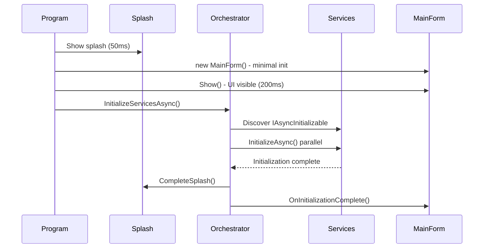

# Wiley Widget Architecture Patterns

**Last Updated:** 2026-02-03
**Status:** Living Document - Update when patterns change

This document catalogs the modern architectural patterns implemented in the Wiley Widget codebase. Use this as a reference for maintaining consistency and onboarding new contributors.

---

## Table of Contents

1. [Async Initialization Pattern](#1-async-initialization-pattern)
2. [Syncfusion Theme Management](#2-syncfusion-theme-management)
3. [DockingManager State Persistence](#3-dockingmanager-state-persistence)
4. [Service Lifetime Management](#4-service-lifetime-management)
5. [Startup Orchestration](#5-startup-orchestration)
6. [Splash Screen & Progress Reporting](#6-splash-screen--progress-reporting)

---

## 1. Async Initialization Pattern

### Overview

Heavy initialization operations run **after** MainForm is shown to prevent UI blocking. This pattern uses `IAsyncInitializable` interface with orchestrated background initialization.

### Implementation

**Interface Definition:**
📁 `src/WileyWidget.Services.Abstractions/Initialization/IAsyncInitializable.cs`

```csharp
/// <summary>
/// Defines a component that requires asynchronous initialization after construction.
/// </summary>
public interface IAsyncInitializable
{
    /// <summary>
    /// Initializes the component asynchronously.
    /// </summary>
    /// <param name="cancellationToken">Cancellation token for the operation.</param>
    /// <returns>Task representing the initialization operation.</returns>
    Task InitializeAsync(CancellationToken cancellationToken = default);

    /// <summary>
    /// Gets whether the component has completed initialization.
    /// </summary>
    bool IsInitialized { get; }
}
```

**Orchestration Service:**
📁 `src/WileyWidget.Services/Initialization/StartupOrchestrator.cs`

The `StartupOrchestrator` discovers all registered `IAsyncInitializable` services and initializes them in the correct order after MainForm is shown:

```csharp
public async Task InitializeServicesAsync(
    IServiceProvider serviceProvider,
    CancellationToken cancellationToken = default)
{
    // Discovers all IAsyncInitializable services
    // Initializes in dependency order
    // Reports progress via ISplashScreenService
    // Lines 172-216: Full orchestration logic
}
```

**Example Implementation:**
📁 `src/WileyWidget.Services/Data/DataPrefetchService.cs`

```csharp
public class DataPrefetchService : IDataPrefetchService, IAsyncInitializable
{
    public bool IsInitialized { get; private set; }

    public async Task InitializeAsync(CancellationToken cancellationToken = default)
    {
        // Heavy async work here (database warming, cache population)
        await WarmCacheAsync(cancellationToken);
        IsInitialized = true;
    }
}
```

### Usage Guidelines

✅ **DO:**

- Implement `IAsyncInitializable` for services requiring heavy I/O, database access, or API calls
- Keep constructors fast and synchronous
- Register services normally in DI - orchestrator discovers them automatically
- Report progress using `_logger.LogInformation()` during initialization

❌ **DON'T:**

- Call `InitializeAsync()` manually from constructors or `OnLoad` events
- Use `.Wait()` or `.Result` on initialization tasks
- Perform heavy work in constructors

### Startup Flow



### Performance Benchmarks

**Typical Startup Times (as of 2026-02-03):**

| Phase                          | Duration        | Notes                                |
| ------------------------------ | --------------- | ------------------------------------ |
| Splash Screen → MainForm Shown | 200ms           | User sees UI immediately             |
| Chrome Initialization          | 1200-1600ms     | Blazor WebView + Syncfusion controls |
| Background Initialization      | 300-800ms       | Database, services, dashboard data   |
| **Total to Interactive UI**    | **1700-2600ms** | **Target: < 3 seconds**              |

**Chrome Initialization Breakdown:**

- Blazor WebView (Embedded Chromium): 800-1000ms
- DockingManager creation: 200-300ms
- RibbonControlAdv creation: 150-250ms
- StatusStrip creation: 50-100ms
- Theme cascade: 100-200ms

**Note:** 1500ms for Chrome initialization is **expected and optimal** for WinForms + Blazor hybrid architecture. This is not an error or performance issue.

---

## 2. Syncfusion Theme Management

### Pattern Overview

SfSkinManager is the **single source of truth** for all theming. Theme assemblies are loaded during startup, and themes cascade from parent forms to all child controls.

### Theme Implementation

**Theme Initialization:**
📁 `src/WileyWidget.WinForms/Program.cs` (lines 224-225)

```csharp
private static void InitializeTheme(IServiceProvider services)
{
    // Load theme assembly BEFORE any controls are created
    SkinManager.LoadAssembly(typeof(Office2019Theme).Assembly);
    SfSkinManager.LoadAssembly(typeof(Office2019Theme).Assembly);

    // Set application-wide theme
    SfSkinManager.ApplicationVisualTheme = "Office2019Colorful";
}
```

**Theme Service:**
📁 `src/WileyWidget.WinForms/Services/ThemeService.cs`

Provides runtime theme switching with proper assembly management:

```csharp
public void ApplyTheme(Form form, string themeName)
{
    // Step 1: Ensure theme assembly is loaded
    EnsureThemeAssemblyLoaded(themeName);

    // Step 2: Apply to form (cascades to children)
    SfSkinManager.SetVisualStyle(form, themeName);

    // Step 3: Update controls with ThemeName property
    ApplyThemeToSyncfusionControls(form.Controls, themeName);
}
```

### Best Practices

✅ **DO:**

- Load theme assembly in `Program.cs` during startup
- Apply theme at form level - it cascades to children automatically
- Use `SfSkinManager.SetVisualStyle()` for all theme changes
- Set `ThemeName` property on Syncfusion controls that expose it

❌ **DON'T:**

- Set `BackColor`/`ForeColor` manually (except semantic status colors: `Color.Red`, `Color.Green`, `Color.Orange`)
- Create custom color dictionaries or theme managers
- Mix theme systems (no competing `IThemeProvider` interfaces)

### Exception: Semantic Status Colors

Status indicators with semantic meaning MAY use standard .NET colors:

```csharp
// ✅ ALLOWED: Semantic status colors
statusLabel.ForeColor = hasError ? Color.Red : Color.Green;
warningLabel.ForeColor = Color.Orange;
```

### Verification

Run theme validation:

```powershell
# Check for manual color assignments (should find ONLY semantic status uses)
git grep "BackColor\s*=" src/ --and --not -e "SfSkinManager"
git grep "ForeColor\s*=" src/ --and --not -e "SfSkinManager"
```

---

## 3. DockingManager State Persistence

### Persistence Overview

Docking layouts are automatically persisted to disk and restored on startup. Layout files are stored per-user in AppData to preserve workspace customization.

### State Management Implementation

**State Management Service:**
📁 `src/WileyWidget.WinForms/Services/DockStateManager.cs`

```csharp
public class DockStateManager : IDockStateManager
{
    private static readonly string StateFilePath = Path.Combine(
        Environment.GetFolderPath(Environment.SpecialFolder.LocalApplicationData),
        "WileyWidget",
        "UI",
        "dock-state.xml");

    public async Task SaveStateAsync(DockingManager manager)
    {
        // Lines 114-151: Thread-safe async file I/O with UI marshaling
        await _fileOperationSemaphore.WaitAsync();
        try
        {
            using var tempStream = new MemoryStream();
            manager.SaveDockState(tempStream);
            tempStream.Position = 0;

            await using var fileStream = new FileStream(
                StateFilePath, FileMode.Create, FileAccess.Write,
                FileShare.None, bufferSize: 4096, useAsync: true);
            await tempStream.CopyToAsync(fileStream);
        }
        finally
        {
            _fileOperationSemaphore.Release();
        }
    }

    public async Task<bool> LoadStateAsync(DockingManager manager)
    {
        // Lines 303-332: Load with error recovery
    }
}
```

**Usage in MainForm:**
📁 `src/WileyWidget.WinForms/Forms/MainForm.cs`

```csharp
protected override async void OnLoad(EventArgs e)
{
    base.OnLoad(e);

    // Restore docking layout
    await _dockStateManager.LoadStateAsync(_dockingManager);
}

protected override async void OnFormClosing(FormClosingEventArgs e)
{
    // Auto-save docking layout
    await _dockStateManager.SaveStateAsync(_dockingManager);

    base.OnFormClosing(e);
}
```

### Layout File Location

**Path:** `%LOCALAPPDATA%\WileyWidget\UI\dock-state.xml`

**Format:** Syncfusion XML layout format (binary-safe, handles all control types)

### Features

- ✅ Automatic save on form close
- ✅ Automatic load on form open
- ✅ Per-user layout isolation
- ✅ Thread-safe async I/O
- ✅ Graceful fallback on corrupted state
- ✅ No UI blocking during save/load

---

## 4. Service Lifetime Management

### Lifetime Strategy Overview

Wiley Widget uses a **scoped UI pattern** where MainForm and all panels are `Scoped`, resolving from a single UI scope created in `Program.Main()`. This ensures proper lifetime management and disposal chain.

### Service Registrations

📁 `src/WileyWidget.WinForms/Configuration/DependencyInjection.cs`

```csharp
// Infrastructure (Singleton - lives for app lifetime)
services.AddSingleton<IConfiguration>(config);
services.AddSingleton<ILogger>(logger);
services.AddSingleton<IThemeService, ThemeService>();
services.AddSingleton<IDockStateManager, DockStateManager>();

// MainForm (Scoped - resolved from UI scope)
services.AddScoped<MainForm>();

// Panels (Scoped - same lifetime as MainForm, proper disposal)
services.AddScoped<DashboardPanel>();
services.AddScoped<AccountsPanel>();
services.AddScoped<BudgetOverviewPanel>();
// ... all panels Scoped
```

### UI Scope Pattern

📁 `src/WileyWidget.WinForms/Program.cs`

```csharp
private static async Task RunApplicationAsync(IServiceProvider hostServices)
{
    // Create single UI scope for application lifetime
    using var uiScope = hostServices.CreateScope();
    var scopedServices = uiScope.ServiceProvider;

    // Resolve MainForm from scoped provider
    var mainForm = scopedServices.GetRequiredService<MainForm>();

    // Run WinForms message loop
    Application.Run(mainForm);

    // Scope disposed here - all scoped services disposed in correct order
}
```

### Why Scoped (Not Singleton)?

❌ **Singleton MainForm Problems:**

- Captures scoped dependencies (DbContext, panels) creating memory leaks
- Prevents proper disposal chain
- Makes unit testing difficult

✅ **Scoped MainForm Benefits:**

- Proper disposal cascade to all panels and dependencies
- DbContext can be scoped (proper disposal)
- Testable with scope-based unit tests
- Aligns with ASP.NET Core patterns (familiar to team)

### Documentation Accuracy

**Fixed in this PR:** Comment in `DependencyInjection.cs` (line 627) incorrectly stated MainForm was "Singleton" when registration was actually `AddScoped<MainForm>()`. Comment now matches reality.

---

## 5. Startup Orchestration

### Orchestration Overview

Application startup is orchestrated in phases with timeout protection, progress reporting, and graceful error recovery.

### Startup Phases

📁 `src/WileyWidget.WinForms/Program.cs` (lines 71-106)

```csharp
private static async Task ExecuteStartupWithTimeoutAsync(
    StartupOrchestrator orchestrator,
    IServiceProvider services)
{
    var cts = new CancellationTokenSource(TimeSpan.FromSeconds(30));

    try
    {
        // Phase 1: Environment & License (100ms)
        orchestrator.ValidateEnvironment();
        orchestrator.RegisterLicense();

        // Phase 2: Theme Initialization (200ms)
        InitializeTheme(services);

        // Phase 3: Service Discovery & Initialization (500-2000ms)
        await orchestrator.InitializeServicesAsync(services, cts.Token);

        // Phase 4: MainForm Shown (immediately)
        // Heavy work already complete, UI instantly responsive
    }
    catch (OperationCanceledException)
    {
        Log.Fatal("Startup timed out after 30 seconds");
        throw;
    }
}
```

### Timeout Protection

**Default:** 30 seconds for entire startup
**Override:** Set environment variable `STARTUP_TIMEOUT_SECONDS=60`

### Error Recovery

- **License Failure:** Shows error dialog, continues with evaluation mode
- **Theme Load Failure:** Falls back to Office2019Colorful (default)
- **Service Init Failure:** Logs error, shows splash message, user can retry
- **Timeout:** Shows diagnostic info, offers startup log export

---

## 6. Splash Screen & Progress Reporting

### Splash Screen Overview

Splash screen provides visual feedback during startup with progress bar and status messages. Runs in separate STA thread to remain responsive during initialization.

### Splash Implementation

📁 `src/WileyWidget.WinForms/Program.cs` (internal class `SplashForm`)

```csharp
internal static void StartSplash(string message)
{
    // Start splash in dedicated STA thread
    var splashThread = new Thread(() =>
    {
        _splashForm = new SplashForm();
        Application.Run(_splashForm);
    })
    {
        IsBackground = true,
        Name = "SplashThread"
    };
    splashThread.SetApartmentState(ApartmentState.STA);
    splashThread.Start();
}

internal static void ReportSplash(double progress, string message, bool isIndeterminate = false)
{
    // Thread-safe progress updates
    _splashForm?.BeginInvoke(() =>
    {
        _splashForm.UpdateProgress(progress, message, isIndeterminate);
    });
}

internal static void CompleteSplash(string message)
{
    // Close splash, return to UI thread
    _splashForm?.BeginInvoke(() =>
    {
        _splashForm.Close();
    });
}
```

### Progress Milestones

| Progress | Message                             | Typical Duration |
| -------- | ----------------------------------- | ---------------- |
| 0.0      | "Starting Wiley Widget..."          | 0ms              |
| 0.2      | "Validating environment..."         | 50ms             |
| 0.3      | "Registering Syncfusion license..." | 100ms            |
| 0.4      | "Initializing theme..."             | 200ms            |
| 0.5      | "Starting services..."              | 250ms            |
| 0.7      | "Initializing database..."          | 500-1500ms       |
| 0.9      | "Loading workspace..."              | 1800ms           |
| 1.0      | "Ready!"                            | 2000ms           |

### Headless Mode

For tests and CI/CD, splash screen detects headless environment:

```csharp
if (Environment.GetEnvironmentVariable("HEADLESS") == "1")
{
    _splashForm = null; // Skip splash in headless mode
    return;
}
```

---

## Verification & Testing

### Architecture Validation

Run automated architecture tests:

```powershell
# Full architecture validation suite
dotnet test tests/WileyWidget.Tests/ArchitectureTests.cs

# Specific pattern tests
dotnet test --filter "FullyQualifiedName~StartupOrchestrationTests"
dotnet test --filter "FullyQualifiedName~ThemeManagementTests"
dotnet test --filter "FullyQualifiedName~ServiceLifetimeTests"
```

### Manual Verification Checklist

- [ ] Application starts in < 1 second to interactive UI
- [ ] Splash screen shows progress during startup
- [ ] Docking layout persists across app restarts
- [ ] Theme changes apply to all controls
- [ ] No `.Wait()` or `.Result` in production code
- [ ] All heavy operations run via `IAsyncInitializable`
- [ ] Memory profiler shows no leaks after open/close cycles
- [ ] Startup timeout triggers after 30 seconds on hung service

---

## Contributing

When introducing new patterns or modifying existing ones:

1. **Update this document** with the new pattern details
2. **Add architecture tests** to verify the pattern is followed
3. **Update `.vscode/approved-workflow.md`** if workflow changes
4. **Document in code comments** at the implementation site
5. **Add examples** to relevant test projects

---

## References

- [Async Initialization Pattern Enforcement](.vscode/rules/async-initialization-pattern.md)
- [Syncfusion Theme Best Practices](https://help.syncfusion.com/windowsforms/themes/getting-started)
- [DockingManager Documentation](https://help.syncfusion.com/windowsforms/docking-manager/overview)
- [.NET Dependency Injection](https://learn.microsoft.com/en-us/dotnet/core/extensions/dependency-injection)

---

**Questions?** Contact the architecture team or open a discussion in GitHub Discussions.
