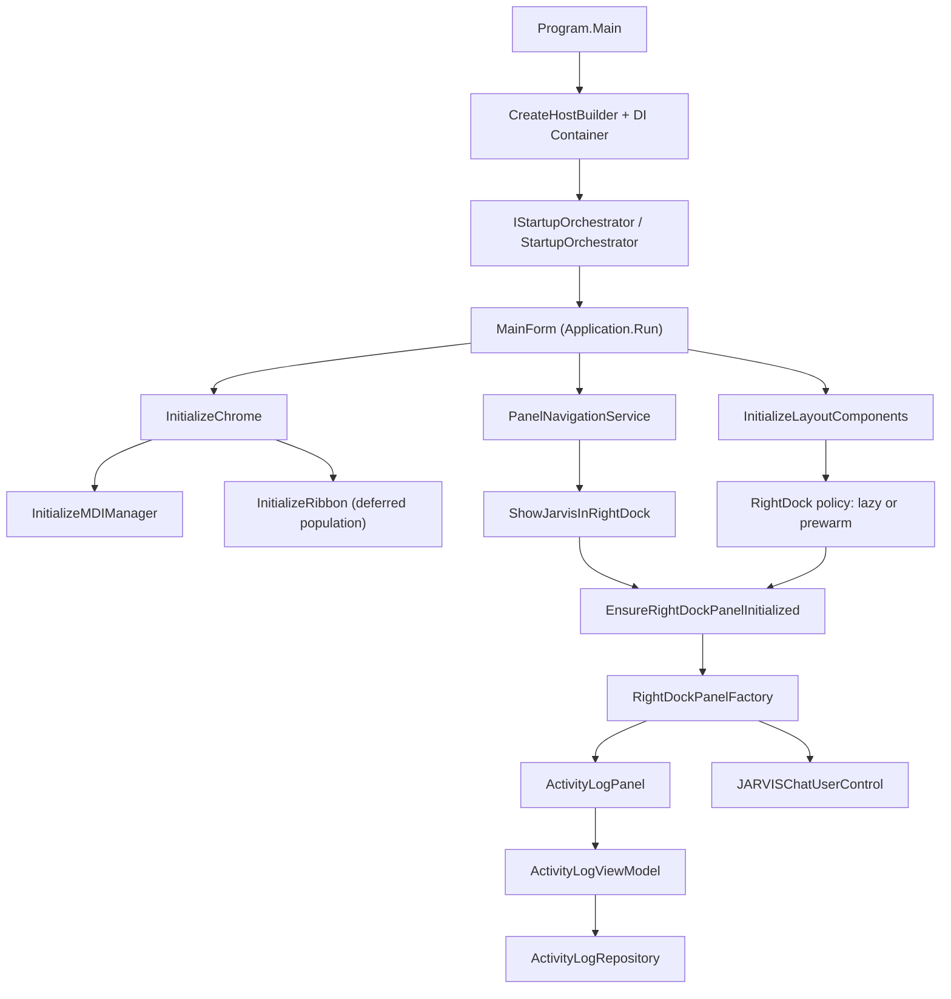
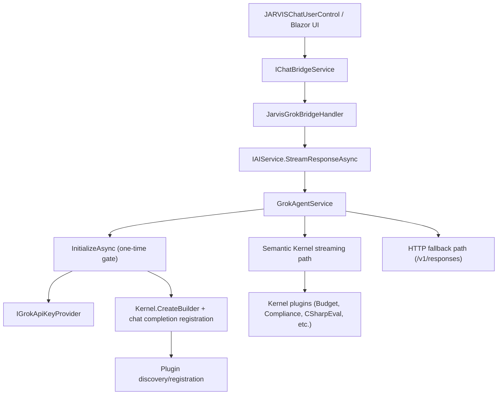

# Wiley Widget Dependency Graph

This file gives you a practical dependency graph for startup and JARVIS/AI flow.

If Mermaid preview is not available in your editor, use the plain-text fallback sections under each diagram.

## What Mermaid Is

Mermaid is a text syntax that renders diagrams from code-like blocks.
GitHub and many VS Code setups can render it directly.

## Graph 1: Startup and UI Composition

Plain-text fallback:

- Program.Main -> Host/DI -> StartupOrchestrator -> MainForm
- MainForm -> InitializeChrome -> InitializeMDIManager + InitializeRibbon
- MainForm -> InitializeLayoutComponents -> RightDock policy (lazy/prewarm)
- Navigation -> ShowJarvisInRightDock -> EnsureRightDockPanelInitialized -> RightDockPanelFactory
- RightDockPanelFactory -> ActivityLogPanel + JARVISChatUserControl
- ActivityLogPanel -> ActivityLogViewModel -> ActivityLogRepository

## Graph 2: JARVIS AI Request Path

Plain-text fallback:

- JARVIS UI -> ChatBridgeService -> JarvisGrokBridgeHandler -> IAIService.StreamResponseAsync
- IAIService implementation is GrokAgentService
- GrokAgentService InitializeAsync builds SK and registers plugins
- Runtime uses SK streaming first, HTTP fallback if kernel/service unavailable

## Immediate Use Cases for This Graph

1. Startup optimization:

- Label each node as eager, deferred, or lazy.
- Move non-critical nodes off the startup critical path.

2. Duplicate-call reduction:

- Track nodes called from multiple entry points (for example MDI init, JARVIS auto-open checks).
- Add "log-once" or "call-once" guards where noise is high.

3. Regression triage:

- When a panel or service misbehaves, walk upstream one hop at a time using the graph.

## Suggested Next Step

Create a second version of this graph with timings from the startup log attached to each node.
That turns this from architecture documentation into a performance map.
